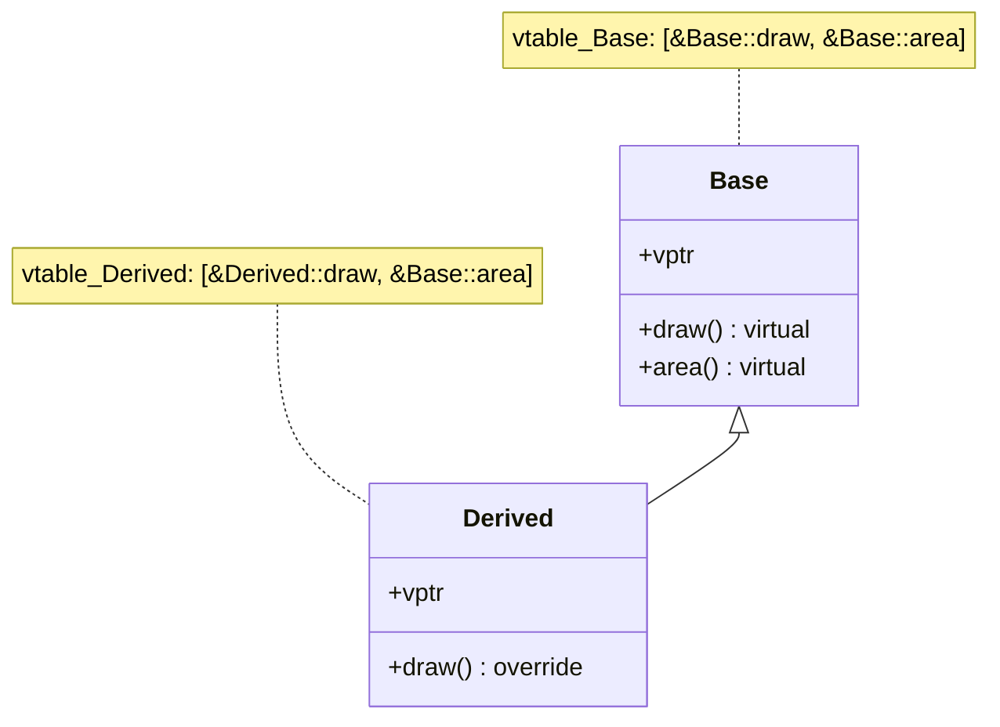
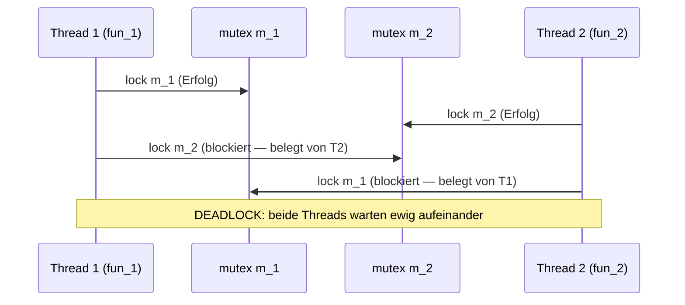
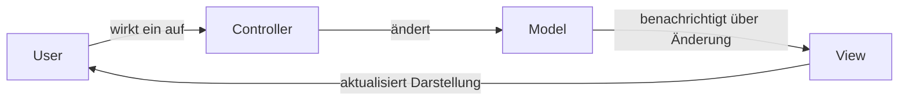
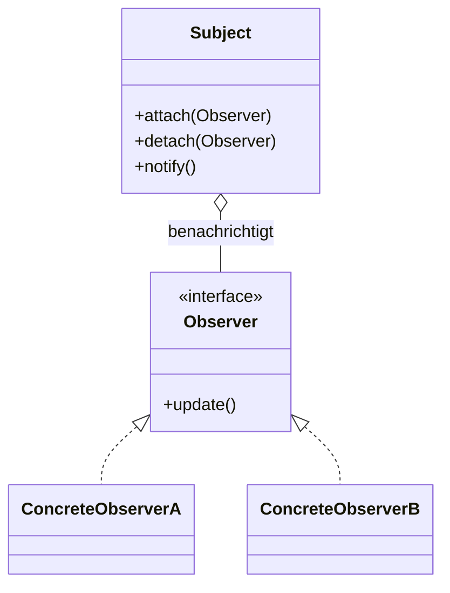
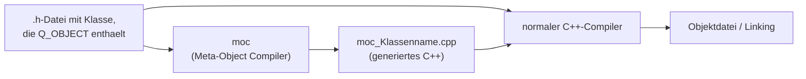
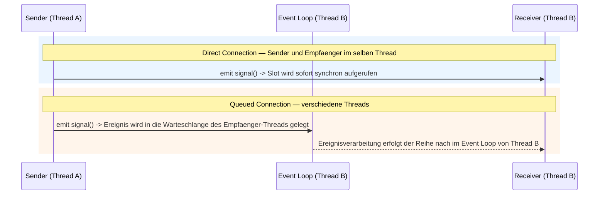
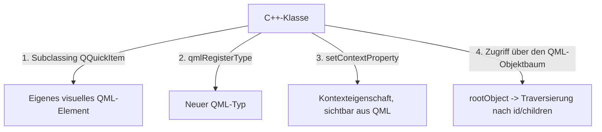
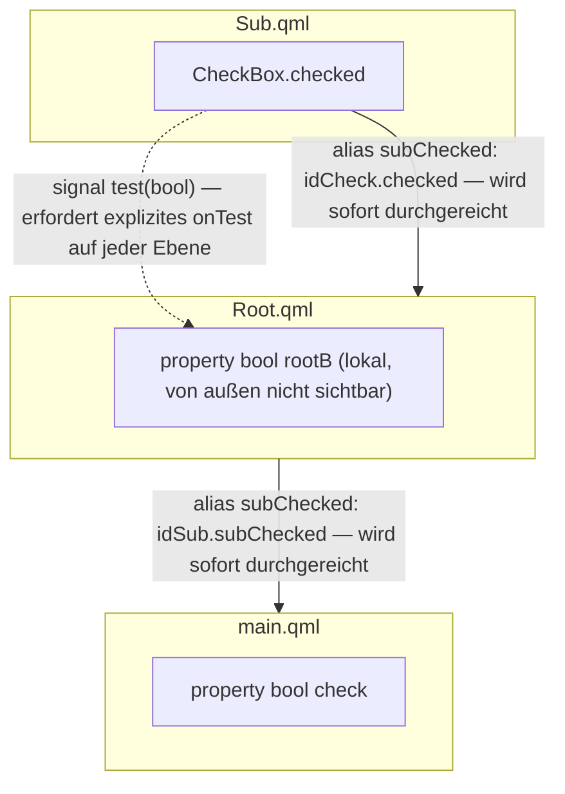
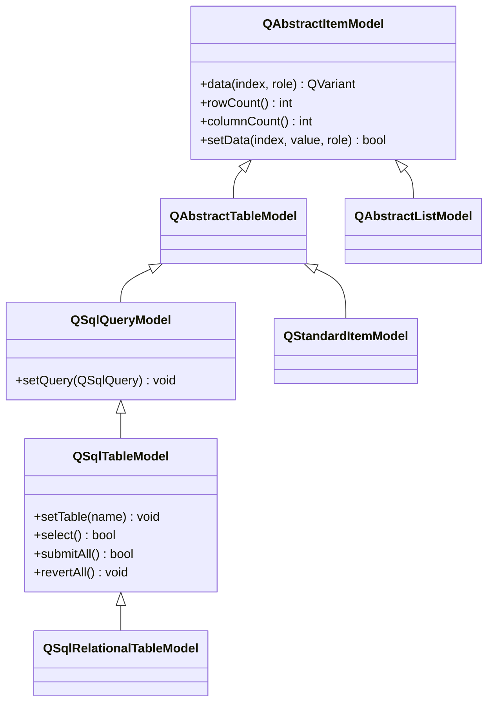
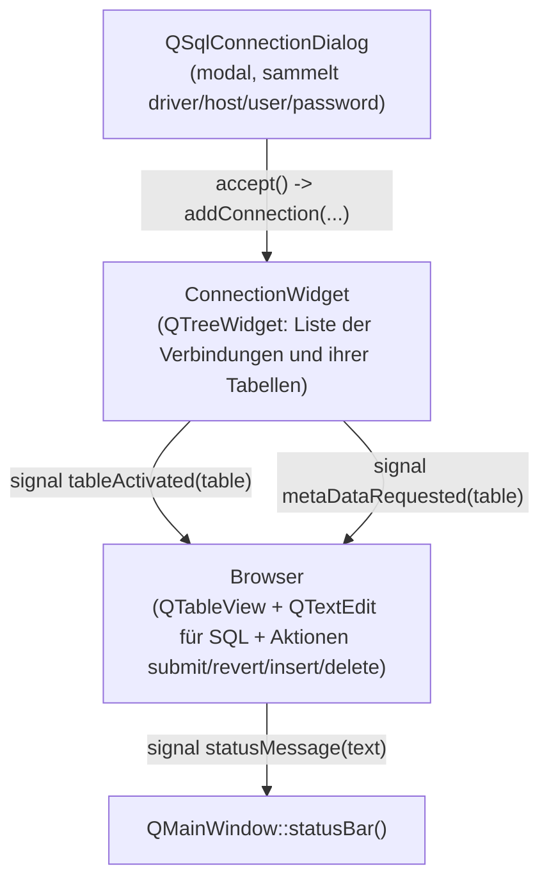

# INHALTSVERZEICHNIS

## TEIL 1: C++

- [Sprachgrundlagen: C++ als Erweiterung von C                               ](#cpp01) <a name="bcpp01"></a>
- [Klassen, Objekte, Polymorphismus                                           ](#cpp02) <a name="bcpp02"></a>
- [Wertkategorien und Move-Semantik                                           ](#cpp03) <a name="bcpp03"></a>
- [Qualifizierer: const, volatile, mutable, static, inline                   ](#cpp04) <a name="bcpp04"></a>
- [Speicherverwaltung: Smart Pointer und Allokatoren                          ](#cpp05) <a name="bcpp05"></a>
- [STL-Container und Algorithmen                                              ](#cpp06) <a name="bcpp06"></a>
- [Multithreading und Synchronisation                                         ](#cpp07) <a name="bcpp07"></a>
- [Windows: Kernel-Objekte, Prozessspeicher, Debugging                        ](#cpp08) <a name="bcpp08"></a>
- [Ein-/Ausgabe und OS: blockierend, asynchron, epoll/kqueue                  ](#cpp09) <a name="bcpp09"></a>
- [Entwurfsmuster                                                             ](#cpp10) <a name="bcpp10"></a>
- [Typische algorithmische Interviewaufgaben                                  ](#cpp11) <a name="bcpp11"></a>
- [Datenstrukturen für die Suche und Arbeit mit großen Datensätzen            ](#cpp12) <a name="bcpp12"></a>
- [Code-Review und Mikrooptimierungen                                         ](#cpp13) <a name="bcpp13"></a>
- [Quellcode: Algorithmen                                                     ](#cpp14) <a name="bcpp14"></a>

## TEIL 2: Qt

- [QObject und das Meta-Objekt-System                                         ](#qt01) <a name="bqt01"></a>
- [Signale und Slots                                                          ](#qt02) <a name="bqt02"></a>
- [Events, Threads und QObject                                                ](#qt03) <a name="bqt03"></a>
- [QML und C++: Interaktion                                                   ](#qt04) <a name="bqt04"></a>
- [Praktische Hinweise zu Qt-Klassen                                          ](#qt05) <a name="bqt05"></a>
- [Benutzerdefinierte Widgets, Event-Filter und Autovervollständigung         ](#qt06) <a name="bqt06"></a>
- [Model/View in Widgets und Qt SQL                                           ](#qt07) <a name="bqt07"></a>
- [Qt vs MFC, SDI/MDI und Verschiedenes                                      ](#qt08) <a name="bqt08"></a>
- [Quellcode: Qt                                                              ](#qt09) <a name="bqt09"></a>

---


# Grundlagen der Sprache: C++ als Erweiterung von C <a name="cpp01"></a> [ BACK ](#bcpp01)

## Unterschied zwischen C und C++

| Aspekt | C | C++ |
|---|---|---|
| Paradigma | strukturierte Programmierung | objektorientierte Programmierung |
| Polymorphismus | nicht vorhanden | vorhanden, ueber virtuelle Funktionen |
| `main()` | kann aus anderen Funktionen aufgerufen werden | nicht moeglich |
| Dateierweiterung | `.c` | `.cpp` |
| Konsolen-Ein-/Ausgabe | `scanf()` / `printf()` | `std::cin` / `std::cout` |
| Standardargumente | nein | ja |
| Zugriffsmodifizierer | nein (nur `struct`, alles oeffentlich) | `public` / `private` / `protected` bei `struct` und `class` |
| `new` / `delete` | `malloc()` / `free()` | `new` / `delete` (Speicherallokation + Konstruktor-/Destruktoraufruf) |
| Ausnahmen | nein | ja (`try` / `catch` / `throw`) |
| Operatorueberladung | nein | ja |
| Referenzen | nein, nur Zeiger | ja (`&`), zusaetzlich zu Zeigern |
| `inline`, `template`, Default-Argumente | nein | ja |
| `namespace` | nein | ja |

Kernidee: Eine C++-Klasse ist technisch gesehen ein C-Strukturtyp, ein Objekt ist eine Variable dieses Typs. Der Unterschied liegt in den Zugriffsmodifizierern und darin, dass Klassenfelder nicht nur Daten, sondern auch Funktionen sein koennen. Eine Klassenmethode ist eine gewoehnliche C-Funktion, deren erster impliziter Parameter ein Zeiger auf die Struktur ist (`this`).

### Struktur vs. Klasse

1. Bei `struct` sind standardmaessig alle Felder oeffentlich, bei `class` privat.
2. Bei `struct` ist die Vererbung standardmaessig oeffentlich, bei `class` privat.

### Vererbung als Komposition

Was in C++ Vererbung genannt wird, ist in C eine in eine andere Struktur eingebettete Struktur (die Felder der Basisklasse sind das erste "Feld" der abgeleiteten Klasse). Zwei echte Verbesserungen gegenueber manueller Komposition in C:

1. Die Felder der Basisklasse werden zu Feldern der abgeleiteten Klasse — der Zugriff ist kuerzer.
2. Methoden mit gleichen Namen in verschiedenen Klassen kollidieren nicht (`Point::paint` und `Circle::paint`) — man muss nicht manuell verschiedene Namen wie `Point_paint`/`Circle_paint` erfinden.

### `new`/`delete` vs. `malloc`/`free`

```cpp
// C-Stil
Point *p = (Point*) malloc(sizeof(Point));
free(p);

// C++-Stil
Point *p = new Point;
delete p;
```

Bei `new` wird zusaetzlich der Konstruktor aufgerufen, bei `delete` der Destruktor. Formel: `new = malloc + Konstruktor`, `delete = free + Destruktor`.

### Virtuelle Funktionen — syntaktischer Zucker ueber einer Zuordnungstabelle

In C muesste man fuer polymorphes Verhalten manuell eine Tabelle "Strukturtyp -> Funktion" und ein Feld mit einem Typ-Tag anlegen und dessen Korrektheit ueberwachen. In C++ genuegt es, eine Methode als `virtual` zu markieren — der Compiler erstellt automatisch die Tabelle der virtuellen Funktionen (vtable) und ein verstecktes Zeigerfeld darauf (vptr). Mehr ueber vtable — in [02-classes-and-oop.md](02-classes-and-oop.md).

### Ausnahmen als goto/longjmp

Im Wesentlichen ist eine Ausnahme eine Folge von `goto`/`return`, die auf `setjmp`/`longjmp` aufbaut. `try`/`catch` ist `setjmp` mit Pruefung, `throw` ist `longjmp`: Wenn `throw` innerhalb eines `try` auftritt, wird die Kontrolle an den entsprechenden `catch` uebergeben, andernfalls wird der Stack nach oben abgewickelt, um einen passenden `catch` zu finden.

### Referenzen

Eine Referenz (`&`) ist im Wesentlichen syntaktischer Zucker ueber einem Zeiger, der es ermoeglicht, Werte "ueber Parameter" zu uebergeben/zurueckzugeben, ohne im Code Dereferenzierungssternchen zu setzen. Nachteil: Der Aufruf einer Funktion mit Referenzparameter ist syntaktisch nicht von einem Aufruf mit Wertparameter zu unterscheiden — es ist "auf den ersten Blick" nicht erkennbar, dass das Argument innerhalb der Funktion geaendert werden kann.

## Unterschied 9: `inline`, `template`, Standardargument

- Ein Standardargument erspart es, immer den Parameterwert anzugeben, wenn dieser meistens derselbe ist.
- Eine `inline`-Funktion ist im Wesentlichen ein `#define` mit Parametern, aber mit Typkontrolle.
- `template` — ein Versuch eines typsicheren `#define`: Identische Template-Instanziierungen werden vom Compiler zu einem einzigen Code zusammengefuehrt, waehrend identische `#define`-Expansionen woertlich dupliziert werden. Nachteile von Templates — schwere Syntax und unbequemes Debugging.

## Groesse von Typen: `char`, `bool`, `BOOL`

```cpp
sizeof(char);   // immer 1 (der Standard definiert nicht die Vorzeichenhaftigkeit von char — sie ist plattform-/compilerabhaengig)
sizeof(wchar_t);// normalerweise 2 (Windows) oder 4 (Linux)
sizeof(TCHAR);  // typedef wchar_t TCHAR; (in Unicode-Builds)
sizeof(bool);   // normalerweise 1
sizeof(BOOL);   // typedef int BOOL; — normalerweise 4 (Win32)
```

## `extern "C"`

```cpp
extern "C" {
#include <foo.h>
}

extern "C" {
  void foo() { }
}
```

C++ **verfaelscht (mangelt)** standardmaessig Funktionsnamen und kodiert darin Informationen ueber die Argumenttypen — das ist es, was Funktionsueberladung ermoeglicht. `extern "C"` verbietet die Namensverzerrung fuer Deklarationen innerhalb des Blocks: Der Name `foo` in der Objektdatei bleibt einfach `foo`, ohne "Verzierungen".

Wann dies benoetigt wird:

- wenn C++-Code eine Bibliothek aufrufen muss, die mit einem C-Compiler kompiliert wurde (andernfalls wuerde der Linker nach einem verzerrten Namen wie `_Z3foov` suchen, der in der C-Bibliothek nicht existiert);
- wenn eine C++-Funktion (z.B. aus einer DLL) fuer Clients in reinem C exportiert wird.

Wenn das gesamte Projekt mit einem einzigen C++-Compiler kompiliert wird (sowohl `.c`- als auch `.cpp`-Dateien), ist `extern "C"` formal nicht erforderlich und kann in Einzelfaellen sogar stoerend sein — aber die meisten System-C-Header umschliessen ihre Deklarationen selbst mit `extern "C"`, damit dies in jedem Fall sicher ist.

## Typumwandlungen (Casts)

```cpp
struct A { int a; };
struct B { int b; };
struct C : public A, public B {};

C c;
c.a = 1;
c.b = 2;
```

### `const_cast`

- Entfernt oder fuegt den Modifizierer `const`/`volatile` bei einem Zeiger/einer Referenz hinzu, ohne den Basistyp zu aendern.
- Kann nicht auf gewoehnliche Variablen (nicht Zeiger/Referenzen) angewendet werden und kann nicht zwischen verschiedenen Typen konvertieren.
- Fehler werden zur Kompilierzeit erkannt.

### `static_cast`

```cpp
int r2 = static_cast<B *>(&c)->b;
```

- Wird zur Laufzeit nur teilweise geprueft (bei polymorphen Hierarchien fehlt eine tatsaechliche Pruefung — im Gegensatz zu `dynamic_cast`).
- Funktioniert in beide Richtungen der Hierarchie (up/down), aber beim Downcast ohne echte Typinformation kann undefiniertes Verhalten auftreten, wenn das Objekt tatsaechlich nicht den erwarteten Typ hat.
- Wird fuer implizite Standardkonvertierungen verwendet: `int -> double`, `void*` -> typisierter Zeiger usw.

### `dynamic_cast`

```cpp
int r3 = dynamic_cast<B *>(&c)->b;
```

- Die Pruefung wird zur Laufzeit ueber RTTI (Run-Time Type Information) durchgefuehrt.
- Sicherer Downcast in der Vererbungshierarchie, auch bei virtueller Vererbung.
- Fuer Zeiger wird `nullptr` zurueckgegeben, wenn die Konvertierung unmoeglich ist; fuer Referenzen wird `std::bad_cast` geworfen.
- Erfordert, dass der Argumenttyp polymorph ist (mindestens eine virtuelle Funktion hat) — andernfalls kompiliert es nicht.
- Haeufige Verwendung von `dynamic_cast` ist ein Zeichen fuer suboptimales Design (Verletzung des Liskovschen Substitutionsprinzips).

### `reinterpret_cast`

```cpp
int r1 = reinterpret_cast<B *>(&c)->b;
```

- Wird zur Kompilierzeit geprueft, prueft inhaltlich aber fast nichts — arbeitet "wie es ist" mit der Bitdarstellung.
- Nur auf Zeiger und Referenzen anwendbar (nicht auf gewoehnliche Variablen).
- Kann zu einem Hardwareabsturz fuehren, da direkt mit dem Speicher gearbeitet wird.

### C-style Cast

```cpp
int r4 = ((B *)(&c))->b;
```

Versucht zuerst `static_cast`, wenn das nicht funktioniert — `reinterpret_cast`. In C++-Code nicht empfohlen, gerade wegen der Unvorhersagbarkeit, welche der beiden Varianten tatsaechlich greift.

## Verschiedenes

- **Was es in C++ gibt, was in C fehlt**: Ausnahmebehandlung (`try`/`catch`) — erfordert das Abwickeln des Stacks ueber Aufrufrahmen. In Echtzeitsystemen werden Ausnahmen wegen der unvorhersagbaren Kosten des Abwickelns normalerweise vermieden.
- **Bitverschiebung statt Multiplikation mit 2**: `x << 1` ist aequivalent zu `x * 2` und wird auf aelteren Architekturen schneller als direkte Multiplikation ausgefuehrt (moderne Compiler fuehren diese Ersetzung bei der Optimierung selbst durch).
- **Groesse eines Zeigers**: abhaengig von der Plattform — 4 Bytes auf 32-Bit, 8 Bytes auf 64-Bit. Dies bestimmt auch den maximal adressierbaren Speicher (2^32 = 4 GiB vs. 2^64 = 16 Exabyte).
- **`switch` ueber String in C++11** — siehe [11-algorithms-and-coding-problems.md](11-algorithms-and-coding-problems.md#switch-по-строке-c11).


---

# Klassen, Objekte, Polymorphismus <a name="cpp02"></a> [ BACK ](#bcpp02)

## Was implizit fuer `class A {};` generiert wird

```cpp
class A {};
```

ist aequivalent zu:

```cpp
class A {
public:
  A() {}
  ~A() {}
  A(const A& that) {}
  A& operator=(const A& that) {}
  A(A&& that) {}             // C++11
  A& operator=(A&& that) {}  // C++11
};
```

Das heisst, der Compiler generiert implizit: Standardkonstruktor, Destruktor, Kopierkonstruktor, Kopierzuweisungsoperator, Move-Konstruktor und Move-Zuweisungsoperator.

Nuance: Wenn mindestens ein benutzerdefinierter Konstruktor deklariert wird (auch mit Parametern), wird der Standardkonstruktor nicht generiert. Wenn ein Destruktor, ein Kopierkonstruktor oder ein Zuweisungsoperator deklariert wird, hoert der Compiler auf, implizit den Move-Konstruktor/Move-Zuweisungsoperator zu generieren (siehe unten).

## Dreierregel / Fuenferregel

Wenn eine Klasse eine "rohe" Ressource besitzt (Zeiger, Handle), kopieren der implizit generierte Kopierkonstruktor und Zuweisungsoperator nur den Zeiger selbst (Shallow Copy) und nicht das, worauf er zeigt — bei doppelter Freigabe fuehrt dies zu Double Free / Use-After-Free.

**Vor C++11 — Dreierregel**: Wenn ein expliziter Destruktor benoetigt wird, dann werden auch ein Kopierkonstruktor und ein Kopierzuweisungsoperator benoetigt.

**Ab C++11 — Fuenferregel**: dasselbe plus Move-Konstruktor und Move-Zuweisungsoperator.

```cpp
class Buffer
{
public:
  Buffer(const std::string& buff)
  : pBuff(nullptr), buffSize(buff.length())
  {
    pBuff = new char[buffSize];
    memcpy(pBuff, buff.c_str(), buffSize);
  }

  ~Buffer() { destroy(); }

  Buffer(const Buffer& other)
  : pBuff(nullptr), buffSize(other.buffSize)
  {
    pBuff = new char[buffSize];
    memcpy(pBuff, other.pBuff, buffSize);
  }

  Buffer& operator=(const Buffer& other)
  {
    if (this == &other) return *this;
    destroy();
    buffSize = other.buffSize;
    pBuff = new char[buffSize];
    memcpy(pBuff, other.pBuff, buffSize);
    return *this;
  }

  Buffer(Buffer&& tmp) noexcept
  : pBuff(tmp.pBuff), buffSize(tmp.buffSize)
  {
    tmp.pBuff = nullptr;
  }

  Buffer& operator=(Buffer&& tmp) noexcept
  {
    if (this == &tmp) return *this;
    destroy();
    buffSize = tmp.buffSize;
    pBuff = tmp.pBuff;
    tmp.pBuff = nullptr;
    return *this;
  }

private:
  void destroy() { delete[] pBuff; }

  char* pBuff;
  size_t buffSize;
};
```

Wenn `operator=` (kopierend) explizit definiert wird, hoert der Compiler auf, implizit den Move-Konstruktor/Move-Zuweisungsoperator zu generieren — die Klasse wird nur kopiert, aber nicht verschoben.

## `explicit` und Konstruktor mit einem Parameter

Ein Konstruktor mit einem Parameter (dessen Typ nicht dem Klassentyp entspricht) kann implizit bei der Initialisierung aufgerufen werden:

```cpp
class A
{
  int m_a;
public:
  A(int a) : m_a(a) {}
};

A obj = 2; // implizit wird A obj(2) aufgerufen;
```

Das ist praktisch, z.B. fuer `std::string`:

```cpp
std::string obj = "abc";       // implizite Konvertierung const char* -> std::string
void foo(std::string s) {}
foo("abc");                    // funktioniert auch ueber implizite Konvertierung
```

Aber manchmal ist die implizite Konvertierung unerwuenscht — dann markiert man den Konstruktor mit `explicit`:

```cpp
class A
{
  int m_a;
public:
  explicit A(int a) : m_a(a) {}
};

A obj = 2;  // KOMPILIERFEHLER
A obj(2);   // OK
```

Alternative Wege, die implizite Konvertierung ohne `explicit` zu verhindern:

1. Privater Konvertierungsoperator des gewuenschten Typs:

```cpp
class foo
{
public:
  double s;
  double& DBL() { return s; }
private:
  operator double() { return s; } // privat — von aussen nicht aufrufbar
};
```

2. Einschraenkung ueber SFINAE / `enable_if` im Template-Parameter — nur einen bestimmten Typ akzeptieren:

```cpp
template <typename T>
void foo(T t, typename std::enable_if<std::is_same<T, uint64_t>::value>::type * = 0)
{
  std::cout << "Only uint64_t.";
}
```

## Virtuelle Funktionen im Konstruktor und Destruktor

**Im Konstruktor** funktioniert der virtuelle Aufruf nicht wie erwartet: Die Tabelle der virtuellen Funktionen (vtable) des Objekts zeigt zum Zeitpunkt der Ausfuehrung des Basisklassenkonstruktors auf die Funktionen der **Basisklasse** — der Konstruktor der abgeleiteten Klasse wurde noch nicht ausgefuehrt. Der Aufruf einer **rein virtuellen** Funktion im Konstruktor fuehrt zu einer `pure virtual call exception`.

**Im Destruktor** das gleiche Problem von der anderen Seite: Zum Zeitpunkt der Ausfuehrung des Basisklassendestruktors hat der Destruktor der abgeleiteten Klasse bereits gearbeitet, das Objekt der abgeleiteten Klasse ist teilweise zerstoert — die vtable zeigt wieder auf die Funktionen der Basisklasse.

Ergebnis: In beiden Faellen wird die Version der Funktion **derjenigen Klasse aufgerufen, deren Konstruktor/Destruktor gerade ausgefuehrt wird**, und nicht das endgueltige Override — spaete Bindung funktioniert im Konstruktor/Destruktor nicht.

## Ausnahmen im Konstruktor und Destruktor

**Im Konstruktor Ausnahmen zu werfen ist normal.** Wenn der Konstruktor nicht abgeschlossen wurde, existiert das Objekt aus Sprachsicht nicht, daher wird sein Destruktor nicht aufgerufen. Lecks sind moeglich fuer *bereits* allokierte Mitglieder bei Verwendung roher Zeiger:

```cpp
class Cnt {
  X *xa;
  X *xb;
public:
  Cnt(int a, int b) {
    xa = new X(a);
    xb = new X(b); // wenn hier eine Ausnahme geworfen wird — xa ist bereits verloren, ~Cnt() wird nicht aufgerufen
  }
  ~Cnt() { delete xa; delete xb; }
};
```

Der Standard garantiert, dass bei einer Ausnahme im Konstruktor der Speicher **bereits vollstaendig konstruierter** nicht-statischer Objektmitglieder korrekt freigegeben wird (durch Aufruf ihrer Destruktoren). Das Problem bleibt nur fuer "nackte" manuell erworbene Ressourcen (`new`, Deskriptoren) — die Loesung ist RAII: `xa`/`xb` als Werte oder in Smart Pointern speichern, dann funktioniert ihre Freigabe automatisch beim Stack-Unwinding.

**Im Destruktor Ausnahmen zu werfen ist unsicher.** Wenn eine Ausnahme aus dem Destruktor fliegt, waehrend der Stack bereits wegen einer anderen Ausnahme abgewickelt wird, erfolgt ein Aufruf von `std::terminate()`. Allgemeine Regel: Der Destruktor darf keine Ausnahmen nach aussen propagieren (er kann sie intern abfangen und unterdruecken).

## Copy-Konstruktor — wann er aufgerufen wird

- bei der Uebergabe eines Objekts an eine Funktion **per Wert**;
- bei der Rueckgabe eines Objekts aus einer Funktion **per Wert**;
- bei der Initialisierung eines Objekts durch ein anderes Objekt derselben Klasse (`A a2 = a1;`).

## `this`

`this` — Zeiger auf die Klasseninstanz, fuer die die aktuelle (nicht-statische) Methode aufgerufen wurde. Innerhalb von `static`-Methoden nicht verfuegbar, da eine `static`-Methode nicht an eine konkrete Instanz gebunden ist.

## Tabelle der virtuellen Funktionen (vtable)

Wenn mindestens eine Funktion der Klasse als `virtual` deklariert ist, erstellt der Compiler fuer die Klasse eine `vtable` — eine Tabelle mit den Adressen der virtuellen Funktionen dieser Klasse — und fuegt jedem Objekt ein verstecktes Feld `vptr` hinzu, das auf diese Tabelle zeigt. Wenn eine abgeleitete Klasse eine virtuelle Funktion nicht ueberschreibt, bleibt in ihrer vtable die Adresse der Elternfunktion.



Wenn ein Zeiger/eine Referenz der Basisklasse mit einem Objekt der abgeleiteten Klasse verbunden wird, zeigt der `vptr` des Objekts auf die vtable der abgeleiteten Klasse — daher findet der Aufruf einer virtuellen Methode ueber einen Zeiger des Basistyps die richtige ueberschriebene Implementierung. Genau dieser Mechanismus implementiert die dynamische Bindung (spaete Bindung) in C++.

## Statischer und dynamischer Polymorphismus

- **Statischer Polymorphismus** — Funktionsueberladung und Templates; wird zur Kompilierzeit aufgeloest.
- **Dynamischer Polymorphismus** — virtuelle Funktionen; wird zur Laufzeit ueber die vtable aufgeloest.

## Placement new und Objekterzeugung an einer bestimmten Adresse

```cpp
new T;      // operator new(sizeof(T))
new T[5];   // operator new[](sizeof(T)*5 + overhead)
new(2,f) T; // operator new(sizeof(T), 2, f)
```

`new` besteht tatsaechlich aus zwei Schritten: Allokation von Rohspeicher ueber `operator new`, dann Aufruf des Konstruktors in diesem Speicher. Placement new ermoeglicht es, explizit anzugeben, wo genau das Objekt konstruiert werden soll — zum Beispiel in einem vorab allokierten Puffer auf dem Stack:

```cpp
unsigned char buf[sizeof(int) * 2];
int *pInt = new (buf) int(3);
int *qInt = new (buf + sizeof(int)) int(5);
```

Oder direkt ueber einer bestehenden Variablen:

```cpp
int X = 10;
int *mem = new (&X) int(100); // aendert den Wert von X auf 100
```

Eine andere Moeglichkeit, ein Objekt "wie es ist" im Speicher zu kopieren — `memcpy`:

```cpp
memcpy(&dst[dstIdx], &src[srcIdx], numElementsToCopy * sizeof(Element));
```

## Groesse eines "leeren" Objekts

```cpp
class Empty {};
sizeof(Empty); // nicht Null (normalerweise 1 Byte)
```

Der Compiler fuegt ein fiktives Mitglied hinzu, damit das Objekt eine Groesse ungleich Null hat und entsprechend eine eindeutige Adresse — andernfalls koennten zwei verschiedene Objekte dieselbe Adresse erhalten, was grundlegende Sprachinvarianten verletzen wuerde (z.B. Zeigervergleich).


---

# Wertkategorien und Move-Semantik <a name="cpp03"></a> [ BACK ](#bcpp03)

## lvalue und rvalue

- **lvalue** — das, was eine konkrete Adresse im Speicher hat und in der Regel einen Namen ("das, was einen Namen hat").
- **rvalue** — ein temporaeres Objekt ohne dauerhafte Adresse ("das, was keinen Namen hat"): Literale, Ergebnis eines Ausdrucks, Rueckgabe einer Funktion per Wert.

```cpp
int x = 5;  // x — lvalue, 5 — rvalue (pure rvalue / prvalue)
int(10);    // ebenfalls rvalue
```

Formal gibt es in C++11+ drei Basiskategorien und zwei zusammengesetzte:

- `lvalue`
- `xvalue` (expiring value — "ablaufender" Wert, z.B. das Ergebnis von `std::move`)
- `prvalue` (pure rvalue)
- `rvalue` = `prvalue` + `xvalue`
- `glvalue` (generalized lvalue) = `lvalue` + `xvalue`

Der wesentliche Unterschied aus praktischer Sicht: Objekte der Kategorie rvalue koennen **verschoben** werden (ihre internen Ressourcen koennen "gestohlen" werden), Objekte der Kategorie lvalue muessen im Allgemeinen **kopiert** werden, sofern nicht explizit anders angegeben.

## Rvalue-Referenzen und wozu sie dienen

`T&&` — Referenz auf rvalue (rvalue reference). Die wichtigste praktische Anwendung ist die Ueberladung von Funktionen zur Optimierung durch Verschieben statt Kopieren:

```cpp
class Dog { public: Dog() {} };

int main() {
  int a;              // lvalue
  Dog rex;             // lvalue

  int& simpleRef = a;        // lvalue ref -> lvalue: OK
  const int& constRef = a;   // const lvalue ref -> sowohl lvalue als auch rvalue: OK

  int&& rValRef = a;         // FEHLER: rvalue ref kann nicht an lvalue gebunden werden
  int&& rValRef2 = 5;        // OK: 5 — rvalue
}
```

Regel: Ein rvalue kann nicht an einen nicht-konstanten lvalue-Parameter uebergeben werden:

```cpp
void inc(int& n) { n++; }
inc(3); // FEHLER: 3 — rvalue

void inc(const int& n) { }
inc(3); // OK
```

## `std::move`

`std::move` **verschiebt** selbst nichts — es ist ein reiner Typcast zu einer rvalue-Referenz. Intern werden alle Referenzen aus dem Eingabetyp entfernt und `&&` angehaengt:

```cpp
template<typename _Tp>
inline typename std::remove_reference<_Tp>::type&&
move(_Tp&& __t)
{ return static_cast<typename std::remove_reference<_Tp>::type&&>(__t); }
```

Die tatsaechliche Verschiebung fuehrt derjenige Move-Konstruktor/Move-Zuweisungsoperator durch, dem das Ergebnis von `std::move` uebergeben wird — er "stiehlt" die internen Ressourcen der Quelle und laesst die Quelle in einem gueltigen, aber unbestimmten Zustand zurueck.

```cpp
std::string str = "Hello world!";
std::vector<std::string> v;
v.push_back(std::move(str));
// str ist jetzt leer, der Inhalt wurde ohne Kopieren in v uebertragen
```

Ohne `std::move` haette der Container den String komplett kopiert.

## Reference collapsing (Referenz-Faltung)

Wenn bei der Substitution eines Template-Parameters eine "Referenz auf Referenz" entsteht, gilt die Faltungsregel:

```
T&   &   -> T&
T&   &&  -> T&
T&&  &   -> T&
T&&  &&  -> T&&
```

Die resultierende Referenz wird nur dann eine rvalue-Referenz, wenn **beide** zu faltenden Referenzen rvalue-Referenzen waren — in allen anderen Faellen ist das Ergebnis eine lvalue-Referenz.

### Universelle Referenz (forwarding reference)

```cpp
template<typename T>
void foo(T&& t) {}
```

Hier ist `T&&` keine "Referenz auf rvalue" im reinen Sinne, sondern eine universelle (forwarding) Referenz, weil `T` abgeleitet wird:

- beim Aufruf von `foo` mit einem lvalue vom Typ `A` → `T` wird als `A&` abgeleitet, und nach der Faltung wird der Parameter zu `A&`;
- beim Aufruf von `foo` mit einem rvalue vom Typ `A` → `T` wird als `A` abgeleitet, der Parameter bleibt `A&&`.

## `std::forward` und perfect forwarding

`std::move` castet das Argument bedingungslos zu rvalue. Das Problem: Innerhalb einer Template-Funktion mit universeller Referenz wissen wir nicht, ob ein lvalue oder rvalue uebergeben wurde — moechten es aber *weiter* mit Beibehaltung der urspruenglichen Kategorie weiterleiten. Dafuer braucht man `std::forward`:

```cpp
template<typename T>
T&& forward(T&& param)
{
  if (is_lvalue_reference<T>::value)
    return param;
  else
    return move(param);
}
```

- wenn die Referenz als rvalue uebergeben wurde — verhaelt sich `forward` wie `std::move`, und der rvalue wird als rvalue weitergeleitet;
- wenn sie als lvalue uebergeben wurde — wird sie als lvalue zurueckgegeben, ohne Cast.

Die Idiomatik der "perfekten Weiterleitung" (perfect forwarding):

```cpp
template <typename T>
void f(T&& arg) {
  g(std::forward<T>(arg));
}
```

Der Sinn — das Argument durch die Template-Funktion `f` an die Funktion `g` weiterzuleiten, wobei seine urspruengliche Wertkategorie erhalten bleibt (lvalue bleibt lvalue, rvalue bleibt rvalue), was bei normaler Referenz-Faltung ohne `std::forward` unmoeglich waere.

## `decltype`

Bestimmt den Typ eines Ausdrucks zur Kompilierzeit. Besonders nuetzlich zusammen mit `auto`:

```cpp
auto c = 0;     // Typ von c — int
auto d = c;     // Typ von d — int
decltype(c) e;  // Typ von e — derselbe wie c, also int
```

## `declval<T>()`

Erzeugt einen "Wert" vom Typ `T` zur Verwendung innerhalb von `decltype`, ohne dass `T` einen Standardkonstruktor (oder ueberhaupt einen Konstruktor) haben muss — der Aufruf findet nie tatsaechlich statt, alles arbeitet nur auf Typebene zur Kompilierzeit.

```cpp
struct foo
{
  foo() = delete;
  int bar() { return 200; }
};

int main()
{
  // decltype(foo().bar()) kompiliert nicht — foo() erfordert einen Standardkonstruktor
  decltype(std::declval<foo>().bar()) n = 500; // OK, Typ — int
}
```

## `typedef` vs `using`

Beide Konstrukte erzeugen ein Typ-Synonym, jedoch:

- `using` wurde in C++11 eingefuehrt und kann etwas, was `typedef` nicht kann — **Template-Aliase** (alias templates);
- `typedef` — ein Erbe aus reinem C, unterstuetzt Templates ueberhaupt nicht.

```cpp
typedef float (*func_ptr)(int);
using func_ptr = float (*)(int);   // aequivalent, Syntax liest sich von links nach rechts
```

Synonym fuer einen Template-Typ — hier gewinnt `using` deutlich:

```cpp
// ueber using — direkt
template<typename T>
using MyAllocList = std::list<T, MyAlloc<T>>;

MyAllocList<Widget> lw;
```

```cpp
// ueber typedef — Umweg ueber einen verschachtelten Typ
template<typename T>
struct MyAllocList {
  typedef std::list<T, MyAlloc<T>> type;
};

MyAllocList<Widget>::type lw;
```

## `constexpr`

- Garantiert keine Berechnung zur Kompilierzeit — es erlaubt dem Compiler lediglich, den Wert zur Kompilierzeit zu berechnen, wenn dies moeglich ist.
- Wenn die Argumente zur Kompilierzeit bekannt sind — erfolgt die Berechnung zur compile-time; wenn nicht — faellt der Compiler auf Laufzeitberechnung zurueck.
- In C++17 sind innerhalb von `constexpr`-Funktionen Schleifen erlaubt (in C++11 — nur Rekursion), was viele compile-time-Algorithmen vereinfacht (siehe Beispiel mit `switch` ueber String in [11-algorithms-and-coding-problems.md](11-algorithms-and-coding-problems.md#switch-по-строке-c11)).


---

# Qualifizierer: `const`, `volatile`, `mutable`, `static`, `inline` <a name="cpp04"></a> [ BACK ](#bcpp04)

## `const`

Drei Hauptanwendungen:

1. **Konstantheit des Objekts** — verbietet die Aenderung des Objekts selbst:

```cpp
const int i(1);
int const j(1);
```

2. **Konstantheit des Zeigers vs. Konstantheit dessen, worauf er zeigt**:

```cpp
const char* a1 = "12";   a1 = "21";     // OK: wir aendern den Zeiger, nicht die Daten
char const* a2 = "11";   a2 = "22";     // dasselbe, aequivalente Schreibweise
char* const a3 = "13";   a3 = "23";     // FEHLER: Zeiger ist konstant
                          *a3 = 'Y';     // aber Daten koennen geaendert werden (wenn es kein Stringliteral waere)
const char* const s = "data";           // sowohl Zeiger als auch Daten sind konstant
```

```cpp
int i = 4;
int* const j(&i);
int k = 6;
*j = k;  // OK — wir aendern das, worauf j zeigt
j = &k;  // FEHLER: j selbst ist konstant
```

3. **Konstante Methode der Klasse** — die Methode kann nicht-statische Felder des Objekts nicht aendern, mit Ausnahme von Feldern, die als `mutable` markiert sind:

```cpp
class A {
  int x;
public:
  void f(int a) const {
    x = a; // KOMPILIERUNGSFEHLER
  }
};
```

## `mutable`

Erlaubt einer konstanten Methode, ein bestimmtes Feld zu aendern, selbst wenn das Objekt als `const` aufgerufen wird. Das haeufigste praktische Beispiel — ein Mutex innerhalb eines `const`-Getters, der threadsicher auf eine gemeinsame Ressource der Klasse zugreifen muss:

```cpp
class MyClass : public QObject
{
  Q_OBJECT
public:
  State getState() const;

private:
  mutable QMutex _internalLock;
  State _state;
};

State MyClass::getState() const
{
  QMutexLocker locker(&_internalLock); // Mutex in const-Methode sperren
  return _state;
}
```

Ohne `mutable` wuerde der Aufruf von `_internalLock.lock()` innerhalb einer `const`-Methode nicht kompilieren, da `lock()` den Zustand des Mutex aendert.

## `static`

- `static`-Methoden einer Klasse haben nur Zugriff auf `static`-Felder der Klasse.
- `static`-Methoden sind nicht an eine bestimmte Instanz gebunden und haben keinen Zugriff auf `this`.
- `inline`-Funktionen koennen in bestimmten Kompilierungskontexten nicht gleichzeitig als `static` deklariert werden (Einschraenkung bestimmter Compiler und Linking-Standards).

## `inline`

Eine Funktion, deren Koerper an der Aufrufstelle eingesetzt wird, anstatt einen separaten Funktionsaufruf zu generieren — spart den Overhead eines Funktionsaufrufs. Der Compiler ist nicht verpflichtet, diesem Hinweis woertlich zu folgen:

- eine Funktion mit Schleifen, `switch`, `goto` kann nicht immer eingebettet werden;
- eine rekursive `inline`-Funktion kann normalerweise nicht eingebettet werden;
- es ist verboten, statische lokale Variablen der Funktion auf eine Weise zu verwenden, die mit mehreren Einsetzungspunkten inkompatibel ist (abhaengig vom Compiler).

## `volatile`

Weist den Compiler darauf hin, dass eine Variable sich von aussen aendern kann, auf eine vom Compiler nicht kontrollierbare Weise (Hardware-Register, ein anderer Thread ohne Synchronisation, Interrupt-Handler) — und daher darf der Zugriff darauf **nicht optimiert** werden (Wert im Register cachen, "ueberfluessige" wiederholte Lesevorgaenge eliminieren).

```cpp
volatile int i = 1;

while (1)
{
  if (i == 1)
  {
    // irgendein Code, der i nicht aendert
  }
}
```

Ohne `volatile` koennte der Compiler feststellen, dass `i` sich auf fuer ihn sichtbare Weise innerhalb der Schleife nicht aendert, und die Pruefung durch eine Konstante ersetzen — mit `volatile` ist er verpflichtet, `i` bei jeder Iteration aus dem Speicher neu zu lesen.

Wichtig: `volatile` nicht mit Thread-Sicherheit verwechseln: `volatile` bietet keine Atomaritaet und setzt keine Speicherbarrieren zwischen Threads — fuer Inter-Thread-Synchronisation werden `std::atomic` oder Mutexe benoetigt (siehe [07-concurrency-and-synchronization.md](07-concurrency-and-synchronization.md)).


---

# Speicherverwaltung: Smart Pointer und Allokatoren <a name="cpp05"></a> [ BACK ](#bcpp05)

## Arten von Smart Pointern

- `unique_ptr` — alleiniger Besitz. Kopieren ist verboten (privater Kopierkonstruktor und Zuweisungsoperator), Besitzuebertragung — nur ueber `std::move()`.
- `shared_ptr` — Besitz mit Referenzzaehler (kann mehrere Besitzer haben). Potentielles Problem — zyklische Referenzen, die den Zaehler nie auf Null sinken lassen.
- `weak_ptr` — "schwache" Referenz auf ein Objekt, das einem `shared_ptr` gehoert; erhoeht den Besitzzaehler nicht und loest das Problem zyklischer Referenzen.
- `auto_ptr` — **deprecated / aus dem Standard entfernt**, implementierte "destruktives Kopieren" (das Kopieren dieses Zeigers nullte die Quelle, was leicht zu haengenden Zeigern fuehrte):

```cpp
std::vector<std::auto_ptr<T>> v_ptrs;
auto p_a = v_ptrs[i]; // Inhalt von v_ptrs[i] "umgezogen" nach p_a, v_ptrs[i] ist jetzt ungueltig
for (auto& ptr : v_ptrs) {
  // beim i-ten Element — ungueltiger Zeiger, Absturz
}
```

## `shared_ptr` in Multithread-Code

Man kann dieselbe Instanz eines `shared_ptr` aus verschiedenen Threads verwenden, jedoch mit Einschraenkungen:

1. Verschiedene Threads koennen sicher **konstante** Methoden derselben `shared_ptr`-Instanz aufrufen.
2. Der Referenzzaehler selbst wird atomar inkrementiert/dekrementiert (das garantiert der Standard) — das Kopieren von `shared_ptr` in verschiedenen Threads ist sicher.
3. Das Schreiben in dieselbe `shared_ptr`-Instanz (z.B. `ptr = another`) aus verschiedenen Threads ohne externe Synchronisation ist jedoch unsicher — atomare Operationen werden benoetigt (`std::atomic_load`/`std::atomic_store` in der alten API, oder `std::atomic<std::shared_ptr<T>>` in C++20).

## `make_shared` vs `shared_ptr(new T(...))`

```cpp
shared_ptr<some_struct> x(new some_struct(a, b, c));
auto ptr = make_shared<some_struct>(a, b, c);
```

Vorteile von `make_shared`:

1. **Eine Allokation statt zwei.** `shared_ptr<A> x(new A(...))` fuehrt eine separate Allokation fuer das Objekt `A` und eine separate fuer den Kontrollblock (starke/schwache Referenzzaehler) durch. `make_shared` alloziert Speicher fuer Objekt und Kontrollblock in einem Block — weniger Fragmentierung, weniger Overhead fuer den Allokator.
2. **Das Objekt lebt laenger bei vorhandenen weak_ptr.** Wenn das Objekt ueber `shared_ptr(new A)` erstellt wurde, wird bei Erreichen von Null bei der letzten starken Referenz das Objekt `A` sofort zerstoert, aber der Kontrollblock lebt weiter, solange `weak_ptr` existieren. Wenn das Objekt ueber `make_shared` erstellt wurde, teilen sich Objekt und Kontrollblock den Speicher, daher kann das Objekt physisch nicht vor dem Kontrollblock freigegeben werden: Der Destruktor von `A` wird bei Erreichen von Null bei den starken Referenzen aufgerufen, aber der Speicher selbst wird erst freigegeben, wenn auch die schwachen Referenzen auf Null sinken.
3. **Kein "nacktes" `new` in der Argumentliste eines Aufrufs.** Das Problem mit Exceptions bei der Auswertung von Funktionsargumenten:

```cpp
process(std::shared_ptr<Bar>(new Bar), foo());
```

Die Reihenfolge der Auswertung von `new Bar`, `foo()` und dem `shared_ptr`-Konstruktor ist vom Standard nicht definiert. Wenn `new Bar` ausgefuehrt wurde und danach `foo()` eine Exception wirft, bevor der `shared_ptr`-Konstruktor ausgefuehrt wurde — leckt der Speicher fuer `Bar`, weil ihn noch niemand besitzt. `make_shared<Bar>()` beseitigt diese Luecke.

## STL-Allokator

`std::allocator` wird standardmaessig in allen STL-Containern verwendet. Vom Allokator braucht der Container nur: Rohspeicher auf Anfrage allozieren/freigeben:

```cpp
template<class T>
class allocator
{
public:
  typedef T value_type;
  typedef value_type* pointer;
  typedef size_t size_type;

  pointer allocate(size_type count)
  {
    if (count == 0) return nullptr;
    void* ptr = ::operator new(count * sizeof(value_type));
    return static_cast<pointer>(ptr);
  }

  void deallocate(pointer ptr, size_type)
  {
    ::operator delete(ptr);
  }
};
```

Wichtig ist der Unterschied zwischen `new` und `operator new`: `new T()` ist eine Kombination aus zwei Schritten — Aufruf von `operator new(sizeof(T))` (alloziert Rohspeicher) und anschliessender Aufruf des Konstruktors von `T` in diesem Speicher ueber placement new:

```cpp
Foo* foo1 = new Foo();                       // wie wir normalerweise schreiben

void* ptr = operator new(sizeof(Foo));       // 1. Speicherallokation
Foo* foo2 = ::new (ptr) Foo();               // 2. Konstruktoraufruf in diesem Speicher
```

`operator new`/`operator delete` arbeiten standardmaessig mit dem Heap, aber nichts hindert daran, sie fuer die Arbeit mit jeder anderen Speicherquelle umzudefinieren (Pools, Arena-Allokatoren usw.).

### Wie viele Zeiger braucht `std::vector`

Drei:

- `first` — zeigt auf den Anfang des allokierten Speicherbereichs;
- `last` — zeigt auf die Position direkt hinter dem letzten gespeicherten Element;
- `end` — zeigt auf das Ende des allokierten (aber nicht unbedingt genutzten) Speicherbereichs.

Die Differenz zwischen `last` und `end` ist die Reserve (`capacity() - size()`), die die amortisierte Komplexitaet von `push_back` O(1) gewaehrleistet.

## Small Object Optimization (SOO / SSO)

Innerhalb von `std::string` (und in einigen Implementierungen von `std::function`, `std::any` usw.) gibt es einen kleinen eingebauten Puffer fester Groesse. Wenn die tatsaechlichen Daten in diesen Puffer passen, wird ueberhaupt kein Heap-Speicher alloziert — die Daten werden direkt im Objekt auf dem Stack gespeichert. Da Heap-Allokation eine teure Operation ist, beschleunigt dies die Arbeit mit kurzen Strings erheblich.

## `fbvector`

Verbesserte Implementierung von `std::vector` von Facebook (Folly-Bibliothek). Hauptunterschiede zum Standard-`vector`: erfordert nicht, dass der Elementtyp copy/move-constructible ist in den Faellen, wo der Standard dies formal verlangt; nutzt aggressiver `realloc` anstelle der Kombination "neue Allokation + Verschieben aller Elemente + Freigabe der alten" dort, wo es anwendbar ist.


---

# Container und Algorithmen der STL <a name="cpp06"></a> [ BACK ](#bcpp06)

## Uebersicht der Container

**Sequenzielle Container**
- `array` — statisches zusammenhaengendes Array
- `vector` — dynamisches zusammenhaengendes Array
- `deque` — doppelseitige Warteschlange
- `forward_list` — einfach verkettete Liste
- `list` — doppelt verkettete Liste

**Assoziative Container**
- `set` — eindeutige Schluessel, sortiert
- `map` — Schluessel-Wert-Paare, Schluessel eindeutig und sortiert
- `multiset` — Schluessel, sortiert, Duplikate erlaubt
- `multimap` — Schluessel-Wert-Paare, nach Schluessel sortiert, Schluessel koennen sich wiederholen

**Ungeordnete assoziative Container**
- `unordered_set` — eindeutige Schluessel, Hashtabelle
- `unordered_map` — Schluessel-Wert-Paare, Hashtabelle, Schluessel eindeutig
- `unordered_multiset` / `unordered_multimap` — dasselbe, aber mit Schluessel-Duplikaten

**Container-Adapter**
- `stack` — LIFO ueber einem anderen Container
- `queue` — FIFO ueber einem anderen Container
- `priority_queue` — Prioritaetswarteschlange

## `map` vs `unordered_map`

| | `map` | `unordered_map` |
|---|---|---|
| Interne Struktur | Rot-Schwarz-Baum | Hashtabelle |
| Durchlaufreihenfolge | nach Schluessel sortiert | nicht definiert |
| Komplexitaet Einfuegen/Suchen | O(log n) | amortisiert O(1), im schlimmsten Fall (viele Kollisionen) — bis O(n) |

## Komplexitaet der Einfuegeoperationen in `map`

Amortisiertes O(1) fuer Hashtabellen ist charakteristisch fuer `unordered_map`; fuer `map` (Rot-Schwarz-Baum) ist das Einfuegen garantiert O(log n). Fuer `unordered_map`: ohne Kollisionen — O(1), bei Kollisionen degeneriert der Bucket zu einer Liste — bis O(n) im schlimmsten Fall.

## Anforderungen an den Schluessel eines assoziativen Containers

Um einen benutzerdefinierten Typ als Schluessel fuer `std::map`/`std::set` zu verwenden, muss `operator<` definiert werden (oder ein separater Komparator als dritter Template-Parameter fuer `map`, als zweiter fuer `set` uebergeben werden):

```cpp
bool operator<(const Class& _that) const
{
  if (this->param_1 != _that.param_1)
    return this->param_1 < _that.param_1;
  if (this->param_2 != _that.param_2)
    return this->param_2 < _that.param_2;
  // ...
  return this->param_N < _that.param_N;
}
```

Die Operatoren `>`, `==`, `!=` werden für die Ordnung in assoziativen Containern nicht benötigt — die STL leitet die Äquivalenz aus einem einzigen `operator<` ab: `a` und `b` sind äquivalent, wenn `!(a < b) && !(b < a)`.

Für `unordered_map`/`unordered_set` werden anstelle von `operator<` `operator==` und eine Spezialisierung von `std::hash<T>` benötigt.

## Template-Parameter von Containern

```cpp
template<class Key, class Compare = std::less<Key>, class Allocator = std::allocator<Key>>
class set;

template<class Key, class T, class Compare = std::less<Key>,
         class Allocator = std::allocator<std::pair<const Key, T>>>
class map;

template<class Key, class Hash = std::hash<Key>, class KeyEqual = std::equal_to<Key>,
         class Allocator = std::allocator<Key>>
class unordered_set;

template<class Key, class T, class Hash = std::hash<Key>, class KeyEqual = std::equal_to<Key>,
         class Allocator = std::allocator<std::pair<const Key, T>>>
class unordered_map;
```

- **Dritter Parameter von `map`** — Komparatorfunktion (standardmäßig `std::less<>`, kann durch `std::greater<>` für umgekehrte Reihenfolge ersetzt werden).
- **Vierter Parameter von `map`** — Allocator.

```cpp
std::map<std::string, int, std::greater<>> myMap;
myMap["A"] = 90; myMap["C"] = 9; myMap["B"] = 99;
// Reihenfolge für greater<>: C, B, A
// Reihenfolge für less<> (Standard): A, B, C
```

## `operator[]` vs `at()`

- `vector::at(i)` wirft `std::out_of_range` bei Überschreitung der Grenzen.
- `vector::operator[](i)` prüft keine Grenzen — undefiniertes Verhalten bei Überschreitung, aber genau das macht ihn schneller.
- Entsprechend ist `QStringList::at(i)` schneller als `list[i]`, da `operator[]` in einigen Qt-Containern bei nicht-konstantem Zugriff eine tiefe Kopie (detach) auslösen kann — `at()` tut dies garantiert nicht.

## Das Erase-Remove-Idiom

`std::remove`/`std::remove_if` verkleinern den Container nicht — sie **verschieben** lediglich die benötigten Elemente an den Anfang des Bereichs und geben einen Iterator auf das erste "Müll"-Element nach der Verschiebung zurück. Die physische Löschung erfolgt durch das anschließende `erase`:

```cpp
#include <algorithm>
vec.erase(std::remove(vec.begin(), vec.end(), 8), vec.end());
```

Beispiel der Mechanik am Vektor `{1 2 3 1 2 3 1 2 3}`, wir entfernen `2`:

```
Ursprünglich: 1 2 3 1 2 3 1 2 3
Schritt 1: bei 2 angekommen, verschieben die folgenden Elemente an seine Stelle
Schritt 2: 1 3 1 3 1 3 ? ? ?   (am Ende — "Müll"-Werte, Inhalt nicht garantiert)
remove() gibt einen Iterator auf das erste Müll-Element zurück (erstes ?)
erase(dieser_Iterator, vec.end()) löscht den Rest — Ergebnis: {1 3 1 3 1 3}
```

Für `std::list` ist dies nicht nötig — er hat eine eigene Methode `remove()`, die Elemente sofort entfernt (durch Umhängen der Zeiger, ohne Datenverschiebung), daher ist kein `erase`-Aufruf erforderlich:

```cpp
list.remove(8); // entfernt alle Elemente mit dem Wert 8, effizient (ohne Speicherverschiebung)
```

## `std::find` / `std::count_if` anstelle manueller Schleifen

Schlecht — manuelle Schleife mit Zustand:

```cpp
bool findTrainNumberInContainer(const QVector<StationScheduleInfo>& vec, int trainNumber, int& countStops)
{
  bool isNumberFound = false;
  for (auto a : vec)
  {
    if (countStops > 0 && !isNumberFound)
      return true;
    isNumberFound = (a.trainNum() == trainNumber);
    if (isNumberFound)
      countStops++;
  }
  return false;
}
```

Besser — ein Standardalgorithmus ist lesbarer und weniger anfällig für Fehler in manueller Logik:

```cpp
countStops = std::count_if(vec.begin(), vec.end(),
    [&](const StationScheduleInfo& elem) { return elem.trainNum() == trainNumber; });
return countStops > 0;
```

## Spezielle Boost-Container (nicht in der STL enthalten)

- Listen: Array, einfach verkettete Liste, doppelt verkettete Liste, Skip-Liste
- Bäume: B-Baum, binärer Suchbaum, AVL-Baum, Rot-Schwarz-Baum, Heap
- Graphen: gerichteter Graph, gerichteter azyklischer Graph (DAG), binäres Entscheidungsdiagramm, Hypergraph
- Sonstiges: Hashtabelle, Stack, `boost::circular_buffer`

Siehe auch [12-databases-and-data-structures.md](12-databases-and-data-structures.md) für ausführlichere Informationen zu Bäumen und Hashtabellen.


---

# Multithreading und Synchronisation <a name="cpp07"></a> [ BACK ](#bcpp07)

## Synchronisationsprimitive in der STL

- `std::mutex` / `std::recursive_mutex` — grundlegende Sperre.
- `std::lock_guard` — RAII-Wrapper: sperrt den Mutex im Konstruktor, gibt ihn im Destruktor frei. Sperrt und gibt **genau einmal** frei.
- `std::unique_lock` — schwererer, aber flexiblerer RAII-Wrapper (siehe separaten Abschnitt unten).
- `std::scoped_lock` (C++17) — wie `lock_guard`, kann aber mehrere Mutexe gleichzeitig sperren, deadlocksicher.
- `std::condition_variable` — Primitiv zum Warten auf ein Ereignis unter einem Mutex.
- `std::atomic<T>` — atomare Operationen ohne Thread-Blockierung.

## Probleme der Multithread-Programmierung

- Data Races — nicht synchronisierter Zugriff auf gemeinsame Daten;
- Deadlock (gegenseitige Blockierung);
- Zugriff auf gemeinsame Ressourcen/Speicher;
- Synchronisation einer großen Anzahl von Clients/Servern ("Problem der 10.000 Clients" / C10k);
- klassische illustrative Aufgaben: "Speisende Philosophen", "Gefangenendilemma", "Menschenfresser und Hüte in zwei Farben".

Das Minimum an Mutexen, das für einen Deadlock erforderlich ist, beträgt **zwei** (jeder Thread hält einen und wartet auf den zweiten).

## `std::thread`: Grundregeln

- Parameter werden an die Thread-Funktion **by value** (kopiert) übergeben, nicht per Referenz:

```cpp
void fun(std::string& msg) {}

std::string s = "1";
std::thread t1(fun, std::ref(s));   // per Referenz übergeben — in std::ref einwickeln
std::thread t2(fun, std::move(s));  // oder Besitz per move übertragen
```

- `std::thread` kann nicht kopiert, nur verschoben werden:

```cpp
std::thread tr2 = tr1;        // FEHLER: thread ist nicht kopierbar
tr2 = std::move(tr1);         // OK: Besitz des Threads wird übertragen
```

- `std::this_thread::sleep_for(...)` — versetzt genau den aktuellen Thread in den Schlaf.
- `join()` blockiert den aufrufenden Thread, bis der Ziel-Thread beendet ist; der Rückgabewert der Thread-Funktion wird ignoriert.

## `std::atomic`

- Es ist garantiert, dass eine Operation nicht "halb" ausgeführt werden kann — eine atomare Operation ist entweder vollständig von einem Thread ausgeführt oder noch nicht begonnen.
- Sichtbarkeit: Sobald ein Thread eine atomare Operation abgeschlossen hat, ist ihr Ergebnis sofort für alle anderen Threads sichtbar.
- **Keine Garantie**, dass `std::atomic` immer ohne Sperren auf Prozessorebene implementiert wird — dies kann mit `is_lock_free()` überprüft werden.

Klassisches Beispiel eines Data Race ohne Atomarität — Inkrement einer gemeinsamen Variable durch zwei Threads:

```cpp
// g_x = 0 anfänglich
// Thread 1: MOV EAX,[g_x]; INC EAX; MOV [g_x],EAX
// Thread 2: MOV EAX,[g_x]; INC EAX; MOV [g_x],EAX
```

Wenn die Operationen "ungünstig" verschachtelt werden (beide Threads lesen `g_x=0`, bevor einer von ihnen `1` geschrieben hat), ergibt sich der Endwert von `g_x` als `1` statt der erwarteten `2` — ein klassisches Lost Update.

## `lock_guard` vs `unique_lock`

`lock_guard`:
- sperrt im Konstruktor, entsperrt im Destruktor — und das ist alles, mehr kann er nicht;
- minimal im Overhead.

`unique_lock` kann mehr:

1. **Vorzeitige Entsperrung** innerhalb des Gültigkeitsbereichs:

```cpp
void shared_print()
{
  std::unique_lock<std::mutex> locker(m);
  // kritischer Abschnitt
  locker.unlock(); // vor dem Ende des Blocks freigeben
}
```

2. **Verzögerte Sperrung** — Objekt erstellen, ohne sofort zu sperren:

```cpp
std::unique_lock<std::mutex> locker(m, std::defer_lock);
locker.lock(); // später manuell sperren
```

3. Mehrfaches `lock()`/`unlock()` innerhalb eines Gültigkeitsbereichs — `lock_guard` kann das nicht.
4. Unterstützt **Verschiebung** — der Mutex-Besitz kann von einem `unique_lock` auf einen anderen übertragen werden:

```cpp
std::unique_lock<std::mutex> locker_1(mutex);
std::unique_lock<std::mutex> locker_2 = std::move(locker_1);
```

Der Preis für die Flexibilität — `unique_lock` ist schwerer als `lock_guard`.

Tag-Parameter der Sperrpolitik für den Konstruktor: `std::defer_lock` (nicht sofort sperren), `std::try_to_lock` (versuchen zu sperren, ohne den Thread zu blockieren), `std::adopt_lock` (es wird angenommen, dass der Mutex bereits vom aufrufenden Thread gesperrt ist — der Wrapper "adoptiert" einfach den Besitz).

## Deadlock und wie man ihn vermeidet

Die klassische Falle: Zwei Funktionen sperren zwei Mutexe in unterschiedlicher Reihenfolge.



```cpp
void fun_1()
{
  std::lock_guard<std::mutex> locker(m_1);
  std::lock_guard<std::mutex> locker2(m_2);
}

void fun_2()
{
  std::lock_guard<std::mutex> locker2(m_2); // umgekehrte Reihenfolge!
  std::lock_guard<std::mutex> locker(m_1);
}
```

### Lösung 0 — beide Sperren nicht gleichzeitig halten, wenn möglich

```cpp
void fun_1()
{
  { std::lock_guard<std::mutex> locker(m_1); /* Arbeit mit Objekt_1 */ }
  { std::lock_guard<std::mutex> locker2(m_2); /* Arbeit mit Objekt_2 */ }
}
```

### Lösung 1 — Mutexe in allen Funktionen in derselben Reihenfolge sperren

```cpp
void fun_1() { std::lock_guard<std::mutex> l1(m_1); std::lock_guard<std::mutex> l2(m_2); }
void fun_2() { std::lock_guard<std::mutex> l1(m_1); std::lock_guard<std::mutex> l2(m_2); }
```

### Lösung 2 — `std::lock` für gleichzeitiges sicheres Sperren

```cpp
void fun_1()
{
  std::lock(m_1, m_2); // sperrt beide Mutexe sicher und vermeidet Deadlocks
  std::lock_guard<std::mutex> locker(m_1, std::adopt_lock);
  std::lock_guard<std::mutex> locker2(m_2, std::adopt_lock);
}
```

Zusätzliche Regeln guter Praxis:

- Vermeiden Sie den Aufruf benutzerdefinierter Funktionen, während ein `lock_guard` gehalten wird — es ist unbekannt, was der aufgerufene Code tut, und es kann zu einer erneuten (rekursiven bei nicht-rekursivem Mutex) Sperrung oder einem Zugriff auf dieselbe Ressource kommen;
- eine klare Mutex-Prioritätshierarchie festlegen — ein Thread, der einen niedrigprioren Mutex hält, sollte keinen hochprioren sperren;
- Granularität der Sperren — ein Kompromiss: feinkörnige Sperren reduzieren die Haltezeit, erhöhen aber das Deadlock-Risiko bei komplexen Szenarien; grobkörnige Sperren sind einfacher zu analysieren, aber Threads warten länger.

## Lazy Initialization und `std::call_once`

Naive Lazy Initialization innerhalb einer Methode, die von vielen Threads aufgerufen wird, ist nicht threadsicher:

```cpp
// UNSICHER: Zwei Threads können gleichzeitig !is_open() == true sehen
void shared_print(std::string s)
{
  if (!m_f.is_open()) { m_f.open("file.txt"); }  // Data Race
  std::unique_lock<std::mutex> locker(m_mtx);
  m_f << "PRINT: " << s << std::endl;
}
```

Das Einwickeln der Prüfung in einen Mutex "heilt" das Data Race, kostet aber eine Blockierung bei jedem Aufruf, obwohl die Datei nur einmal geöffnet werden muss. Die richtige Lösung — `std::once_flag` + `std::call_once`:

```cpp
class LogFile
{
  std::mutex m_mtx;
  std::once_flag flag;
  std::ofstream m_f;
public:
  void shared_print(std::string s)
  {
    std::call_once(flag, [&]() { m_f.open("log.txt"); }); // wird genau einmal ausgeführt
    std::unique_lock<std::mutex> locker(m_mtx);
    m_f << "PRINT: " << s << std::endl;
  }
};
```

## Condition variable

Ein naiver Producer/Consumer mit Busy Waiting (ständiges Durchlaufen der Schleife beim Warten auf Daten) verschwendet Prozessorzeit. Die richtige Lösung — `std::condition_variable`:

```cpp
std::deque<int> q;
std::mutex mu;
std::condition_variable cond;

void producer()
{
  int count = 10;
  while (count > 0)
  {
    std::unique_lock<std::mutex> locker(mu);
    q.push_front(count);
    locker.unlock();
    cond.notify_one();   // einen wartenden Thread aufwecken
    std::this_thread::sleep_for(std::chrono::seconds(1));
    count--;
  }
}

void consumer()
{
  int data = 0;
  while (data != 1)
  {
    std::unique_lock<std::mutex> locker(mu);
    cond.wait(locker, [] { return !q.empty(); }); // Prädikat schützt vor Spurious Wake
    data = q.back();
    q.pop_back();
    locker.unlock();
    std::cout << "DATA:" << data << std::endl;
  }
}
```

Warum `wait()` einen `locker` akzeptiert und nicht einfach einen Mutex: Bevor der Thread einschläft, muss er den Mutex **freigeben** (sonst kann niemand anderes ihn sperren, während der schlafende Thread wartet); beim Aufwachen durch `notify_one()`/`notify_all()` sperrt `wait()` automatisch den Mutex zurück, bevor die Kontrolle an den aufrufenden Code zurückgegeben wird.

**Spurious Wake** — ein Thread kann manchmal von selbst aufwachen, ohne einen Aufruf von `notify_one()`. Um die Logik nicht "zur falschen Zeit" auszuführen, akzeptiert `wait()` einen zweiten Parameter — eine Prädikatfunktion; der Thread überprüft die Bedingung nach jedem Aufwachen und schläft wieder ein, wenn sie falsch ist.

- `notify_one()` — weckt genau einen wartenden Thread.
- `notify_all()` — weckt alle wartenden Threads an dieser Variable.

## Ansätze zur Thread-Synchronisation

1. **Monitor** — ein Objekt, das den kritischen Abschnitt vorübergehend "freigeben" kann, bis ein Ereignis eintritt, anstatt ihn untätig zu halten. Problem — "verlorenes Aufwecken" (Lost Wake-Up), wenn das Ereignis eingetreten ist, aber der Monitor es verpasst hat; wird durch Wartezeiten (Timeouts) behoben.
2. **Read-Write Locks** — getrennte Zugriffsebenen: Lesesperre stört andere Leser nicht, blockiert aber Schreiber; Schreibsperre blockiert alle. Beispiel — `SELECT`/`UPDATE` in einer Datenbank.
3. **Reentrant Lock** — die Sperre kann erneut vom selben Thread erworben werden, dem sie bereits gehört (im Gegensatz zu einem normalen Mutex, dessen erneutes Sperren durch denselben Thread ein Deadlock oder UB ist).
4. **Semaphor** — lässt nicht mehr als N Threads gleichzeitig in den kritischen Abschnitt. Beispiel — ein Datenbankverbindungspool mit einer Lizenzbeschränkung für die Anzahl gleichzeitiger Verbindungen.

## `std::future` / `std::promise` / `std::async`

```cpp
#include <future>

void factorial(int N)
{
  int res = 1;
  for (int i = N; i > 1; i--) res *= i;
  std::cout << "Result is: " << res << std::endl;
}

int main()
{
  std::thread t1(factorial, 4);
  t1.join();
}
```

`std::async` startet eine Aufgabe asynchron (möglicherweise in einem separaten Thread) und gibt ein `std::future` zurück, über das man das Berechnungsergebnis erhalten kann, ohne sich mit manueller Thread-Verwaltung und Ergebnissynchronisation befassen zu müssen.

## `fiber` vs `thread`

Eine Fiber (unter Linux wird das Äquivalent über `setcontext`/`swapcontext` oder ähnliche Mechanismen realisiert, unter Windows über `ConvertThreadToFiber`/`CreateFiber`) ist ein "User-Level-Thread": Die Umschaltplanung zwischen Fibers übernimmt das Programm selbst (kooperatives Multitasking), nicht der OS-Scheduler (präemptives Multitasking bei normalen Threads). Fibers sind billiger zu erstellen und umzuschalten (kein Übergang in den Kernel-Modus), erfordern aber, dass der Code die Kontrolle explizit abgibt — eine hängende Fiber blockiert alle anderen auf diesem OS-Thread.

## TCP vs UDP

| | TCP | UDP |
|---|---|---|
| Verbindung | wird im Voraus hergestellt (Handshake) | verbindungslos |
| Zuverlässigkeit | garantiert Zustellung und Paketreihenfolge | garantiert weder das eine noch das andere |
| Overhead | höher (Bestätigungen, Neuübertragungen) | niedriger |
| Typische Anwendung | HTTP, Dateien, alles was Integrität erfordert | Streaming, Spiele, DNS — wo Geschwindigkeit wichtiger ist als Vollständigkeit |

## Verwandte Themen

- Wartemechanismen auf Windows-Kernel-Objekten (Mutex, Event, Semaphor, `WaitForMultipleObjects`) und damit verbundene Low-Level-Details — in [08-windows-internals.md](08-windows-internals.md).
- Probleme des blockierenden/nicht-blockierenden und synchronen/asynchronen I/O, `epoll`/`kqueue` — in [09-io-and-os.md](09-io-and-os.md).


---

# Windows: Kernel-Objekte, Prozessspeicher, Debugging <a name="cpp08"></a> [ BACK ](#bcpp08)

## Kernel-Objekte

Für wichtige Systemressourcen erstellt Windows **Kernel-Objekte** — Speicherblöcke, die vom Kernel für seine Zwecke alloziert werden und nur dem Kernel direkt zugänglich sind. Beispiele: Prozess, Thread, Mutex, Event, Semaphor, Datei.

Eigenschaften von Kernel-Objekten:

- das Objekt enthält einen Namen (optional), eine Schutzklasse, einen Benutzerzähler (Referenzzähler) und typspezifische Informationen;
- die Anwendung erhält Zugriff auf das Objekt über ein **Handle (HANDLE)** — einen Index in der Handle-Tabelle des Prozesses, nicht einen direkten Zeiger auf das Objekt;
- Kernel-Objekte gehören dem **Kernel**, nicht dem Prozess — wenn der Prozess, der das Objekt erstellt hat, beendet wird, gibt der Kernel alle Objekte frei (schließt sie), die ihm gehörten, zerstört das Objekt aber nicht sofort, wenn es noch von einem anderen Prozess verwendet wird;
- der Kernel verfolgt über den Referenzzähler im Objekt selbst, wie viele Prozesse ein bestimmtes Objekt verwenden.

Jedes Kernel-Objekt kann sich in einem von zwei Zuständen befinden, auf die man **warten** kann:

- **signalisiert (signaled)** — "frei";
- **nicht-signalisiert (non-signaled)** — "belegt".

Für Thread, Mutex, Event und Semaphor ist die Bedeutung des signalisierten/nicht-signalisierten Zustands typspezifisch (siehe unten).

## Prozess, Thread, Speicher

- Ein Prozess ist ein Container für Threads und Besitzer des Adressraums. Auch wenn ein Thread Speicher alloziert, befindet sich dieser physisch im Adressraum des **Prozesses** und ist allen seinen Threads zugänglich.
- Der Adressraum jedes Prozesses ist **isoliert**: dieselbe virtuelle Adresse in zwei Prozessen entspricht unterschiedlichen physischen Speicherzellen. Die Zuordnung "virtuelle Adresse → physische Speicherseite" wird in der Seitentabelle gespeichert.
- `VirtualAlloc` reserviert einen Bereich virtueller Adressen (ohne Bindung an physischen Speicher), `MEM_COMMIT` bindet physischen Speicher an die reservierten Adressen.
- Ein Prozess hat zwei Stacks: **Kernel-Stack** (~16 KB) und **User-Stack** (üblicherweise ~1 MB, wird durch den `CreateThread`-Parameter festgelegt).
- Ein Systemaufruf (z.B. `CreateEvent()`) schaltet die Ausführung in den Kernel-Modus um; der Registerzustand wird über die `CONTEXT`-Struktur gespeichert, um nach Abschluss des Systemaufrufs korrekt zum Benutzercode zurückzukehren.
- Der User-Stack wird nicht vollständig reserviert: Bei einer Anforderung von 20 MB werden beispielsweise tatsächlich nur die ersten Seiten sofort alloziert, der Rest wird bei Bedarf nachgeladen, wenn der Stack wächst (z.B. bei tiefer Rekursion).

## Mutex

Der einfachste binäre Semaphor zum Schutz des Zugriffs auf eine gemeinsame Ressource vor mehreren Threads.

- **Nicht-signalisierter Zustand** — der Mutex ist gesperrt (belegt) von einem Thread.
- **Signalisierter Zustand** — der Mutex ist frei (von niemandem gesperrt).

Besonderheiten:

- wenn der Thread, der den Mutex gesperrt hat, beendet wird (auch bei Absturz oder durch `TerminateThread` "getötet"), gibt der Kernel den Mutex automatisch frei — der Thread war ein Kernel-Objekt, der Kernel überwacht die Freigabe von Kernel-Objekten, die dem beendeten Thread gehörten;
- den Mutex entsperren kann **nur** der besitzende Thread: ein Aufruf von `ReleaseMutex()` aus einem anderen Thread gibt einen Fehler zurück;
- ein Mutex ist ein Kernel-Objekt, daher erfordert der Besitzwechsel (`lock`/`unlock`) einen User-Kernel-Übergang — dies ist relativ **teuer** in Bezug auf die Zeit;
- dafür kann ein Mutex zwischen Prozessen über einen Namen (`CreateMutex`/`OpenMutex`) geteilt werden — im Gegensatz zur kritischen Sektion;
- die Technik "zweite Programminstanz verhindern" — `CreateMutex()` aufrufen und `GetLastError() == ERROR_ALREADY_EXISTS` prüfen.

## Kritische Sektion

Ein Objekt des **User-Modus** (im Gegensatz zum Mutex — einem Kernel-Objekt). Das Sperren/Freigeben einer kritischen Sektion erfordert im Allgemeinen keinen Übergang in den Kernel-Modus — ist also schneller als ein Mutex.

- Nur innerhalb **eines Prozesses** verfügbar (kann nicht zwischen Prozessen geteilt werden, im Gegensatz zum Mutex).
- Bei langem Warten auf den Eintritt in die kritische Sektion kann die Implementierung intern einen "versteckten" Mutex verwenden — dann nähern sich die Kosten denen eines normalen Mutex.

## Semaphor

Ein Ressourcenzähler mit einer unteren Grenze von 0 (belegt) und einer oberen Grenze von N (Maximum gleichzeitiger Besitzer). Solange der Zähler größer als 0 ist, ist der Semaphor frei.

```cpp
WaitForSingleObject(Semaphore, INFINITE); // verringert den Zähler; wenn 0 — Thread wird blockiert
// kritischer Abschnitt, begrenzt auf maximal N parallele Threads
ReleaseSemaphore(Semaphore, 1, NULL);     // erhöht den Zähler, gibt wartenden Thread frei
```

Man kann es als Verallgemeinerung eines Mutex auf mehrere Ressourcen gleichzeitig betrachten (ein Mutex ist ein Spezialfall eines Semaphors mit N=1).

## Ereignisse (Event)

### Mit automatischem Zurücksetzen (auto-reset)

`SetEvent()` weckt **genau einen** Thread, der auf `WaitForSingleObject()` wartet, danach wird das Ereignis automatisch in den nicht-signalisierten Zustand zurückversetzt.

### Ohne automatisches Zurücksetzen (manual-reset)

`SetEvent()` weckt **alle** wartenden Threads; in den nicht-signalisierten Zustand muss das Ereignis durch einen expliziten Aufruf von `ResetEvent()` zurückversetzt werden.

## Interlocked-Funktionen

Versetzen den Thread nicht in einen Wartezustand (im Gegensatz zu Mutex/kritischem Abschnitt) — arbeiten vollständig im Benutzermodus, wodurch sie eine hohe Geschwindigkeit besitzen. Sie werden verwendet, wenn der Zugriff auf **eine einzige** Variable (einen Zähler) synchronisiert werden muss und nicht auf einen ganzen Codeblock.

- `InterlockedIncrement`/`InterlockedDecrement` (und 64-Bit-Varianten) — atomares Inkrement/Dekrement mit Rückgabe des neuen Wertes.
- `InterlockedExchangeAdd` — atomare Addition, gibt den **alten** Wert zurück.
- `InterlockedExchange` — exklusiver Austausch eines Wertes.
- `InterlockedAnd` / `InterlockedOr` / `InterlockedXor` — atomare Bitoperationen.
- `InterlockedCompareExchange` — atomares Compare-and-Swap (CAS), Grundlage für lock-free Algorithmen.

Unter der Haube verwenden diese Funktionen auf x86 ein Hardware-Signal auf dem Bus (`LOCK`-Präfix), das anderen Prozessorkernen den Zugriff auf dieselbe Speicheradresse während der Ausführung der Operation verbietet.

## Spin lock

Aktives Warten (busy wait) — eine Endlosschleife, die mit hoher Frequenz den Zustand der gemeinsam genutzten Ressource abfragt, ohne in den Schlafmodus zu wechseln. Es wird keine Zeit für Kontextwechsel aufgewendet, aber der Thread verbraucht während der gesamten Wartezeit Prozessorzeit. Gerechtfertigt nur bei **sehr kurzen** kritischen Abschnitten — andernfalls werden konkurrierende Threads blockiert, während der Spin-Lock Prozessorzeit verbraucht.

## Wait-Funktionen: `WaitForMultipleObjects`

- Wenn `bWaitAll == FALSE` — die Funktion gibt die Steuerung zurück, sobald **mindestens eines** der übergebenen Objekte ein Signal sendet.
- Wenn `bWaitAll == TRUE` — die Rückgabe erfolgt nur dann, wenn **alle** Objekte gleichzeitig im signalisierten Zustand sind.
- `WaitForSingleObjectEx()` mit dem Flag `ALTERABLE` — der Thread kann vorzeitig aufwachen, wenn eine asynchrone (alertable) I/O-Operation, auf die er abonniert ist, abgeschlossen wird, selbst wenn das eigentliche Warteobjekt noch nicht signalisiert.

## Zugriff auf ein Kernel-Objekt aus zwei Prozessen

Drei Methoden:

1. **Über den Namen** — der zweite Prozess öffnet das Objekt über einen Zeichenkettennamen mittels `OpenEvent()`/`OpenMutex()` usw.
2. **Über die Eltern-Kind-Beziehung** — bei der Erstellung des Objekts wird das Flag `INHERITABLE` gesetzt; dann erbt der Kindprozess, der über `CreateProcess()` erstellt wurde, die Handles solcher Objekte.
3. **Expliziter Aufruf von `DuplicateHandle()`** — kopiert einen Eintrag aus der Deskriptortabelle eines Prozesses in die Tabelle eines anderen.

Wichtig: Ein Handle ist ein Index in der Deskriptortabelle **eines bestimmten Prozesses**. `Handle_1`, das Prozess A bei der Erstellung des Objekts erhalten hat, und `Handle_2`, das Prozess B beim Öffnen desselben Objekts über seinen Namen erhalten hat, — sind unterschiedliche Indexzahlen in verschiedenen Tabellen, die auf dasselbe physische Kernel-Objekt verweisen. Es findet keine Kopie des Objekts statt.

Direktes Schreiben in den Speicher eines fremden Prozesses ist nicht direkt möglich — man muss explizit `ReadProcessMemory()`/`WriteProcessMemory()` aufrufen und dabei das Handle des Zielprozesses (mit den erforderlichen Zugriffsrechten) übergeben.

## 64-Bit-Umgebung

```
32-Bit-Maschine: Zeiger = 4 Byte  → adressiert 2^32 Byte = 4 Gigabyte
64-Bit-Maschine: Zeiger = 8 Byte  → adressiert 2^64 Byte = 16 Exabyte (64 Terabyte praktisches OS-Limit)
```

- Die Größe von `char` ändert sich nicht zwischen 32- und 64-Bit-Builds — immer 1 Byte.
- Für 32-Bit-Anwendungen unter 64-Bit-Windows funktioniert die Registry- und Dateisystem-Umleitung über `SysWOW64`.
- Es gibt separate Versionen von Systemaufrufen für jede Bitbreite.

## Debugging: WinDBG und Dumps

- **User-Mode-Debugger** — z.B. OllyDbg.
- **Kernel-Mode-Debugger** — WinDBG: ermöglicht die Anzeige von Registern, das Debuggen von Variablen, funktioniert sowohl mit User-Mode- als auch mit Kernel-Mode-Programmen; wird zur Analyse von Crash-Dumps (`.dmp`) verwendet.

## Surrogatprozess in COM

Ein In-Process-COM-Server (als DLL implementiert) bietet eine bessere Projektstrukturierung, separate Kompilierung und Wiederverwendung von Modulen, hat aber einen wesentlichen Nachteil: Er kann nicht direkt über das Netzwerk aufgerufen werden, da er direkt in den Adressraum des Client-Prozesses geladen wird.

**Surrogatprozess** — ein separates EXE-Modul, das speziell dafür vorgesehen ist, einen In-Process (DLL) COM-Server in sich zu laden. Dies ermöglicht:

- die Möglichkeit, einen In-Process-Server in eine vollwertige DCOM-Anwendung umzuwandeln, die remote aufgerufen werden kann;
- Isolation: Ein kritischer Fehler (Zugriff auf eine ungültige Adresse, Speicherleck) innerhalb des Servers bringt nicht den Client-Prozess zum Absturz — er ist im Surrogatprozess isoliert;
- ein Surrogatprozess kann mehrere Clients gleichzeitig bedienen;
- die DLL innerhalb des Surrogatprozesses erbt dessen Sicherheitskontext-Einstellungen.

Technisch werden Surrogatobjekte weiterhin im DLL-Format implementiert, aber als Out-of-Process-Server aktiviert — dafür werden spezielle Schlüssel in die Registry eingetragen, die der COM SCM (Service Control Manager) bei der Verarbeitung einer Aktivierungsanfrage prüft.


---

# Ein-/Ausgabe und Betriebssystem: blockierend, asynchron, epoll/kqueue <a name="cpp09"></a> [ BACK ](#bcpp09)

## Arten der Ein-/Ausgabe

| | Blockierend | Nicht-blockierend |
|---|---|---|
| Synchron | `write`, `read` | `write`, `read` + `poll`/`select` |
| Asynchron | — | `aio_write`, `aio_read` |

- **Blockierende Ein-/Ausgabe** — der aufrufende Thread wird bis zum Abschluss der Operation angehalten.
- **Nicht-blockierend** — der Aufruf gibt sofort die Steuerung zurück (möglicherweise mit dem Hinweis "Daten noch nicht bereit"), der Thread entscheidet selbst, wann er den Zustand erneut abfragt.
- **Multiplexed** — ein Thread überwacht den Zustand mehrerer Deskriptoren gleichzeitig (`select`/`poll`/`epoll`).
- **Asynchron** — der Thread plant die Operation im Voraus und arbeitet weiter; das Betriebssystem benachrichtigt separat über den Abschluss (im Gegensatz zu nicht-blockierend, wo der Thread selbst die Bereitschaft abfragen muss).

## Warum "ein Thread pro Verbindung" im großen Maßstab eine schlechte Idee ist

Das Modell "ein Thread pro `read`/`recv`" skaliert schlecht — sowohl unter Linux als auch unter Windows — aus demselben Grund: Der Kontextwechsel (unter Windows — zwischen User Mode und Kernel Mode, unter Linux — ein analoger Übergang über `setcontext`-ähnliche Mechanismen) ist teuer, und bei Tausenden von Verbindungen wächst die Anzahl der Threads und der Wechsel zwischen ihnen linear — das ist der Kern des "C10k-Problems" (Problem der 10.000 Clients).

## Mechanismen der asynchronen Ein-/Ausgabe

- **Callback-Funktionen** — verfügbar in FreeBSD, OS X, VMS, Windows. Risiko — unkontrolliertes Wachstum der Stacktiefe, wenn ein Callback die nächste I/O-Operation plant, bevor der vorherige abgewickelt wurde.
- **Coroutinen** — ermöglichen das Schreiben von asynchronem Code im synchronen Stil (`async`/`await` in C#, Python, ECMAScript; Generatoren über `yield` in PHP, Python, Ruby; Bibliotheken `libcoro`, Boost.Coroutine für C++).
- **Completion Ports (Abschlusswarteschlangen)** — verfügbar in Windows (I/O Completion Ports), Solaris, DNIX. Operationen werden asynchron gestartet, Benachrichtigungen über ihren Abschluss kommen über eine einheitliche Synchronisierungswarteschlange in der Reihenfolge ihrer Fertigstellung.
- **I/O-Kanäle** — verfügbar auf Großrechnern (IBM, Groupe Bull, Unisys), konzipiert für maximalen Durchsatz.

## Synchrone nicht-blockierende Ein-/Ausgabe nach Plattformen

- Windows: Klassischer Mechanismus — WSA-Sockets, die blockierende Variante wartet auf `accept`/`listen` in einem separaten Thread (in GUI-Anwendungen — über `HANDLE` des Fensters und `WndProc`).
- Linux: `select()`, `poll()`, `epoll()`.
- BSD: `kqueue`.
- Zusätzlich: `timerfd`, `eventfd` — Dateideskriptoren, die einen Timer/ein Ereignis kapseln, für eine einheitliche Integration in den `epoll`/`select`-Zyklus.

## `epoll` (extended poll, Linux)

API für multiplexte Ein-/Ausgabe: Die Anwendung registriert einen Satz von Dateideskriptoren (Dateien, Geräte, Sockets) und erhält Benachrichtigungen über die Bereitschaft zum Lesen/Schreiben.

**Problem von `select`/`poll`**, das `epoll` löst: Bei jedem Aufruf muss die Anwendung dem Kernel erneut die **vollständige** Liste der überwachten Deskriptoren übergeben, und der Kernel muss den Zustand jedes einzelnen erneut prüfen — Komplexität O(n) bezüglich der Anzahl der Deskriptoren. `epoll` speichert den Überwachungszustand kernelseitig zwischen den Aufrufen — die Komplexität der Warteoperation ist O(1) bezüglich der Gesamtzahl der überwachten Deskriptoren (beim Ereignis — einfach eine Benachrichtigung für die Deskriptoren, deren Zustand sich tatsächlich geändert hat).

API:

- `epoll_create()` — erstellt eine epoll-Instanz, gibt einen Dateideskriptor für die weitere Arbeit zurück.
- `epoll_ctl()` — `EPOLL_CTL_ADD`/`EPOLL_CTL_DEL`/`EPOLL_CTL_MOD`/`EPOLL_CTL_DISABLE` — Verwaltung der Menge der überwachten Deskriptoren.
- `epoll_wait()` — gibt die Anzahl der Deskriptoren zurück, deren Zustand sich geändert hat.

Ereignisse: `EPOLLIN` (neue Daten zum Lesen), `EPOLLOUT` (bereit, Daten zum Schreiben anzunehmen), `EPOLLERR` (Fehler am Deskriptor), `EPOLLHUP` (Schließung).

## `kqueue` (BSD, macOS)

Skalierbare Ereignisbenachrichtigungsschnittstelle — Analogon zu `epoll` in der BSD-Welt (erstmals in FreeBSD 4.1 erschienen, auch vorhanden in NetBSD, OpenBSD, DragonFlyBSD, macOS).

```c
int kq;
if ((kq = kqueue()) == -1)
  exit(1);
// danach registriert kevent(), über welche Ereignisse (z.B. Änderung der Datei mit Deskriptor fd) der Prozess informiert werden möchte
```

## SIMD und SSE

Einen Teil der Rechenaufgaben kann man nicht durch Algorithmusoptimierung beschleunigen — dann helfen Prozessorbefehle, die mehrere Datenelemente in einer einzigen Operation verarbeiten (**SIMD** — Single Instruction, Multiple Data). Auf x86 sind das die Erweiterungen MMX, SSE/SSE2/SSE3/SSE4/SSE4.1/SSE4.2, AVX/AVX2/AVX512.

```cpp
#include <x86intrin.h>
```

Kategorien von Intrinsics: `Compare` (z.B. `_mm_cmpeq_epi*` vergleicht mehrere Elemente pro Takt), `Set`/`Load`, Bitzählung (`_popcnt32`/`_popcnt64`), Arbeit mit Masken (`_mm_movemask_epi8`). Die direkte Verwendung von SIMD kann eine 2- bis 5-fache Beschleunigung bei geeigneten Aufgaben liefern (Verarbeitung von Zahlen-Arrays, Bildern usw.).

## Stapelrahmen (Stack Frames)

Die x86-Prozessorfamilie (32- und 64-Bit) verwendet einen Hardware-Stack zum Speichern der Folge von Unterprogrammaufrufen während ihrer Ausführung. Jeder Stapelrahmen ("Aufrufrahmen", "Aktivierungsdatensatz") entspricht einem Aufruf, der begonnen, aber noch nicht abgeschlossen wurde. Wenn z.B. `DrawSquare` die Funktion `DrawLine` aufgerufen hat und `DrawLine` noch ausgeführt wird — liegt auf der Spitze des Stacks der Rahmen von `DrawLine`, darunter — der Rahmen von `DrawSquare`.

Die Ausnahmebehandlung (`try`/`catch`) wird durch das Durchlaufen der Kette von Stack-Frames auf der Suche nach einem passenden Handler implementiert — das ist einer der Gründe, warum Ausnahmen in Echtzeitsystemen vermieden werden: Das Stack-Unwinding hat eine zeitlich unvorhersagbare Kosten.


---

# Entwurfsmuster <a name="cpp10"></a> [ BACK ](#bcpp10)

## Liste häufig gefragter Entwurfsmuster

Singleton, Strategie, Fabrikmethode, Fassade, Beobachter (Observer), Listener, Empfänger (Receiver), Fabrik, Dekorator, Brücke, Erbauer (Builder), Kommando (Command), Zustand (State), Proxy.

## Mehrkomponentige Architekturmuster

- **MVC** (Model-View-Controller): Controller ändert Model → Model benachrichtigt über Änderung → View wird aktualisiert.
- **MVP** (Model-View-Presenter).
- **MVVM** (Model-View-ViewModel).
- **MVPVM** (Model-View-Presenter-ViewModel).



## Singleton

### Vor- und Nachteile

**Vorteile:**
- die Klasse kontrolliert selbst die Erstellung der einzigen Instanz;
- das Muster lässt sich leicht für die Erstellung einer festen Anzahl von Instanzen anpassen;
- man kann von der Singleton-Basis erben.

**Nachteile:**
- in einer Multithread-Anwendung mit mehreren voneinander abhängigen Singletons kann die Implementierung drastisch komplexer werden (Initialisierungsreihenfolge, Zerstörungsreihenfolge).

### Problem der threadsicheren Initialisierung

Was passiert, wenn zwei (oder mehr) Threads gleichzeitig als Erste auf die Singleton-Instanz zugreifen?

- **C++03** ($6.7.4) — der Standard regelte die Multithreading-Aspekte bei der Initialisierung statischer lokaler Variablen überhaupt nicht. Der Compiler konnte für einen Thread die Initialisierung beginnen und für einen zweiten einen Zeiger auf ein noch nicht vollständig initialisiertes Objekt zurückgeben.
- **C++11** ($6.7.4) — der Standard garantiert explizit: Wenn ein Thread in die Deklaration einer Variablen eintritt, während sie von einem anderen Thread initialisiert wird, muss er den Abschluss der Initialisierung **abwarten**; dabei darf die Implementierung keinen Deadlock zulassen. Das ist die Thread-Sicherheit des Meyers-Singletons in modernem C++ — ohne eine einzige explizite Sperre im Code.

Praktische Unterstützung: MSVC — ab Visual Studio 2015, GCC — ab GCC 4.3.

### Evolution der Implementierungen

**1. Unsichere Singleton-Funktion:**

```cpp
template<typename T>
T& single()
{
  static T t; // vor C++11 ist die Initialisierung NICHT garantiert threadsicher
  return t;
}
```

**2. Unsichere Singleton-Klasse (manuelle Zeigerverwaltung):**

```cpp
class Singleton
{
  static Singleton* p_instance;
  Singleton() {}
  Singleton(const Singleton&);
  Singleton& operator=(Singleton&);
public:
  static Singleton* getInstance()
  {
    if (!p_instance)                 // Race Condition: zwei Threads können die Prüfung gleichzeitig passieren
      p_instance = new Singleton();
    return p_instance;
  }
};
Singleton* Singleton::p_instance = nullptr;
```

**3. Meyers-Singleton (Meyers' Singleton)** — statische lokale Variable innerhalb einer Funktion. In C++11+ dank der Garantie des Standards aus `$6.7.4` threadsicher, vor C++11 — nicht threadsicher:

```cpp
class Singleton
{
  Singleton() {}
  Singleton(const Singleton&);
  Singleton& operator=(Singleton&);
public:
  static Singleton& getInstance()
  {
    static Singleton instance; // C++11+: Initialisierung ist "out of the box" threadsicher
    return instance;
  }
};
```

**4. Double-Checked Locking Pattern (DCLP, auch "Dijkstra-Singleton")** — wurde historisch vor C++11 verwendet, um nicht bei jedem Aufruf den Preis einer Sperre zu zahlen, wenn das Objekt bereits initialisiert ist:

```cpp
template<typename T>
T& singleUnsafe() { static T t; return t; }

template<typename T>
T& single()
{
  static T* volatile pt;
  if (pt == nullptr)               // erste Prüfung ohne Lock — schneller Pfad
  {
    T* tmp;
    {
      StaticLock lock;             // Lock nur während der eigentlichen Initialisierung
      tmp = &singleUnsafe<T>();
    }
    pt = tmp;
  }
  return *pt;
}
```

Die Idee von DCLP: Die Bedingung "bereits initialisiert?" wird zweimal geprüft — einmal ohne Sperre (schneller Pfad für ein bereits fertiges Objekt) und erneut unter Sperre (für den Fall, dass mehrere Threads gleichzeitig die erste Prüfung passiert haben). Vor den C++11-Garantien und Speicherbarrieren war dieses Muster auf einigen Architekturen bei unzureichend strengen Barriers anfällig für subtile Race Conditions — daher auch der Artikel von Scott Meyers "C++ and the Perils of Double-Checked Locking".

## Observer

Der Beobachter abonniert Änderungen eines Subjekts und erhält bei deren Eintreten eine Benachrichtigung. Unten — eine Illustration eines verwandten Themas, das in Vorstellungsgesprächen häufig zusammen mit Observer auftaucht: Damit ein Typ als Schlüssel in `std::map` verwendet werden kann, benötigt er einen `operator<` (siehe auch [06-stl-containers-and-algorithms.md](06-stl-containers-and-algorithms.md#anforderungen-an-den-schlüssel-eines-assoziativen-containers)):



```cpp
struct Point {
  Point(int x, int y) : X(x), Y(y) {}

  bool operator<(const Point& that) const
  {
    if (this->X < that.X) return true;
    if (this->X == that.X) return this->Y < that.Y;
    return false;
  }

  bool operator==(const Point& that) const
  {
    return this->X == that.X && this->Y == that.Y;
  }

private:
  int X, Y;
};
```

Zentrale Beobachtung: Um `sort`, `find`, die Verwendung in `std::map`/`std::set` zu unterstützen, genügt es, nur `operator<` (oder einen separaten Komparator) zu definieren — die Operatoren "größer" und "gleich" lassen sich logisch aus einem einzigen "kleiner" ableiten: `a > b` ist äquivalent zu `b < a`, und Äquivalenz (nicht unbedingt `operator==`) ist `!(a < b) && !(b < a)`.

```cpp
std::map<Point, int> mPnt;
Point p1(0, 1), p2(1, 0), p3(1, 1);
mPnt[p1] = 1;
mPnt[p2] = 2;
mPnt[p3] = 3;
mPnt[p3] = 4; // überschreibt den Wert bei p3, die Kartengröße wächst nicht

if (p1 < p2) std::cout << "p1 < p2"; // funktioniert dank operator<
```

Beachte: Wenn der Schlüsseltyp überhaupt keinen `operator<` definiert hat (wie im Beispiel mit `struct XY` ohne Vergleichsoperatoren), lässt sich `std::map<XY, int>` schlicht nicht kompilieren — Fehler `binary '<': no operator found`.


---

# Typische algorithmische Aufgaben in Vorstellungsgesprächen <a name="cpp11"></a> [ BACK ](#bcpp11)

Codebeispiele für die meisten der folgenden Aufgaben sind auch in [`src/algorithms/`](../../src/algorithms/) als kompilierbare Dateien vorhanden.

## Umkehren einer Zahl

Eingabe `456`, Ausgabe `654`:

```cpp
int reverse_int(int a)
{
  int result = 0;
  while (a > 0)
  {
    int digit = a % 10;
    a /= 10;
    result = result * 10 + digit;
  }
  return result;
}
```

## Umkehren einer Zeichenkette (C-String, Zeiger auf `char`)

Eingabe `"abcde"`, Ausgabe `"edcba"`:

```cpp
void reverse_str(char* str)
{
  int len = strlen(str);
  for (int i = 0; i < len / 2; i++)
    std::swap(str[i], str[(len - 1) - i]);
}
```

## Umkehren einer Zeichenkette (`std::string`)

```cpp
// Variante 1 — manuell
void reverse_str(std::string& s)
{
  for (int i = 0, len = s.length(); i < len / 2; i++)
    std::swap(s[i], s[(len - 1) - i]);
}

// Variante 2 — Standardalgorithmus (bevorzugt)
std::string foo("foo");
std::reverse(foo.begin(), foo.end());
```

## Bubble Sort

Basisversion in C, Komplexität O(n²):

```c
void bubble(int* a, int n)
{
  for (int i = n - 1; i > 0; i--)
    for (int j = 0; j < i; j++)
      if (a[j] > a[j + 1])
        std::swap(a[j], a[j + 1]);
}
```

Template-Version in C++:

```cpp
template<typename T>
void bubble_sort(T array[], std::size_t size)
{
  for (std::size_t i = 0; i < size - 1; i++)
    for (std::size_t j = 0; j < size - i - 1; j++)
      if (array[j + 1] < array[j])
        std::swap(array[j], array[j + 1]);
}
```

Verbesserte Version mit vorzeitigem Abbruch, wenn das Array bereits sortiert ist (Flag `exit`):

```cpp
void bubbleSort(int* arr, int n)
{
  bool sorted = false;
  while (!sorted)
  {
    sorted = true;
    for (int i = 0; i < n - 1; i++)
      if (arr[i] > arr[i + 1])
      {
        std::swap(arr[i], arr[i + 1]);
        sorted = false; // es gab einen Tausch — noch nicht sicher, ob sortiert
      }
  }
}
```

## Fakultät

Iterativ:

```cpp
int my_fact(int n)
{
  if (n < 0) return 0; // oder eine Ausnahme werfen / assert
  int result = 1;
  for (int i = 1; i <= n; i++) result *= i;
  return result;
}
```

Rekursiv:

```cpp
int my_fact(int n)
{
  return (n <= 1) ? 1 : n * my_fact(n - 1);
}
```

Mit Templates (Berechnung zur Kompilierzeit):

```cpp
template<unsigned N> struct factorial {
  static const unsigned value = N * factorial<N - 1>::value;
};
template<> struct factorial<0> {
  static const unsigned value = 1;
};

const unsigned f5 = factorial<5>::value; // 120, vom Compiler berechnet
```

## Potenzierung

Einfache iterative Version ohne Berücksichtigung negativer Exponenten:

```cpp
int my_pow(int base, unsigned int power)
{
  int result = 1;
  for (unsigned int i = 0; i < power; i++)
    result *= base;
  return result;
}
```

Mit Berücksichtigung negativer Exponenten (`2^-2 = 1/4`):

```cpp
int my_pow(int base, int power)
{
  if (power < 0) power = -power;
  int result = 1;
  for (int i = 0; i < power; i++) result *= base;
  if (power < 0) result = 1 / result; // Bedingung wird nicht ausgelöst — power ist bereits positiv, Fehler im Original
  return result;
}
```

Schnelle Potenzierung (binäre Potenzierung, O(log n) statt O(n)) — rekursive Variante:

```cpp
double my_pow(double x, int N)
{
  if (N < 0) return 1 / my_pow(x, -N);
  if (N == 0) return 1;
  if (N % 2 == 0)
  {
    double half = my_pow(x, N / 2);
    return half * half;
  }
  return my_pow(x, N - 1) * x;
}
```

Derselbe Algorithmus mit Templates, für Compile-Time-Berechnung bei bekanntem Exponenten `N`:

```cpp
template<int N, typename T>
typename std::enable_if<(N < 0), T>::type
pow(T x) { return 1 / pow<-N>(x); }

template<int N, typename T>
typename std::enable_if<(N == 0), T>::type
pow(T x) { return 1; }

template<int N, typename T>
typename std::enable_if<(N > 0) && (N % 2 == 0), T>::type
pow(T x) { T p = pow<N / 2>(x); return p * p; }

template<int N, typename T>
typename std::enable_if<(N > 0) && (N % 2 == 1), T>::type
pow(T x) { return pow<N - 1>(x) * x; }

auto y = pow<3>(x); // Aufrufbeispiel
```

## Binomialkoeffizienten mit Templates

```cpp
template<unsigned N, unsigned K>
struct C {
  static const unsigned value =
      factorial<N>::value / factorial<K>::value / factorial<N - K>::value;
};

const unsigned i = C<5, 2>::value; // 10
```

## `atoi` "selbst implementiert"

Explizites `switch` über Ziffern:

```cpp
int myAtoi(const std::string& a)
{
  int result = 0;
  for (char c : a)
  {
    result *= 10;
    switch (c)
    {
      case '0': result += 0; break;
      case '1': result += 1; break;
      // ...
      case '9': result += 9; break;
    }
  }
  return result;
}
```

Kompakter — über Arithmetik mit Zeichencodes:

```cpp
int myAtoi(const std::string& a)
{
  int result = 0;
  for (char c : a)
    result = result * 10 + (c - '0');
  return result;
}
```

## Binäre Suche

Funktioniert nur auf einem **sortierten** Array. Bei jedem Schritt wird das gesuchte Element mit dem mittleren Element des aktuellen Bereichs verglichen und die Hälfte verworfen, in der es definitiv nicht enthalten ist. Komplexität — O(log n).

```cpp
int binary_find(int n, int* x, int target)
{
  int left = 0, right = n - 1;
  while (true)
  {
    if (left > right) return -1; // nicht gefunden
    int mid = left + (right - left) / 2;
    if (x[mid] < target)      left = mid + 1;
    else if (x[mid] > target) right = mid - 1;
    else                       return mid;
  }
}
```

## Zykluserkennung in einer verketteten Liste

Aufgabe: Feststellen, ob eine verkettete Liste einen Zyklus enthält.

Bekannte Ansätze:

1. **Algorithmus "Schildkröte und Hase" (Floyd)** — zwei Zeiger bewegen sich mit unterschiedlicher Geschwindigkeit durch die Liste (einer um 1 Knoten pro Schritt, der andere um 2). Wenn die Liste zyklisch ist, holt der schnelle Zeiger früher oder später den langsamen innerhalb des Zyklus ein; wenn die Liste endlich ist, erreicht der schnelle Zeiger zuerst `nullptr`. Speicher O(1), Zeit O(n).
2. **Algorithmus von Brent** — basiert auf der Idee der exponentiellen Suche, im Durchschnitt effizienter als Floyds Algorithmus bezüglich der Anzahl der Vergleiche.
3. **Mit Umkehrung der Verweise** — beim Durchlaufen der Liste wird `next` auf den vorherigen Knoten umgekehrt; wenn man wieder den ursprünglichen Anfang erreicht, war die Liste zyklisch. Nach der Prüfung muss die Liste wieder zurückgedreht werden.
4. **Naiver Ansatz** — für jedes Element die Anzahl der Schritte vom Listenanfang zählen; wenn für zwei verschiedene Durchläufe die Schrittanzahl "zum aktuellen" und "zum nächsten" Element nicht monoton wächst, gibt es einen Zyklus. Speicher O(1), aber Zeit O(n²) — schlechter als Floyds Algorithmus.

## Prüfen, ob ein String ein Anagramm eines anderen ist

Beispiel: `automobile` und `abeilmootu` — Anagramme (Permutation derselben Zeichen).

**Methode 1 — Sortierung der Strings.** Beide Strings zeichenweise sortieren und das Ergebnis vergleichen:

```java
String sort(String s) {
    char[] content = s.toCharArray();
    java.util.Arrays.sort(content);
    return new String(content);
}

boolean permutation(String s, String t) {
    return s.length() == t.length() && sort(s).equals(sort(t));
}
```

Komplexität — O(n log n) wegen der Sortierung.

**Methode 2 — Zählung der Zeichenhäufigkeiten.** Bei Anagrammen stimmen die Häufigkeiten jedes Zeichens überein. Ein Zähler-Array wird anhand des ersten Strings aufgebaut, dann anhand des zweiten dekrementiert — wenn etwas negativ wird, ist es kein Anagramm:

```java
boolean permutation(String s, String t) {
    if (s.length() != t.length()) return false;

    int[] letters = new int[256];
    for (char c : s.toCharArray()) letters[c]++;

    for (int i = 0; i < t.length(); i++)
        if (--letters[t.charAt(i)] < 0) return false;

    return true;
}
```

Komplexität — O(n), schneller als Sortierung.

## `switch` über einen String (C++11)

In C++ gibt es keine eingebaute Unterstützung für `switch` über `std::string` — aber man kann sie durch `constexpr`-Hashing des Strings zur Kompilierzeit emulieren (Einschränkung — normalerweise Strings nicht länger als ~9 Zeichen wegen des Hash-Bereichs):

```cpp
constexpr bool str_is_correct(const char* const str)
{
  return (static_cast<signed char>(*str) > 0) ? str_is_correct(str + 1) : (*str ? false : true);
}

typedef unsigned char uchar;
typedef unsigned long long ullong;

constexpr ullong str_hash(const char* const str, const uchar current_len)
{
  return *str ? (raise_128_to(current_len - 1) * static_cast<uchar>(*str)
                 + str_hash(str + 1, current_len - 1))
              : 0;
}

#define CASE(str) \
  static_assert(str_is_correct(str), "CASE string contains wrong characters"); \
  case str_hash(str, sizeof(str) - 1)

#define SWITCH(str) switch(str_hash_for_switch(str))
```

Verwendung:

```cpp
SWITCH(month)
{
  CASE("february"):
    days = "28 or 29";
    break;
  default:
    days = "?";
    break;
}
```

Ab C++17 sind Schleifen innerhalb von `constexpr`-Funktionen erlaubt (in C++11 — nur Rekursion), was die Implementierung solcher Compile-Time-Hashes vereinfacht.

Ein funktionierendes, kompilierbares Beispiel basierend auf dem FNV-1a-Hash (einfacher und ohne historische Tippfehler der Originalnotizen) — [`src/algorithms/switch_on_string.cpp`](../../src/algorithms/switch_on_string.cpp).


---

# Datenstrukturen für die Suche und Arbeit mit großen Datenmengen <a name="cpp12"></a> [ BACK ](#bcpp12)

## Abfrage großer Datenmengen aus einer Tabelle (Qt SQL)

**Schlechte Lösung** — manuell feststellen, ob das Modell alle Datensätze anzeigt, und andernfalls die Abfrage erneut ausführen und die Gesamtzeilenzahl manuell über `query.last()`/`query.at()` ermitteln:

```cpp
bool modelShowsAllRecords = !mModel->canFetchMore();
if (modelShowsAllRecords)
{
  for (int row = 0; row < rowCnt; ++row)
    for (int col = 0; col < colCnt; ++col)
      out << mModel->index(row, col).data().toString() << mFieldDelimeter;
}
else
{
  QSqlQuery query(mModel->query());
  if (!query.exec()) { /* Fehler */ }
  query.last();
  int rowFullCount = query.at() + 1; // einzige Möglichkeit, die Zeilenanzahl für SQLite3 zu ermitteln — size() funktioniert nicht
  // ...
}
```

**Gute Lösung** — das standardmäßige Protokoll der seitenweisen Nachladung des Modells `canFetchMore()`/`fetchMore()` verwenden, ohne die Abfrage ein zweites Mal manuell auszuführen:

```cpp
while (mModel->canFetchMore())
  mModel->fetchMore();

int totalRows = mModel->rowCount();
for (int row = 0; row < totalRows; ++row)
{
  for (int col = 0; col < mModel->columnCount(); ++col)
    out << mModel->index(row, col).data().toString() << mFieldDelimeter;
  out << EOL;
}
```

## Binärer Suchbaum (BST)

Jeder Knoten hat höchstens zwei Nachfolger; für jeden Knoten sind alle Schlüssel im linken Teilbaum kleiner, im rechten größer. Suche/Einfügung/Löschung — O(log n) **unter der Voraussetzung eines balancierten** Baumes; im entarteten Fall (z.B. Einfügung bereits sortierter Daten hintereinander) degeneriert der Baum zu einer verketteten Liste — O(n).

## Balancierte Bäume

- **B-Baum** — ein Knoten speichert mehrere Schlüssel und mehrere Nachfolger; wird dort eingesetzt, wo es wichtig ist, die Anzahl der Festplattenzugriffe zu minimieren (Datenbankindizes, Dateisysteme).
- **AVL-Baum** — wird so balanciert, dass sich die Höhen des linken und rechten Teilbaums eines beliebigen Knotens um höchstens 1 unterscheiden.
- **Rot-Schwarz-Baum (RB-Tree)** — eine "lockerere" Balancierung als AVL (erlaubt größere Höhenunterschiede), erfordert dafür aber weniger Rebalancierungsoperationen bei Einfügung/Löschung — typische Implementierung von `std::map`/`std::set`.

Der Unterschied zwischen den Arten balancierter Bäume liegt genau in der **Regel, nach der die Balance aufrechterhalten wird**, und folglich im Kompromiss zwischen Suchgeschwindigkeit und Modifikationsgeschwindigkeit.

## Hash-Tabellen

### Wozu sie dienen und welche Vor-/Nachteile sie haben

Im Gegensatz zu einem Baum muss eine Hash-Tabelle nicht bei jeder Einfügung "die Balance halten". Ohne Kollisionen beträgt die Einfügung O(1) gegenüber O(log n) bei einem Baum.

Nachteile:

- bei einer großen Anzahl von Elementen steigen die Kosten für die Hash-Funktion selbst und für die Speicherung der Hash-Indizes — d.h. auch der Speicher wird zum Engpass;
- bei Kollisionen entstehen "Buckets" (Listen von Elementen mit gleichem Hash) mit allen charakteristischen Problemen verketteter Listen (Verlust von O(1) für den jeweiligen Bucket).

### Zwei grundlegende Organisationsformen

1. **Verkettung (geschlossener Typ)** — jede Zelle des Arrays zeigt auf eine verkettete Liste von Schlüssel-Wert-Paaren mit gleichem Hash. Kollisionen werden zu Ketten mit einer Länge größer als 1.
2. **Offene Adressierung (offener Typ)** — Schlüssel-Wert-Paare werden direkt in den Array-Zellen gespeichert; bei einer Kollision wird nach einer bestimmten Regel ("Sondierungssequenz") die nächste freie Zelle gesucht. Spart Speicher für Kettenzeiger auf Kosten eines komplexeren Einfüge-/Suchalgorithmus.

## Bloom-Filter

Eine probabilistische Datenstruktur, die die Frage beantwortet "ist das Element definitiv nicht in der Menge enthalten, oder möglicherweise doch?" — d.h. sie gibt nur in eine Richtung eine Garantie: falsch-negative Antworten gibt es nicht, falsch-positive sind möglich (mit kontrollierbarer Wahrscheinlichkeit).

Praktische Anwendung: Google verwendet Bloom-Filter in BigTable, um unnötige Festplattenzugriffe zu vermeiden — BigTable ist eine dünn besetzte mehrdimensionale Tabelle, daher könnten die meisten Schlüsselabfragen "ins Leere zeigen"; der Bloom-Filter verwirft schnell (im Speicher) offensichtlich nicht vorhandene Schlüssel noch vor dem Festplattenzugriff.

## Arten von Indizes

1. **Hash-Tabellen** — schnelle Punktsuche nach Gleichheit, unterstützen keinen geordneten Durchlauf.
2. **B-Bäume** — unterstützen geordneten Durchlauf und Bereichsabfragen (`BETWEEN`, `ORDER BY`).
3. **Invertierter Index** — wird in der Volltextsuche verwendet: ein Mehrfachindex, bei dem für jedes Wort ein Zeiger auf alle Dokumente/Positionen gespeichert wird, in denen es vorkommt.
4. **Clustered Index** — Daten werden physisch nach dem indizierten Feld geordnet gespeichert (in Clustern gruppiert).

## Full Text Search (FTS)

Aufgabe: Anhand eines eingegebenen Wortes die Dokumente/Zeilen finden, in denen es vorkommt. Die Lösung hängt davon ab, welches Kriterium indiziert wird und ob ein geordneter Durchlauf oder eine Punktsuche benötigt wird — entsprechend wird eine Hash-Tabelle (schnelle Punktsuche) oder ein Baum (geordneter Durchlauf, Bereichsabfragen) gewählt.

**Invertierter (reversed) Index** — eine Abbildung "Wort → Dokumente, in denen es vorkommt". Er heißt invertiert, weil er normalerweise aus einem direkten Index "Dokument → Wörter darin" durch Umkehrung der Verknüpfungsrichtung erzeugt wird. Zwei Varianten:

- *Inverted File Index* — ordnet einem Wort nur die Liste der Dokumente zu, in denen es vorkommt;
- *Full Inverted Index* — speichert zusätzlich die Position jedes Vorkommens des Wortes innerhalb des Dokuments.

Mögliche Backends für die Implementierung (nach aufsteigender Entwicklungskomplexität):

- eingebettetes DBMS (SQLite, Berkeley DB) — einfache Integration, Persistenz "out of the box";
- Struktur im Speicher — z.B. `std::map<std::string, WordData>` (+ Serialisierung, falls Persistenz benötigt wird);
- eigene Struktur auf der Festplatte (Memory-Mapped-Dateien) — maximale Geschwindigkeit, maximale Implementierungskomplexität.

Klassischer Algorithmus zum Aufbau eines invertierten Index: Alle Dokumente durchgehen, eine Liste von Paaren `(Dokument-ID, Wort)` ohne Duplikate innerhalb eines Dokuments sammeln, nach Wort sortieren, zu `(Wort, [ID₁, ID₂, ...])` zusammenfassen.

## Clustered Index in der Praxis

Beispiel: eine doppelt verkettete Liste, die nach einem bestimmten Merkmal in "Cluster" gruppiert ist. Es ist schneller, zuerst den benötigten Cluster über den Index (Hash-Tabelle oder Baum) zu finden und dann die bereits geordneten Daten innerhalb des Clusters sequentiell zu durchlaufen — statt den gesamten Datenbestand zu durchsuchen. Ziel — die Anzahl der Lese-Operationen von Festplatte/Speicher zu reduzieren.


---

# Code-Review und Mikrooptimierungen <a name="cpp13"></a> [ BACK ](#bcpp13)

## Fallbeispiel: vor und nach dem Review — `data()` in einem Qt-Modell

**Vor dem Review** — mehrfache `return` innerhalb von `switch`, wodurch die Struktur dupliziert wird und man leicht ein `break` vergessen kann:

```cpp
QVariant StationScheduleTableModel::data(const QModelIndex& index, int role) const
{
  if (index.isValid())
  {
    int irow = index.row();
    int cnt = _itemsShown.count();
    if (irow < 0 || irow >= cnt) return QVariant();

    const StationScheduleInfo& item = _itemsShown[irow];
    switch (role)
    {
      case TrainNumberRole:
        if (irow % _distanceNum == 0) return item.trainNum();
        break;
      case StationIdRole:    return item.stationId();
      case StationNameRole:  return item.stationName();
      case ArivalTimeRole:   return item.arivalTimeString();
      case DepartureTimeRole:return item.departureTimeString();
      default: return QVariant();
    }
  }
  return QVariant();
}
```

**Nach dem Review** — ein einziger Austrittspunkt über eine lokale Variable `result`, `switch` füllt sie und endet mit `break`:

```cpp
QVariant StationScheduleTableModel::data(const QModelIndex& index, int role) const
{
  QVariant result;
  if (index.isValid())
  {
    int irow = index.row();
    int cnt = _itemsShown.count();
    if (irow < 0 || irow >= cnt) return QVariant();

    const StationScheduleInfo& item = _itemsShown[irow];
    switch (role)
    {
      case TrainNumberRole:
        if (irow % _distanceNum == 0) result = item.trainNum();
        break;
      case StationIdRole:     result = item.stationId();     break;
      case StationNameRole:   result = item.stationName();   break;
      case ArivalTimeRole:    result = item.arivalTimeString();  break;
      case DepartureTimeRole: result = item.departureTimeString(); break;
      default: break;
    }
  }
  return result;
}
```

Vorteile der zweiten Variante: Ein einziger Austrittspunkt vereinfacht das Hinzufügen einer gemeinsamen Nachbearbeitung (Logging, Metriken) und reduziert das Risiko, beim Hinzufügen neuer `case`-Zweige ein `break` zu vergessen.

## `for`: Containergröße im Schleifenkopf cachen

`vec.size()` bei jeder Iteration neu zu berechnen ist nicht immer nötig — wenn der Schleifenkörper die Containergröße garantiert nicht ändert, kann man die Grenze einmal berechnen:

```cpp
// Funktioniert, aber berechnet vec.size() bei jeder Iteration neu
for (int i = 0; i < vec.size(); ++i) { int b = vec[i]; }

// Mikrooptimierung — Größe einmal berechnet
for (int i = 0, ilen = vec.size(); i < ilen; ++i) { int b = vec[i]; }
```

Wichtig: Nur anwendbar, wenn der Schleifenkörper garantiert die Containergröße nicht ändert — andernfalls ändert sich das Verhalten.

## `operator<` für einen zusammengesetzten Schlüssel: mehrere Versionen derselben Idee

**Funktionierender, aber schlecht lesbarer Ansatz** — verschachtelte `if`/`else`:

```cpp
bool compareFunc(const Param& lhs, const Param& rhs)
{
  bool res = false;
  if (lhs.param_1 < rhs.param_1) { res = true; }
  else if (lhs.param_1 == rhs.param_1)
  {
    if (lhs.param_2 < rhs.param_2) { res = true; }
    else if (lhs.param_2 == rhs.param_2)
    {
      res = lhs.param_N < rhs.param_N; // ...und so weiter bis param_N
    }
  }
  return res;
}
```
```

**Besser** — Schleife über die Felder, wenn sie in einem einheitlichen Container/Array liegen:

```cpp
bool compareFunc(const Param& lhs, const Param& rhs)
{
  for (int i = 0, ilen = lhs.size(); i < ilen; i++)
  {
    if (lhsStr[i] < rhsStr[i]) return true;
    if (lhsStr[i] != rhsStr[i]) return false;
  }
  return false;
}
```

**Noch kompakter** — ein einzelnes `return` statt `break`/Flag:

```cpp
bool compareFunc(const Param& lhs, const Param& rhs)
{
  for (int i = 0, ilen = lhsStr.size(); i < ilen; i++)
  {
    if (lhsStr[i] == rhsStr[i]) continue;
    return lhsStr[i] < rhsStr[i];
  }
  return false;
}
```

Der Sinn der Evolution — weg von der manuellen Duplizierung von Vergleichen für jedes Feld hin zu einer einheitlichen Schleife, die einfacher zu erweitern und auf Korrektheit zu prüfen ist.

## `mutable` in Verbindung mit konstanten Gettern

Ausführlich behandelt in [04-keywords-and-qualifiers.md](04-keywords-and-qualifiers.md#mutable) — praktisches Beispiel: `mutable QMutex` innerhalb einer `const`-Methode, die den Klassenzustand unter Sperrung liest.

## Initialisierung über die Initialisierungsliste des Konstruktors

Die Initialisierungsliste ist keine stilistische Laune, sondern in vielen Fällen die einzige Möglichkeit, ein Feld korrekt zu initialisieren:

```cpp
// Schlecht: const-Feld kann im Konstruktorkörper nicht zugewiesen werden, Referenz — kann ebenfalls nicht erneut zugewiesen werden
class MyClass
{
public:
  MyClass(int a, double d, SubClass& s)
  {
    _a = a;
    _d = 0.1;  // KOMPILIERUNGSFEHLER: _d — const, erneute Zuweisung verboten
    _s = s;    // wenn _s — Referenz, ist das keine Neuzuweisung der Referenz, sondern Wertzuweisung durch sie
  }
private:
  int _a;
  const double _d;
  SubClass _s;
};
```

```cpp
// Gut: Initialisierungsliste
class MyClass
{
public:
  MyClass(int a, double d, SubClass& s) : _a(a), _d(0.1), _s(s) {}
private:
  int _a;
  const double _d;
  SubClass _s;
};
```

Gründe, die Initialisierungsliste zu bevorzugen:

- weniger Code im Konstruktorkörper;
- `const`-Felder und Referenz-Felder **müssen** genau in der Initialisierungsliste initialisiert werden — ihnen im Konstruktorkörper einen Wert zuzuweisen bedeutet bei Referenzen physisch etwas anderes als erwartet (Schreiben durch die Referenz, nicht deren „Umleitung“), und bei `const`-Feldern kompiliert es überhaupt nicht.

## Kategorien typischer Runtime-Probleme

- access violation (Zugriff auf eine ungültige Adresse);
- Division durch Null;
- Überschreitung der Array-/Speichergrenzen (out of range).

## Lambdas: Capture-Varianten

```cpp
[=](float a, float b)  { return std::abs(a) < std::abs(b); }  // alles by value (Kopie)
[](float a, float b)   { return std::abs(a) < std::abs(b); }  // ohne Capture
[&](float a, float b)  { return std::abs(a) < std::abs(b); }  // alles by reference
[this](float a, float b) { return std::abs(a) < std::abs(b); } // Capture von this — Zugriff auf Klassenmitglieder
```

Capture by reference (`[&]`) — potenzielle Quelle von dangling references, wenn das Lambda die erfassten Objekte überlebt (z. B. bei asynchronem Aufruf). Capture by value (`[=]`) ist sicherer bezüglich der Lebensdauer, bezahlt aber mit Kopieren.


---

# Quellcode: Algorithmen <a name="cpp14"></a> [ BACK ](#bcpp14)


## atoi.cpp

```cpp
// Siehe docs/cpp/11-algorithms-and-coding-problems.md#atoi-своими-руками
#include <cassert>
#include <iostream>
#include <string>

int my_atoi(const std::string& a)
{
  int result = 0;
  for (char c : a)
    result = result * 10 + (c - '0');
  return result;
}

int main()
{
  assert(my_atoi("345") == 345);
  assert(my_atoi("0") == 0);

  std::cout << my_atoi("345") << std::endl;
  return 0;
}
```

## binary_search.cpp

```cpp
// Siehe docs/cpp/11-algorithms-and-coding-problems.md#двоичный-бинарный-поиск
#include <cassert>
#include <iostream>

int binary_find(int n, int* x, int target)
{
  int left = 0, right = n - 1;
  while (true)
  {
    if (left > right) return -1; // nicht gefunden
    int mid = left + (right - left) / 2;
    if (x[mid] < target)      left = mid + 1;
    else if (x[mid] > target) right = mid - 1;
    else                       return mid;
  }
}

int main()
{
  int arr[] = {1, 3, 5, 7, 9, 11, 13};
  int n = 7;

  assert(binary_find(n, arr, 7) == 3);
  assert(binary_find(n, arr, 1) == 0);
  assert(binary_find(n, arr, 13) == 6);
  assert(binary_find(n, arr, 4) == -1);

  std::cout << binary_find(n, arr, 7) << std::endl;
  return 0;
}
```

## bubble_sort.cpp

```cpp
// Siehe docs/cpp/11-algorithms-and-coding-problems.md#сортировка-пузырьком
#include <algorithm>
#include <cassert>
#include <cstddef>
#include <iostream>

template <typename T>
void bubble_sort(T array[], std::size_t size)
{
  for (std::size_t i = 0; i + 1 < size; i++)
    for (std::size_t j = 0; j + 1 < size - i; j++)
      if (array[j + 1] < array[j])
        std::swap(array[j], array[j + 1]);
}

int main()
{
  int arr[] = {2, 4, 6, 1, 3, 5};
  bubble_sort(arr, 6);

  int expected[] = {1, 2, 3, 4, 5, 6};
  assert(std::equal(std::begin(arr), std::end(arr), std::begin(expected)));

  for (int v : arr) std::cout << v << ' ';
  std::cout << std::endl;
  return 0;
}
```

## factorial_and_power.cpp

```cpp
// Siehe docs/cpp/11-algorithms-and-coding-problems.md#факториал
// und #возведение-в-степень
#include <cassert>
#include <iostream>

int factorial_iter(int n)
{
  int result = 1;
  for (int i = 1; i <= n; i++) result *= i;
  return result;
}

int factorial_rec(int n)
{
  return (n <= 1) ? 1 : n * factorial_rec(n - 1);
}

// Berechnung zur Kompilierungszeit (compile-time)
template <unsigned N> struct factorial_ct { static const unsigned value = N * factorial_ct<N - 1>::value; };
template <> struct factorial_ct<0> { static const unsigned value = 1; };

// Schnelle (binäre) Potenzierung, O(log n)
double fast_pow(double x, int n)
{
  if (n < 0) return 1 / fast_pow(x, -n);
  if (n == 0) return 1;
  if (n % 2 == 0)
  {
    double half = fast_pow(x, n / 2);
    return half * half;
  }
  return fast_pow(x, n - 1) * x;
}

int main()
{
  assert(factorial_iter(5) == 120);
  assert(factorial_rec(5) == 120);
  static_assert(factorial_ct<5>::value == 120, "compile-time factorial mismatch");

  assert(fast_pow(2, 10) == 1024);
  assert(fast_pow(2, -2) == 0.25);

  std::cout << factorial_iter(5) << " " << fast_pow(2, 10) << std::endl;
  return 0;
}
```

## is_permutation.cpp

```cpp
// Siehe docs/cpp/11-algorithms-and-coding-problems.md#является-ли-строка-анаграммой-другой
#include <array>
#include <cassert>
#include <iostream>
#include <string>

// O(n): Zeichenfrequenzzählung statt Sortierung O(n log n)
bool is_permutation(const std::string& s, const std::string& t)
{
  if (s.length() != t.length()) return false;

  std::array<int, 256> letters{};
  for (unsigned char c : s) letters[c]++;

  for (unsigned char c : t)
    if (--letters[c] < 0) return false;

  return true;
}

int main()
{
  assert(is_permutation("automobile", "abeilmootu") == true);
  assert(is_permutation("abc", "abd") == false);
  assert(is_permutation("abc", "ab") == false);

  std::cout << "ok" << std::endl;
  return 0;
}
```

## linked_list_cycle.cpp

```cpp
// Siehe docs/cpp/11-algorithms-and-coding-problems.md#обнаружение-цикла-в-связном-списке
// Algorithmus „Schildkröte und Hase“ (Floyd): O(n) Zeit, O(1) Speicher.
#include <cassert>
#include <iostream>

struct Node
{
  int value;
  Node* next;
};

bool has_cycle(Node* head)
{
  Node* slow = head;
  Node* fast = head;

  while (fast != nullptr && fast->next != nullptr)
  {
    slow = slow->next;
    fast = fast->next->next;
    if (slow == fast) return true;
  }
  return false;
}

int main()
{
  Node c{3, nullptr};
  Node b{2, &c};
  Node a{1, &b};

  assert(has_cycle(&a) == false);

  c.next = &a; // Liste zum Zyklus schließen: a -> b -> c -> a
  assert(has_cycle(&a) == true);

  std::cout << "ok" << std::endl;
  return 0;
}
```

## reverse_int.cpp

```cpp
// Siehe docs/cpp/11-algorithms-and-coding-problems.md#переворот-числа
#include <cassert>
#include <iostream>

int reverse_int(int a)
{
  int result = 0;
  while (a > 0)
  {
    int digit = a % 10;
    a /= 10;
    result = result * 10 + digit;
  }
  return result;
}

int main()
{
  assert(reverse_int(456) == 654);
  assert(reverse_int(0) == 0);
  assert(reverse_int(100) == 1);

  std::cout << reverse_int(456) << std::endl;
  return 0;
}
```

## reverse_string.cpp

```cpp
// Siehe docs/cpp/11-algorithms-and-coding-problems.md#переворот-строки-c-строка-указатель-на-char
// und #переворот-строки-stdstring
#include <algorithm>
#include <cassert>
#include <cstring>
#include <iostream>
#include <string>

void reverse_cstr(char* str)
{
  int len = static_cast<int>(strlen(str));
  for (int i = 0; i < len / 2; i++)
    std::swap(str[i], str[(len - 1) - i]);
}

void reverse_std_string(std::string& s)
{
  for (int i = 0, len = static_cast<int>(s.length()); i < len / 2; i++)
    std::swap(s[i], s[(len - 1) - i]);
}

int main()
{
  char buf[] = "abcde";
  reverse_cstr(buf);
  assert(std::string(buf) == "edcba");

  std::string s = "abcde";
  reverse_std_string(s);
  assert(s == "edcba");

  // Idiomatische Methode über den Standardalgorithmus:
  std::string foo("foo");
  std::reverse(foo.begin(), foo.end());
  assert(foo == "oof");

  std::cout << buf << " " << s << " " << foo << std::endl;
  return 0;
}
```

## switch_on_string.cpp

```cpp
// Siehe docs/cpp/11-algorithms-and-coding-problems.md#switch-по-строке-c11
//
// In C++ gibt es keinen eingebauten switch über std::string. Wir emulieren ihn durch
// einen constexpr-Hash der Zeichenkette (FNV-1a), der zur Kompilierungszeit für
// Literale in case-Labels und zur Laufzeit für die Eingabezeichenkette berechnet wird.
#include <cassert>
#include <iostream>
#include <string_view>

constexpr unsigned long long fnv1a(std::string_view s)
{
  unsigned long long hash = 14695981039346656037ull;
  for (char c : s)
  {
    hash ^= static_cast<unsigned char>(c);
    hash *= 1099511628211ull;
  }
  return hash;
}

std::string_view days_in_month(std::string_view month)
{
  switch (fnv1a(month))
  {
    case fnv1a("february"):
      return "28 or 29";
    case fnv1a("april"):
    case fnv1a("june"):
    case fnv1a("september"):
    case fnv1a("november"):
      return "30";
    default:
      return "31";
  }
}

int main()
{
  assert(days_in_month("february") == "28 or 29");
  assert(days_in_month("april") == "30");
  assert(days_in_month("january") == "31");

  std::cout << days_in_month("february") << std::endl;
  return 0;
}
```

---

# ===============================
# TEIL 2: Qt
# ===============================

# QObject und das Meta-Objekt-System <a name="qt01"></a> [ BACK ](#bqt01)

## Wozu dient das Makro `Q_OBJECT`

`Q_OBJECT` teilt dem Praeprozessor `moc` (Meta-Object Compiler) mit, dass die Klasse GUI-spezifische Elemente (Signale, Slots, Eigenschaften) enthaelt und durch die Generierung von zusaetzlichem C++-Code verarbeitet werden muss. Das Makro ist in jeder Klasse erforderlich, die:

- von `QObject` erbt (direkt oder indirekt) **und** Signale/Slots verwenden moechte;
- `qobject_cast` verwenden moechte;
- dynamische Eigenschaften (`Q_PROPERTY`) verwenden moechte.

Es wird **nur im private-Abschnitt** der Klasse geschrieben (obwohl es tatsaechlich in einen public+private-Block expandiert wird — siehe unten).

Innerhalb von `Q_OBJECT` werden implizit generiert: `QMetaObject`, `qt_metacall`, Hilfsmakros, Deklarationen von `signals`/`slots`/`Q_PROPERTY` und andere.



Das Werkzeug `moc` liest die Header-Datei; wenn es eine Klassendeklaration mit `Q_OBJECT` findet, generiert es eine separate `.cpp`-Datei mit Meta-Objekt-Code fuer diese Klasse. Dieser Code wird vom Signal/Slot-Mechanismus, von `qobject_cast` (RTTI-aehnliche Typpruefung ohne Einschalten des Standard-RTTI) und vom System dynamischer Eigenschaften benoetigt. Bei Verwendung von `qmake`/CMake mit Qt-Integration wird der `moc`-Aufruf automatisch in den Build integriert.

Unter der Haube ist das Makro selbst eine Expansion der Form:

```cpp
#define signals public
#define slots /* nothing */

#define Q_OBJECT \
public: \
    static const QMetaObject staticMetaObject; \
    virtual void *qt_metacast(const char *); \
    virtual int qt_metacall(QMetaObject::Call, int, void **); \
private: \
    static void qt_static_metacall(QObject *, QMetaObject::Call, int, void **); \
    struct QPrivateSignal {};
```

## Vererbung von `QObject`

- `QObject` (oder sein Nachkomme) muss **an erster Stelle** in der Liste der Basisklassen stehen — `moc` versteht keine Klassen, bei denen `QObject` nicht an erster Stelle steht:

```cpp
class classA : public QObject, public classB, public classC
{
  Q_OBJECT
  // ...
};
```

- **Mehrfachvererbung von `QObject` ist nicht moeglich** — `moc` unterstuetzt keine Klassen, die zweimal (auf beliebiger Tiefe des Vererbungsbaums) von `QObject` erben.

## Einschraenkungen von `moc`

- Template-Klassen **koennen keine** Signale oder Slots haben (Haupteinschraenkung).
- Funktionszeiger koennen nicht als Parameter von Signalen/Slots verwendet werden.
- Typ-Makros koennen nicht als Parameter von Signalen/Slots verwendet werden.
- Verschachtelte Klassen koennen keine Signale/Slots haben.
- Der Rueckgabetyp eines Signals/Slots kann keine Referenz sein.

### Umgehung der Einschraenkung "Template + `Q_OBJECT`"

`moc` generiert keinen Meta-Code fuer Template-Klassen — Loesung: den `Q_OBJECT`-Teil in eine separate nicht-template Basisklasse auslagern und das Template von ihr erben lassen:

```cpp
// Basisklasse mit Q_OBJECT — KEIN Template
class SomeSubWidget : public QWidget
{
  Q_OBJECT
public:
  SomeSubWidget(QWidget* parent = nullptr) : QWidget(parent) {}
};

// Template erbt davon, deklariert selbst kein Q_OBJECT
template <class T>
class SomeWidget : public SomeSubWidget
{
public:
  SomeWidget(QWidget* parent = nullptr) : SomeSubWidget(parent) {}
protected:
  virtual T* component(QWidget* parent = nullptr) { return new T(parent); }
  T* widget;
};
```

Wenn eine begrenzte Anzahl von Typen benoetigt wird, ist eine Alternative — Signale/Slots in einer nicht-template Basisklasse aufzuzaehlen und das Template bereits von ihr erben zu lassen:

```cpp
class SignalsSlots : public QObject
{
  Q_OBJECT
public:
  explicit SignalsSlots(QObject* parent = nullptr) : QObject(parent) {}
public slots:
  virtual void writeAsync(int value) {}
signals:
  void readAsyncPolledChanged(int value);
};

template <class T>
class Abstraction : public SignalsSlots { /* ... */ };
```

## `Q_GADGET`

Leichtgewichtige Alternative zu `Q_OBJECT` fuer Klassen, die keine Signale/Slots benoetigen:

- (+) erfordert keine Vererbung von `QObject`;
- (+) geringerer Overhead;
- (-) ohne Unterstuetzung des Signal/Slot-Mechanismus;
- (-) `QMetaObject` ist verfuegbar, aber mit Einschraenkungen (z.B. sind Signale/Slots ueber Meta-Aufruf nicht verfuegbar).

Nuetzlich, wenn nur `Q_PROPERTY`/`Q_ENUM` benoetigt werden (z.B. bei einer POD-aehnlichen Struktur, die man "transparent" aus QML sehen moechte).

## `Q_ENUM`, `Q_PROPERTY`, `Q_INVOKABLE`

- `Q_ENUM` — registriert eine Enumeration im Meta-Objekt-System (zugaenglich per Name aus QML/`QMetaEnum`, und nicht nur als numerischer Wert).
- `Q_PROPERTY` — deklariert eine Klasseneigenschaft mit Getter/Setter/Benachrichtigungssignal, zugaenglich als einheitliches "Attribut" sowohl aus C++ als auch aus QML (Details — [04-qml-and-cpp-interop.md](04-qml-and-cpp-interop.md)).
- `Q_INVOKABLE` — markiert eine gewoehnliche Methode als ueber das Meta-Objekt-System aufrufbar (einschliesslich aus QML), ohne sie zum Slot machen zu muessen. Als Alternative zu Signalen/Slots — funktioniert, aber ist ein weniger maechiges Modell: `Q_INVOKABLE` wird wie eine gewoehnliche Callback-Funktion gebunden (eine Methode pro Aufruf), waehrend an ein Signal beliebig viele Slots angehaengt werden koennen und umgekehrt.

## `QVariant`

Container-Wrapper, der einen Wert praktisch jeden registrierten Typs speichern kann (Analogon zu `void*`, aber mit Erhalt der Typinformation). Wird z.B. verwendet, damit eine Funktion einheitlich Werte verschiedener Typen zurueckgeben kann, oder um Daten zwischen C++ und QML ohne strikte Typisierung an der Grenze zu uebertragen.

## Intelligente Zeiger in Qt

- **`QPointer<T>`** — schwacher Zeiger, spezialisiert auf `QObject`. Wird automatisch auf `nullptr` gesetzt, wenn das Objekt, auf das er zeigt, zerstoert wird:

```cpp
QObject* obj = new QObject;
QPointer<QObject> pObj(obj);
delete obj;
Q_ASSERT(pObj.isNull()); // pObj ist jetzt nullptr
```

- **`QSharedPointer<T>`** — Analogon zu `std::shared_ptr`, Referenzzaehlung; das Objekt wird geloescht, wenn der letzte `QSharedPointer` darauf zerstoert wird.
- **`QWeakPointer<T>`** — Analogon zu `std::weak_ptr`; haelt das Objekt nicht vom Loeschen ab, fuer den Zugriff muss man ueber `toStrongRef()` "sperren".
- **`QScopedPointer<T>`** — RAII-Wrapper ohne geteilten Besitz (Analogon zu `std::unique_ptr`, aber ohne Move-Unterstuetzung in aelteren Qt-Versionen).

## D-Pointer (Pimpl) in Qt

Technik zur Erhaltung der binaeren Kompatibilitaet einer Bibliothek zwischen Versionen: die oeffentliche Klasse speichert **einen einzigen** Zeiger auf eine private Datenstruktur (`d-pointer`), in der alle tatsaechlichen Felder leben. Die Groesse der oeffentlichen Klasse aendert sich nie (es ist immer die Groesse eines Zeigers), selbst wenn sich die interne Datenstruktur aendert — daher funktioniert Client-Code, der gegen die alte Version des Headers kompiliert wurde, weiterhin mit der neuen Bibliotheksversion ohne Neukompilierung.


---

# Signale und Slots <a name="qt02"></a> [ BACK ](#bqt02)

## Signale und Slots vs. Callback-Funktionen

Der klassische Callback-Mechanismus — ein Funktionszeiger, der an eine "Arbeits"-Funktion uebergeben wird, die ihn bei Bedarf aufruft. Zwei fundamentale Nachteile:

1. **Nicht typsicher** — es gibt keine Garantie, dass die aufrufende Seite dem Callback korrekte Argumente uebergibt.
2. **Enge Kopplung** — die aufrufende Funktion muss genau wissen, welchen Callback sie aufrufen soll; GUI-Elemente werden eng mit der Geschaeftslogik gekoppelt.

Signale und Slots loesen beide Probleme:

- Die Signatur von Signal und Slot wird geprueft (vollstaendig — in der neuen Qt5-Syntax, teilweise — in der alten String-Syntax), daher ist der Mechanismus typsicher;
- Der Sender eines Signals weiss nicht und kuemmert sich nicht darum, wer (und ob ueberhaupt jemand) mit dem Signal verbunden ist — lose Kopplung.

Besonderheiten, die Signale/Slots von gewoehnlichen Funktionen unterscheiden:

- Signale und Slots **sind kein Teil der Sprache C++** — es wird ein zusaetzlicher Praeprozessor (`moc`) vor der Kompilierung benoetigt;
- das Senden eines Signals ist langsamer als ein direkter Funktionsaufruf;
- Vererbung von `QObject` ist erforderlich;
- zur Kompilierzeit (in der alten String-Syntax) wird die Existenz des Signals/Slots und die Kompatibilitaet ihrer Signaturen nicht geprueft — der Fehler zeigt sich erst zur Laufzeit als Warnung in der Konsole.

### Was ist ein Signal

- Wird wie eine gewoehnliche Methode deklariert, aber **ohne Implementierung** — die Implementierung generiert `moc`.
- Wird ueber `emit` gesendet — aber `emit` ist ein leeres Makro als Hinweis fuer den Entwickler, das vom Compiler/`moc` nicht verarbeitet wird: `emit someSignal();` ist identisch mit dem einfachen Aufruf `someSignal();`.
- Signale werden automatisch von `moc` generiert und niemals manuell in `.cpp` geschrieben.
- Koennen keinen Wert zurueckgeben (nur `void`).

### Was ist ein Slot

- Eine gewoehnliche C++-Methode, deren einzige Besonderheit ist, dass ein Signal mit ihr verbunden werden kann.
- Standardmaessig ist der Zugriff **nicht explizit angegeben** — das ist ein Kompilierungsfehler, man muss explizit `public slots:`, `protected slots:` oder `private slots:` schreiben.
- Kann keine Standardparameter haben.
- Kann nicht `static` sein.
- Kann `virtual` sein — aber die Verbindung mit einem virtuellen Slot ist langsamer als mit einem nicht-virtuellen (zusaetzlicher virtueller Aufruf ueber den Meta-Mechanismus hinaus).

### Zugaenglichkeit von Signalen: Qt4 vs. Qt5

- In Qt4 waren Signale `protected` — `emit` konnte nur aus derselben Klasse (oder Unterklasse) aufgerufen werden.
- In Qt5 wurden Signale `public` (siehe die Makro-Expansion `#define signals public` in `qobjectdefs.h`).

## `connect()`: Signatur und Parameter

```cpp
QObject::connect(
    const QObject* sender,
    const char* signal,
    const QObject* receiver,
    const char* slot,
    Qt::ConnectionType type = Qt::AutoConnection
);
```

- `sender` — das Objekt, das das Signal sendet;
- `signal` — das Signal, eingewickelt in das Makro `SIGNAL(...)` (alte Syntax);
- `receiver` — das Empfaengerobjekt;
- `slot` — der Slot, eingewickelt in `SLOT(...)`;
- `type` — Verarbeitungsmodus, standardmaessig `Qt::AutoConnection`.

Die Signatur des Slots kann **kuerzer** sein als die Signatur des Signals (ueberzaehlige Argumente werden einfach ignoriert), aber nicht laenger:

```
Signal: signal(int, int, QString)
Zulaessige Slots: slot1(int, int, QString), slot2(int, int), slot3(int), slot4()
```

## Verbindungstypen (`Qt::ConnectionType`)

| Typ | Sync/Async | Verhalten |
|---|:---:|---|
| `Qt::DirectConnection` | Sync | Slot wird sofort im Thread des Signalsenders aufgerufen |
| `Qt::QueuedConnection` | Async | Signal wird in ein Ereignis umgewandelt und in die Ereigniswarteschlange des Empfaenger-Threads gestellt |
| `Qt::AutoConnection` (Standard) | Sync/Async | `DirectConnection`, wenn Sender und Empfaenger im selben Thread; sonst `QueuedConnection` |
| `Qt::BlockingQueuedConnection` | Async | wie `QueuedConnection`, aber der aufrufende Thread blockiert bis der Slot abgeschlossen ist — **Deadlock**, wenn Sender und Empfaenger im selben Thread |
| `Qt::UniqueConnection` | Flag, kein Typ | wird ueber `\|` hinzugefuegt; erstellt keine Verbindung, wenn eine identische (dasselbe Signal -> derselbe Slot, dasselbe Objektpaar) bereits existiert |



### Wichtige Nuancen bei `QueuedConnection`

- Das Signal wird nicht zugestellt (und der Slot wird nicht aufgerufen), bis die Funktion, in der `emit` ausgefuehrt wurde, abgeschlossen ist — man kann also nicht `while (true) { emit mySignal(); }` schreiben und erwarten, dass der Slot zwischen den Iterationen ausgefuehrt wird;
- `Qt::BlockingQueuedConnection` innerhalb **eines** Threads fuehrt garantiert zu einem Deadlock (der Thread wartet auf sich selbst).

## Warum ist der Standard `AutoConnection` und nicht immer `DirectConnection`

Wenn Objekte in verschiedenen Threads leben und die Verbindung `DirectConnection` ist, wird der Slot trotzdem im Thread des **Senders** ausgefuehrt, nicht des Empfaengers — d.h. der Code wird de facto auf unvorhersehbare Weise multithreaded, ohne explizite Synchronisation der Empfaengerdaten. Dies kann gefaehrlich sein, wenn innerhalb des Slots auf Daten zugegriffen wird, die Singlethread-Zugriff voraussetzen (z.B. alle GUI-Widgets — sie duerfen nur aus dem Haupt-Thread angesprochen werden).

## Wie funktioniert die Thread-uebergreifende Signalzustellung physisch

Jeder `QThread` startet nach dem Aufruf von `run()` (standardmaessig) eine Nachrichtenverarbeitungsschleife ueber `exec()`. `QueuedConnection` legt den Slot-Aufruf in die Nachrichtenwarteschlange des Empfaenger-Threads (in dieselbe Warteschlange, in die auch System-Nachrichten des Betriebssystems gelangen); der Empfaenger-Thread entnimmt und verarbeitet den Aufruf, wenn er in seinem `event loop` an der Reihe ist. Wenn der Ziel-Thread also keinen laufenden `QEventLoop::exec()` hat, wird die Warteschlange nie verarbeitet und der Slot wird nicht ausgefuehrt.

Erzwungen in einen anderen Thread "springen" ohne gewoehnliches Signal kann man ueber:

```cpp
QMetaObject::invokeMethod(pointerToObject, "functionName", Qt::QueuedConnection);
```

`QObject::connect()` selbst ist threadsicher.

## Wenn Signal und Slot in verschiedenen Threads sind — was passiert auf Mechanismus-Ebene

Eine Signal-Slot-Verbindung zwischen Objekten **verschiedener** Threads wird in ein **Ereignis** (`QEvent`) umgewandelt — dies gewaehrleistet den Uebergang ueber die Thread-Grenze auf eine fuer Qt sichere Weise (siehe auch [03-events-and-threading.md](03-events-and-threading.md)).

## Doppelter `connect()` mit identischen Parametern

Standardmaessig (`Qt::AutoConnection`, ohne `Qt::UniqueConnection`) erstellt ein wiederholter `connect()` mit denselben Parametern eine **zweite** Verbindung — bei `emit` wird der Slot **zweimal** aufgerufen. Um dies zu vermeiden, muss man explizit das Flag `Qt::UniqueConnection` uebergeben.

## Ausfuehrungsreihenfolge mehrerer Slots an einem Signal

Wenn mehrere Slots mit einem Signal verbunden sind, werden sie einer nach dem anderen **in beliebiger Reihenfolge** nach `emit` ausgefuehrt (in sehr fruehen Qt-Versionen entsprach die Reihenfolge der Reihenfolge der `connect`-Aufrufe, aber seit etwa Qt 4.6 wird diese Regel nicht mehr garantiert).

## `qobject_cast` und warum man `sender()` nicht vertrauen sollte

`qobject_cast` — Qt-Analogon zu `dynamic_cast`, basiert aber auf Qt-Metainformationen und nicht auf dem Standard-RTTI (funktioniert daher auch, wenn RTTI im Build deaktiviert ist). Gibt bei Erfolg einen Nicht-Null-Zeiger zurueck und bei Misserfolg `nullptr`, genau wie `dynamic_cast`.

`sender()` (veraltete Methode, als deprecated markiert) gibt das Objekt zurueck, das das **letzte** verarbeitete Signal gesendet hat:

```cpp
MyClass* senderMy = qobject_cast<MyClass*>(sender());
bool isSenderMy = (senderMy != nullptr);
```

Problem in Multithreading-Szenarien: Wenn in denselben Slot Signale von verschiedenen Sendern fast gleichzeitig kommen koennen, kann `sender()` zum Zeitpunkt des Aufrufs innerhalb des Slots bereits nicht mehr auf den Sender zeigen, den der Entwickler erwartet hat — ein Race Condition zwischen "welches Signal hat diesen Slot tatsaechlich aufgerufen" und "was gibt `sender()` gerade zurueck". Vorzuziehen ist es, die Sender-Identifikation explizit als Parameter des Signals/Slots zu uebergeben oder Lambdas mit explizitem Capture zu verwenden.

## `QSignalMapper`

Wird benoetigt, wenn viele verschiedene Signale mit ein und demselben Slot verbunden sind und dieser Slot auf jedes Signal **unterschiedlich** reagieren muss (z.B. Buttons in einer dynamischen Liste, wo es einen Handler gibt, aber man wissen muss, welcher Button genau gedrueckt wurde).

## Neue `connect`-Syntax (Qt5, Zeiger auf Member-Funktionen)

Alte (String-)Syntax:

```cpp
connect(sender, SIGNAL(valueChanged(QString,QString)),
        receiver, SLOT(updateValue(QString)));
```

Nachteile: `SIGNAL`/`SLOT` wandeln die Argumente in Strings um, die gesamte Pruefung erfolgt zur Laufzeit nach dem Parsen. Ein Tippfehler im Signal-/Slot-Namen wird vom Compiler nicht bemerkt — die Verbindung wird einfach nicht hergestellt, es gibt nur eine Laufzeitwarnung. Typnamen in Signal und Slot muessen **woertlich** uebereinstimmen, was schlecht mit `typedef` und Namespaces kompatibel ist.

Neue Syntax:

```cpp
connect(sender, &Sender::valueChanged,
        receiver, &Receiver::updateValue);
```

Vorteile: Pruefung der Existenz von Signal/Slot zur **Kompilierzeit**; funktioniert mit `typedef` und Namespaces; automatische implizite Konvertierung der Argumenttypen (z.B. `QString` -> `QVariant`); jede Member-Funktion eines `QObject` kann verbunden werden, nicht nur als Slot deklarierte.

Nachteile: man muss den Objekttyp explizit angeben; kompliziertere Syntax bei ueberladenen Signalen/Slots (man muss die Ueberladung explizit ueber `static_cast` oder `qOverload<>` aufloesen); Standardwerte fuer Slot-Parameter werden nicht unterstuetzt.

Verbindung mit einer freien Funktion oder einem Lambda:

```cpp
connect(sender, &Sender::valueChanged, someFunction);

connect(sender, &Sender::valueChanged, [=](const QString& newValue) {
    receiver->updateValue("senderValue", newValue);
});
```

Ab Qt 5.2 kann bei einer solchen Verbindung ein "Kontext-Objekt" angegeben werden — wenn das Kontext-Objekt zerstoert wird, wird die Verbindung automatisch getrennt (vor 5.2 gab es bei Lambdas/`std::function` keine automatische Trennung, da ein Funktor kein `QObject` ist).

## Trennung der Verbindung (`disconnect`)

Die alte Methode funktioniert nur fuer Verbindungen, die mit derselben (String-)Syntax hergestellt wurden:

```cpp
disconnect(sender, &Sender::valueChanged, receiver, &Receiver::updateValue);
```

Die neue Methode — ueber das von `connect()` zurueckgegebene `QMetaObject::Connection`-Objekt, funktioniert fuer Verbindungen mit Lambdas und Funktoren:

```cpp
QMetaObject::Connection m_connection = QObject::connect(...);
QObject::disconnect(m_connection);
```

## Wie viele Signale kann man mit einem Slot verbinden und umgekehrt

- Beliebig viele Signale koennen mit einem Slot verbunden werden — der Slot wird bei `emit` jedes von ihnen aufgerufen.
- Beliebig viele Slots koennen mit einem Signal verbunden werden — alle werden bei `emit` in beliebiger Reihenfolge aufgerufen (siehe oben).
- Ein Signal kann mit einem anderen Signal verbunden werden — dies loest das zweite Signal unmittelbar nach dem ersten aus.

## Nachrichtentabelle (Message Map) — zum Vergleich

In MFC/WinAPI wird die Verbindung zwischen einem Interface-Ereignis und einem Handler ueber Makros der "Nachrichtentabelle" aufgebaut — eine statische Zuordnungstabelle "Nachrichtentyp -> Handler-Methode". Der Qt Signal-Slot-Mechanismus loest dieselbe Aufgabe, aber dynamisch ueber `connect()` und mit Signaturpruefung (vollstaendig — in der neuen Syntax).


---

# Ereignisse, Threads und `QObject` <a name="qt03"></a> [ BACK ](#bqt03)

## Signale vs. Ereignisse — der Hauptunterschied

Ein **Ereignis** wird nur von einer Methode (einem Handler) verarbeitet und ist auf einmalige Verarbeitung ausgelegt. Ein **Signal** kann von mehreren Slots gleichzeitig verarbeitet werden — d.h. ein Signal ist von vornherein fuer den Mechanismus "einer zu vielen" konzipiert, waehrend ein Ereignis fuer "einer zu einem" gedacht ist.

`QEvent` — abstrakte Basisklasse fuer Objekte, die etwas darstellen, das innerhalb der Anwendung oder von aussen geschehen ist (Tastatur, Maus, Timer, Systemnachricht). Ereignisse werden von jedem `QObject`-Nachkommen zugestellt und verarbeitet, werden aber besonders aktiv von Widgets genutzt.

## Fuenf Ebenen der Ereignisabfangung

1. **Ueberschreiben von Handler-Funktionen** — `mousePressEvent()`, `keyPressEvent()`, `paintEvent()` usw. Die haeufigste Methode.

```cpp
void MyCheckBox::mousePressEvent(QMouseEvent* event)
{
  if (event->button() == Qt::LeftButton) {
    // selbst verarbeiten
  } else {
    QCheckBox::mousePressEvent(event); // andere Buttons an die Basisklasse weiterleiten
  }
}
```

2. **Ueberschreiben von `QObject::event()`** — Abfangen, bevor das Ereignis die spezialisierten Handler erreicht. Wird fuer seltene Ereignisse verwendet (z.B. `LayoutDirectionChange`) oder um die Reaktion auf eine bestimmte Taste zu aendern (z.B. Tab). Bei Ueberschreibung muss unbedingt `event()` der Basisklasse fuer nicht verarbeitete Ereignisse aufgerufen werden.

```cpp
bool MyWidget::event(QEvent* event)
{
  if (event->type() == QEvent::KeyPress) {
    auto* ke = static_cast<QKeyEvent*>(event);
    if (ke->key() == Qt::Key_Tab) { /* spezielle Tab-Verarbeitung */ return true; }
  }
  return QWidget::event(event);
}
```

3. **Ereignisfilter auf einem bestimmten `QObject`** — nach `installEventFilter()` durchlaufen alle an das Objekt adressierten Ereignisse zuerst `eventFilter()` des filternden Objekts.

```cpp
bool FilterObject::eventFilter(QObject* object, QEvent* event)
{
  if (object == target && event->type() == QEvent::KeyPress) {
    auto* keyEvent = static_cast<QKeyEvent*>(event);
    if (keyEvent->key() == Qt::Key_Tab) return true; // Ereignis absorbiert
  }
  return false; // normal weiterleiten
}
```

4. **Ereignisfilter auf `QApplication`** — faengt **jedes** Ereignis fuer **jedes** Objekt der Anwendung ab. Wird normalerweise zum Debuggen oder zur Implementierung globaler "Hotkeys"/Easter Eggs verwendet.

5. **Vererbung von `QApplication` und Ueberschreiben von `notify()`** — das niedrigste Abfangniveau, vor dem Eintritt in jegliche Filter. `notify()` kann nur eines sein, waehrend es beliebig viele Ereignisfilter geben kann, daher wird diese Methode seltener als die anderen verwendet.

## `sendEvent()` vs. `postEvent()`

- **`sendEvent()`** — verarbeitet das Ereignis **sofort**, unter Umgehung der Nachrichtenwarteschlange. Zum Zeitpunkt der Rueckkehr aus dem Aufruf hat das Objekt (und/oder die Filter) das Ereignis bereits verarbeitet; fuer viele Ereignisklassen ist `isAccepted()` verfuegbar, das anzeigt, ob das Ereignis angenommen oder abgelehnt wurde.
- **`postEvent()`** — stellt das Ereignis in die Nachrichtenwarteschlange zur spaeteren asynchronen Verarbeitung im Event Loop.

## `moveToThread()`

Verschiebt die "Zugehoerigkeit" (Thread Affinity) eines `QObject` von einem Thread in einen anderen — danach werden Timer des Objekts, seine Ereigniswarteschlange und die Verarbeitung von `QueuedConnection`-Signalen im neuen Thread ausgefuehrt.

Einschraenkungen:

- SQL-Datenbankverbindungen koennen nur in demselben Thread verwendet werden, in dem sie erstellt wurden — sie ueber `moveToThread` zu verschieben ist inkorrekt;
- keine Klasse der grafischen Oberflaeche (Widgets) kann vom Haupt-Thread in Kind-Threads verschoben werden — die GUI-Hierarchie ist fest an den Haupt-Thread gebunden.

## `QObject::deleteLater()`

Sichere Methode zum verzoegerten Loeschen eines Objekts — anstelle eines sofortigen `delete` wird ein Loeschereignis in die Warteschlange gestellt, das verarbeitet wird, wenn die Kontrolle zum Event Loop des Threads zurueckkehrt, dem das Objekt gehoert. Nuetzlich, wenn es unsicher ist, das Objekt sofort zu loeschen (z.B. aus seinem eigenen Slot heraus, der durch `emit` desselben Objekts aufgerufen wurde).

## Ereignisorientierte Programmierung in Qt

Kern des Modells: Ein Signal wird gleichzeitig mit mehreren Slots verbunden, von denen jeder seine eigene unabhaengige Logik implementiert, ohne etwas von der Existenz der anderen Abonnenten desselben Signals zu wissen.

## Verzoegerte Verbindungen (`Queued connection`) — wann sie angewendet werden

Wenn der Code **nach** `emit` sofort weiterlaufen soll und der eigentliche Slot-Aufruf spaeter in der Reihenfolge der Ereigniswarteschlange des Ziel-Threads erfolgen soll — d.h. `emit` blockiert den aufrufenden Code nicht, waehrend auf den Abschluss des Slots gewartet wird.


---

# QML und C++: Interaktion <a name="qt04"></a> [ BACK ](#bqt04)

## Vier Wege der Integration von C++ mit QML



1. **Ableitung von `QQuickItem`** — wir schreiben ein eigenes visuelles (oder nicht-visuelles) QML-Element in C++.
2. **Registrierung von C++-Typen in QML** über `qmlRegisterType<T>(...)` — die Klasse wird in QML als normaler Typ verfügbar, der deklarativ instanziiert werden kann.
3. **Registrierung von Kontext-Eigenschaften** über `rootContext()->setContextProperty(...)` — ein `QObject`-Objekt wird in QML unter dem angegebenen Namen verfügbar, mit allen seinen `Q_PROPERTY`/`Q_INVOKABLE`.
4. **Zugriff auf QML-Objekte über den Objektbaum** — alle QML-Objekte bilden eine Baumhierarchie, die über `rootObject()` und weitere Traversierung nach `id`/`objectName`/`children` zugänglich ist.

## Aufruf von C++ aus QML

### Über `Q_INVOKABLE`

```cpp
// main.cpp
engine->rootContext()->setContextProperty("cppMyQml", m_ClassDerivedFromQObject);
```

```cpp
// cpp.h
Q_INVOKABLE void sendParam(bool val);

// cpp.cpp
void MyClass::sendParam(bool val) { m_va = val; }
```

```qml
// MyQml.qml
cppMyQml.sendParam(true);
```

### Über `Q_PROPERTY`

Definiert eine Variable, auf die sowohl C++ als auch QML gleichermaßen Zugriff haben: C++ setzt den Wert über die `set`-Methode, beide Seiten lesen über `get`. Das Makro definiert außerdem automatisch das Signal `somePropertyChanged`, mit dem die C++-Seite QML über Änderungen benachrichtigt.

```cpp
class BackEnd : public QObject
{
  Q_OBJECT
  Q_PROPERTY(int someProperty READ getSomeProperty WRITE setSomeProperty NOTIFY somePropertyChanged)
public:
  int  getSomeProperty() const;
  void setSomeProperty(const int&);
signals:
  void somePropertyChanged();
private:
  int someProperty;
};
```

```cpp
qmlRegisterType<BackEnd>("io.qt.examples.backend", 1, 0, "BackEnd");
```

```qml
import io.qt.examples.backend 1.0

ApplicationWindow {
  BackEnd {
    id: backend
    someProperty: 10
    onSomePropertyChanged: {
      // Reaktion auf Änderung aus C++
    }
  }
}
```

## Aufruf von QML aus C++

### Über Signal/Slot und `Connections`

```cpp
// cpp.h
signals:
  void sigTest(QString sigString);

// cpp.cpp
QTimer::singleShot(10000, [=]() { emit sigTest("test"); });
```

```qml
// MyQml.qml
Connections {
    target: cppMyQml
    onSigTest: console.log(sigString);
}
```

### Über `QMetaObject::invokeMethod`

```qml
// MyItem.qml
function myQmlFunction(msg) {
  console.log("Got message:", msg)
  return "some return value"
}
```

```cpp
QQmlEngine engine;
QQmlComponent component(&engine, "MyItem.qml");
QObject* object = component.create();
QVariant returnedValue;
QMetaObject::invokeMethod(object, "myQmlFunction",
    Q_RETURN_ARG(QVariant, returnedValue),
    Q_ARG(QVariant, QVariant("Hello from C++")));
```

### Über den Objektbaum (`rootObject()`)

Nachdem man `rootObject()` erhalten hat, kann man tiefer in den QML-Objektbaum nach `id`/`objectName` absteigen und direkt auf deren Eigenschaften zugreifen, ohne vorherige Typregistrierung:

```cpp
QQuickView view(QUrl::fromLocalFile("MyItem.qml"));
QObject* item = view.rootObject();
```

### Über `QQmlProperty`

```qml
// MyItem.qml
Item { property int someNumber: 100 }
```

```cpp
QQmlProperty::read(object, "someNumber").toInt();
QQmlProperty::write(object, "someNumber", 5000);
// oder direkt:
object->property("someNumber").toInt();
object->setProperty("someNumber", 100);
```

## Vollständiges Beispiel bidirektionaler Kommunikation (Signal C++ → Slot QML, Slot C++ ← Signal QML)

```cpp
// receiver.h
class Receiver : public QObject
{
  Q_OBJECT
public:
  explicit Receiver(QObject* parent = nullptr);
signals:
  void sendToQml(int count);
public slots:
  void receiveFromQml(int count);
};
```

```cpp
// main.cpp
QQmlApplicationEngine engine;
Receiver receiver;
engine.rootContext()->setContextProperty("receiver", &receiver);
engine.load(QUrl(QStringLiteral("qrc:///main.qml")));
receiver.sendToQml(43);
```

```qml
// main.qml
Window {
    Connections {
        target: receiver
        onSendToQml: console.log("Received in QML from C++: " + count)
    }
    MouseArea {
        anchors.fill: parent
        onClicked: receiver.receiveFromQml(42);
    }
}
```

## Model-View in QML

Fertige Modelle auf QML-Seite: `ListModel`, `VisualItemModel`, `XmlListModel`, `FolderListModel`, JavaScript-Modelle (gewöhnliche JS-Arrays/Objekte).

### C++-Modelle (`QAbstractItemModel` und Ableitungen)

- `QAbstractTableModel` — Daten als Tabelle (Zugriff nach Zeile/Spalte).
- `QAbstractListModel` — Daten als Liste, Spezialfall einer Tabelle mit einer Spalte.
- `QAbstractItemModel` — die allgemeinste Version: jedes Element kann Kindelemente haben, die ebenfalls als Tabelle organisiert sind — so lässt sich eine Baumstruktur aufbauen.
- `QSortFilterProxyModel` — Proxy zwischen Modell und Darstellung: kann Elemente ausblenden, die Reihenfolge ändern, Lesen/Schreiben beeinflussen, ohne das Hauptmodell zu verändern.

Wichtige Einschränkung: Darstellungen **in QML selbst** können **nur Listen** anzeigen. Über `VisualDataModel` kann man durch eine Baumstruktur navigieren, aber es wird immer nur die aktuelle Ebene angezeigt. Wenn die Daten logisch ein Baum sind, aber in QML angezeigt werden sollen — entweder verwenden wir `VisualDataModel`, oder wir schreiben ein Proxy-Modell, das den Baum in eine Liste umwandelt.

### Eigenes (benutzerdefiniertes) C++-Modell

Für ein Listenmodell — Ableitung von `QAbstractListModel`, obligatorische Methoden:

- `rowCount()` — Anzahl der Elemente;
- `data()` — Daten eines bestimmten Elements nach Rolle;
- `roleNames()` — Liste benannter Rollen, die dem Delegate in QML zur Verfügung stehen (Standard: `display`, `decoration`, `edit`, `toolTip`, `statusTip`, `whatsThis`);
- `setData()` — Daten schreiben (wenn das Modell editierbar ist).

Für ein Baummodell — Ableitung von `QAbstractItemModel`, zusätzlich müssen definiert werden:

- `parent()` — Index des Elternelements;
- `index()` — Index des Elements nach Elternteil, Zeile und Spalte.

Das Wurzelelement hat einen ungültigen Index `QModelIndex()`.

## Alias-Ketten und Signal-Weiterleitung zwischen verschachtelten QML-Komponenten

Wenn der Zustand aus einer tief verschachtelten Komponente nach oben „gehoben" werden muss, gibt es zwei grundlegend verschiedene Ansätze — und sie werden leicht verwechselt.

Drei Verschachtelungsebenen: `main.qml` → `Root.qml` → `Sub.qml`, innerhalb von `Sub.qml` — eine gewöhnliche `CheckBox`. Vollständiger Code — [`../../src/qt/qml_alias_chain/`](../../src/qt/qml_alias_chain/).



**`property alias`** — der kürzeste Weg: `property alias subChecked: idSub.subChecked` in `Root.qml` bewirkt, dass Lesen/Schreiben von `subChecked` außerhalb von `Root` ein Lesen/Schreiben derselben Eigenschaft `idCheck.checked` innerhalb von `Sub` ist, ohne Zwischenzustand. Wenn ein solcher Alias auf jeder Ebene der Kette deklariert ist, wird der Wert komplett „durchgereicht", und `onSubCheckedChanged` in `main.qml` wird automatisch ausgelöst, wenn die Checkbox auf der untersten Ebene geändert wird — keine Zwischenkomponente muss etwas speziell weiterleiten.

```qml
// Sub.qml
property alias subChecked: idCheck.checked
// Root.qml
property alias subChecked: idSub.subChecked
// main.qml lauscht auf den fertigen, bereits "durchgereichten" Wert:
onSubCheckedChanged: root.write()
```

**`signal` + Handler** — der umgekehrte Fall: eine gewöhnliche Eigenschaft (`property bool rootB` im Beispiel) wird *nicht* automatisch weitergeleitet. Damit Root überhaupt von einer Änderung innerhalb von Sub erfährt, muss `Sub.qml` explizit ein Signal deklarieren und auslösen (`signal test(bool b)`), und `Root.qml` muss sich explizit darauf abonnieren (`onTest: idRoot.rootB = b`). Wenn dieser Schritt auch nur auf einer Ebene übersprungen wird — bricht die Kette ab, und `rootB` bleibt für immer veraltet.

Zusammenfassung: **Alias — für Daten, die immer synchron und nach außen sichtbar sein sollen**; **Signal — für einmalige Ereignisse oder wenn jede Ebene als Reaktion etwas tun soll (und nicht nur den Wert weiterleiten)**. Das Vermischen von Ansätzen (etwas per Alias bereitstellen, was als lokaler Komponentenzustand gedacht ist) ist typischerweise die Ursache des Bugs „Elternteil sieht keine Änderungen beim Kind".

## Wie man einen Kreis in QML zeichnet

1. `Rectangle` mit einem Radius gleich der halben Breite: `Rectangle { width: 10; height: width; radius: width/2 }`.
2. `Canvas` + `Context2D`, Zeichnen nach Punkten: `ctx.arc(...)`.
3. `Shapes` (`ShapePath` + `PathArc`, Qt 5.10+).
4. Ableitung von `QQuickPaintedItem` in C++ und Überschreiben von `paint(QPainter*)`.
5. QML Scene Graph API (ein niedrigerer und performanterer Weg als `QQuickPaintedItem`).
6. Direkt mit OpenGL-Mitteln.

## Qt für WebAssembly

Kompilierung einer Qt/QML-Anwendung nach WebAssembly zur Ausführung im Browser ohne Plugins.

Einrichtung (Linux):

1. Emscripten SDK einer festen Version installieren (z.B. `sdk-1.38.30-64bit` — es wird empfohlen, nicht mit anderen Versionen zu experimentieren, da bekannte Kompatibilitätsprobleme bestehen):

```bash
git clone https://github.com/emscripten-core/emsdk.git
cd emsdk
./emsdk install sdk-1.38.30-64bit
./emsdk activate --embedded sdk-1.38.30-64bit
source emsdk_env.sh   # muss in jedem neuen Terminal neu ausgeführt werden
```

2. Qt for WebAssembly über den Qt-Online-Installer oder das Qt Maintenance Tool installieren.

Build und Ausführung:

```bash
cd /path-to-project
mkdir build && cd build
/path-to-qt/5.13.2/wasm_32/bin/qmake ..
make
emrun --browser=firefox *.html   # lokaler Webserver + Start im Browser
```

Das Build-Ergebnis ist eine Datei `projectname.html`, die über einen Webserver ausgeliefert werden muss (beliebig, einschließlich des in Emscripten integrierten `emrun`).


---

# Praktische Hinweise zu Qt-Klassen <a name="qt05"></a> [ BACK ](#bqt05)

## `QString` — Kurzanleitung

```cpp
QString s("1234567890");
s = s.mid(3, s.length() - 3); // alles ab Index 3
s = s.left(3);                 // erste 3 Zeichen
s = s.right(3);                // letzte 3 Zeichen
```

### `arg()` in einer Schleife

```cpp
QString str;

// Variante 1: aufeinanderfolgende .arg() ohne explizite Nummer — werden in Reihenfolge des Auftretens von %N gefüllt
str = "some %5987%239 random %66 text";
for (int i = 0; i < 3; ++i)
  str = str.arg(QString::number((i + 1) * 10));
  // "some 1020 random 30 text"

// Variante 2: Platzhalternummer explizit als String zusammenbauen
str = "some %1 random %2 text %3 a %3 b %1 c %2 d finish";
for (int i = 0; i < 3; ++i)
{
  QString argNum = "%" + QString::number(i + 1);
  str = str.arg(argNum).arg(QString::number((i + 1) * 10));
  // "some 10 random 20 text 30 a 30 b 10 c 20 d finish"
}
```

### `QStringList` anstelle einer `.arg()`-Kette

```cpp
QStringList listProxy;
listProxy << "Z" << "X" << "Y";

QString funcProxy = "a'%1'b'%2'c'%3'";
for (int i = 0; i < listProxy.size(); ++i)
  funcProxy.replace(QString("%%1").arg(i + 1), listProxy.at(i));
// a'Z'b'X'c'Y'
```

### `list[i]` vs `list.at(i)`

`list.at(i)` ist schneller als `list[i]`, weil es niemals eine tiefe Kopie (`deep copy` / detach) des Containers auslöst — im Gegensatz zum nicht-konstanten `operator[]`, der einen Copy-on-Write-Detach initiieren kann, wenn der Container Daten mit einer anderen Kopie teilt.

## `tr()` und das Problem der „Zeichensalat"

Problem: Anstelle des übersetzten Textes erscheinen `????` auf dem Bildschirm — typisch bei Übersetzung vom Englischen in eine Sprache mit Nicht-ASCII-Alphabet.

```cpp
setText(QCoreApplication::translate("Text", text.toLocal8Bit())); // URSACHE DES PROBLEMS
```

Die Ursache — `toLocal8Bit()` kodiert den String in die lokale (plattformabhängige) Kodierung, die nicht unbedingt mit der Kodierung der Übersetzung übereinstimmt. Die Lösung — `toUtf8()` anstelle von `toLocal8Bit()` verwenden.

Für die Internationalisierung der Anwendung muss man:
- alle dem Benutzer angezeigten Strings in die statische Methode `tr()` der Klasse `QObject` einwickeln (einschließlich Währungsbezeichnungen und Tastenkürzel);
- einen geeigneten Textcodec einstellen.

### Dynamischer Sprachwechsel zur Laufzeit: `QTranslator`

Übersetzungsdateien werden im Voraus vorbereitet (`.ts` — in Qt Linguist editierbare Quelldatei, `lupdate`/`.pro`-Eintrag `TRANSLATIONS = ...`; `.qm` — kompiliertes Binärformat, das in der Anwendung geladen wird). Sprachwechsel ohne Neustart der Anwendung:

```cpp
void MainWindow::onLanguageChanged(const QString& locale) // z.B. "ru_RU" / "en_US"
{
    m_translator.load(":/languages/QtLanguage_" + locale + ".qm");
    qApp->installTranslator(&m_translator); // ersetzt den zuvor installierten Übersetzer

    retranslateUi(); // siehe unten — obligatorischer Schritt
}
```

`installTranslator()` allein **aktualisiert nicht die bereits erstellten Widgets** — es ändert nur das, was `tr()` beim nächsten Aufruf zurückgibt. Daher muss man manuell den gesamten dem Benutzer sichtbaren Text neu setzen:

```cpp
void MainWindow::retranslateUi()
{
    ui->pushButton->setText(tr("Super Button"));
    ui->label->setText(tr("Text Label"));
    setWindowTitle(tr("MainWindow"));
}
```

Alternative zum manuellen `retranslateUi()` — `changeEvent(QEvent*)` überschreiben und `QEvent::LanguageChange` behandeln (dieses Ereignis sendet Qt automatisch an alle Widgets bei Installation eines neuen `QTranslator`), aber von Qt Designer generierte Objekte (`ui_*.h`) tun dies bereits über ihr eigenes `retranslateUi()`, das man nur erneut aufrufen muss.

## `QTimer`: Typische Muster

```cpp
QTimer* timer = new QTimer(this);       // parent — Timer wird zusammen mit this gelöscht
connect(timer, &QTimer::timeout, this, &MainWindow::updateClock);
timer->start(1000);                     // wiederholend, Intervall in ms
```

Einmaliger verzögerter Aufruf — ohne Erstellen und Speichern eines separaten Timer-Objekts, oft mit Lambda:

```cpp
QTimer::singleShot(5000, this, [this]() {
    label->setText(QTime::currentTime().toString());
});
```

Ändern des Intervalls eines bereits laufenden Timers — `setInterval()` wird auf die **nächste** Auslösung angewendet, der aktuelle Countdown wird nicht unterbrochen:

```cpp
void MainWindow::updateClock()
{
    label->setText(QTime::currentTime().toString());
    interval += 1000;          // z.B. Ticks werden immer seltener
    timer->setInterval(interval);
}
```

`QTimer::singleShot(0, ...)` — verbreitetes Muster „ausführen, nachdem die Kontrolle zum Event Loop zurückkehrt": nützlich, wenn der Code aus einem Konstruktor oder einem anderen Slot aufgerufen wird und die gewünschte Aktion (z.B. Zugriff auf ein noch nicht vollständig initialisiertes Kind-Widget) etwas später stattfinden soll und nicht sofort.

## `QMessageBox`

**Schlecht** — ein `QMessageBox`-Objekt manuell für eine einfache Benachrichtigung erstellen:

```cpp
QMessageBox msg;
msg.setWindowTitle(tr("Invalid variable value"));
msg.setText(tr("Unable to convert Variant value to int state"));
msg.exec();
```

**Gut** — fertige statische Methoden für den jeweiligen Nachrichtentyp verwenden:

```cpp
QMessageBox::warning(nullptr, "Warning", "Macros recording wasn't stopped!\nStop recording the macros and try again.", "Ok");
QMessageBox::critical(this, "Error", error);
QMessageBox::about(this, tr("About program"), aboutMessage);
```

### Bestätigungsdialog über `QMessageBox::question`

```cpp
auto reply = QMessageBox::question(this, tr("Confirm"), tr("Quit?"),
                                    QMessageBox::Yes | QMessageBox::No);
if (reply == QMessageBox::Yes)
    QApplication::quit();
```

Das statische `question()` erstellt den Dialog bereits modal relativ zum übergebenen Elternteil und blockiert die Ausführung bis zur Antwort des Benutzers — Modalität manuell zu setzen ist nicht erforderlich. Manuelle Zusammenstellung eines modalen Fensters ist nur für **standardmäßig nicht-modale** Klassen nötig (z.B. ein gewöhnliches `QWidget`/`QMainWindow` als modales Dialogfenster anzeigen):

```cpp
auto* window = new QMainWindow(this);
window->setAttribute(Qt::WA_ShowModal, true);      // Event Loop dieses Fensters blockiert die anderen
window->setWindowModality(Qt::ApplicationModal);   // serialisiert Eingabe auf Anwendungsebene
window->show();                                    // show(), nicht exec() — QMainWindow hat kein exec()
```

Häufiger Fehler — nur eines der beiden Attribute zu setzen: `WA_ShowModal` ohne `setWindowModality()` garantiert nicht die Blockierung der anderen Anwendungsfenster, und `setWindowModality()` ohne `show()`/`exec()` zeigt überhaupt nichts an. Für Dialoge (`QDialog` und Ableitungen) ist es einfacher und zuverlässiger, `exec()` zu verwenden — es setzt die Modalität selbst für die Dauer der Anzeige und gibt den Ergebniscode zurück.

## `QFile`: Korrekte Fehlerbehandlung

```cpp
QFile fl(flName);
QString error;
if (fl.exists())
{
  if (fl.open(QIODevice::ReadOnly))
  {
    QByteArray block = fl.read(10);
    fl.close();
  }
  else
  {
    error = QString("File: %1 Error: %2").arg(flName).arg(fl.errorString());
  }
}
else
{
  error = "File does not exist";
}
```

Verlassen Sie sich nicht nur auf den Rückgabewert von `open()` — `errorString()` liefert eine aussagekräftige Meldung (permission denied, Datei wird von einem anderen Prozess verwendet usw.).

## `QSettings`: Speicherung des Fensterzustands und der Konfiguration

Typisches Szenario — Größe/Position des Hauptfensters zwischen den Programmstarts merken:

```cpp
void MainWindow::saveSettings()
{
    QSettings settings(configPath, QSettings::IniFormat);
    settings.beginGroup("MainWindow");
    settings.setValue("size", size());
    settings.setValue("pos", pos());
    settings.endGroup();
}

void MainWindow::loadSettings()
{
    QSettings settings(configPath, QSettings::IniFormat);
    settings.beginGroup("MainWindow");
    resize(settings.value("size", QSize(400, 400)).toSize());  // zweites Argument — Standardwert, wenn der Schlüssel noch nicht existiert
    move(settings.value("pos", QPoint(200, 200)).toPoint());
    settings.endGroup();
}
```

`beginGroup("MainWindow")`/`endGroup()` — das ist einfach ein gemeinsames Präfix `MainWindow/` für alle Schlüssel innerhalb des Blocks (in INI entspricht das der Sektion `[MainWindow]`), keine separate Transaktion oder ein Gültigkeitsbereich im C++-Sinne.

Wenn der `QSettings`-Konstruktor ohne Argumente aufgerufen wird (`QSettings settings;`), werden Organisation/Anwendung verwendet, die über `QCoreApplication::setOrganizationName()`/`setApplicationName()` festgelegt wurden, und der Speicher ist plattformabhängig standardmäßig (Registry unter Windows, `~/.config/...` unter Linux, `.plist` unter macOS) — in diesem Modus muss `QSettings::IniFormat` nicht explizit angegeben werden, wenn das plattformspezifische Format ausreicht.

`allKeys()` nach `remove("")` innerhalb einer Gruppe — eine Methode, um sicherzustellen, dass die Gruppe vollständig bereinigt wurde:

```cpp
settings.beginGroup("monkey");
settings.remove("");     // löscht die gesamte Gruppe "monkey" komplett, nicht einen Schlüssel mit leerem Namen
settings.endGroup();
```

## Erstellen temporärer `QDir`/`QFile` zum Debuggen

```cpp
QDateTime dt = QDateTime::currentDateTime();
QDir dr;
dr.mkdir("C:/Users/Public/test/" + dt.toString("dd-MM-yyyy-hh-mm-ss-z"));
```

In eine Datei mit zeitbasiertem eindeutigem Namen anhängen:

```cpp
void writeStrToFile(QString text, QString fileName)
{
  QFile scriptFile(fileName);
  if (scriptFile.open(QIODevice::ReadWrite))
  {
    QTextStream outputStream(&scriptFile);
    QString code = text.append("\n");
    outputStream.seek(outputStream.readAll().size()); // vor dem Schreiben ans Ende springen
    outputStream << code;
    scriptFile.close();
  }
}
```

## Debug-Dump in eine Datei

```cpp
QFile file(filename);
file.open(QIODevice::WriteOnly);
QTextStream out(&file);
out << "Thomas M. Disch: " << 334 << endl;
file.close();
```

## `QScroller` — nicht-standardmäßiges Scroll-Verhalten

```cpp
#include <QTreeView>
#include <QScroller>
#include <QScrollerProperties>

template <class H>
void setTableScrollerNonDragableProperties(H* table)
{
  QScroller* scrol = QScroller::scroller(table);

  // Standardmäßig führt ein schneller Flick zum "Overshoot" — die Tabelle scrollt
  // über die Daten hinaus und springt dann zurück. Wir deaktivieren dieses Verhalten:
  QScrollerProperties scrprop;
  QVariant overshootPolicy = QVariant::fromValue(QScrollerProperties::OvershootAlwaysOff);
  scrprop.setScrollMetric(QScrollerProperties::VerticalOvershootPolicy, overshootPolicy);
  scrprop.setScrollMetric(QScrollerProperties::HorizontalOvershootPolicy, overshootPolicy);
  scrprop.setScrollMetric(QScrollerProperties::DragStartDistance, 0.001);

  scrol->setScrollerProperties(scrprop);
  scrol->grabGesture(table, QScroller::LeftMouseButtonGesture);
}
```

## `QJSEngine` und Objekt-Ownership

```cpp
QJSEngine scriptEngine(this);
QJSValue svApi = scriptEngine.newQObject(this);
scriptEngine.globalObject().setProperty("api", svApi);

// Alle an QJSEngine/QQmlEngine übergebenen C++-Objekte werden standardmäßig
// von der Engine selbst zerstört — ohne diese Zeile kann der Destruktor des Objekts
// doppelt aufgerufen werden: sowohl vom Besitzer auf der C++-Seite als auch von der Script-Engine.
QQmlEngine::setObjectOwnership(this, QQmlEngine::CppOwnership);
```

## Entsprechungen zwischen Qt-Typen und STL/Standardfunktionen

Im Vorstellungsgespräch wird häufig gefragt, wodurch man einen Qt-Container/eine Qt-Funktion in reinem C++ ersetzen kann (oder umgekehrt, warum ein Qt-Äquivalent nötig ist, wenn es die STL gibt):

```cpp
#include <vector>
#include <algorithm>

template <class T>
bool containsForStdVector(std::vector<T>& v, T value)
{
  // Qt: v.contains(value)
  return std::find(v.begin(), v.end(), value) != v.end();
}
```

Typische Entsprechungen: `QVector`/`QList` ↔ `std::vector`, `QString` ↔ `std::string` (+ `QStringList` ↔ `std::vector<std::string>`), `QMap` ↔ `std::map`, `QHash` ↔ `std::unordered_map`, `QSharedPointer` ↔ `std::shared_ptr`, `QScopedPointer` ↔ `std::unique_ptr` (ohne Ownership-Transfer in älteren Versionen).

UUID-Generierung ohne Qt (`QUuid`), mit Mitteln von `<random>`:

```cpp
#include <random>
#include <sstream>

unsigned int random_char()
{
  std::random_device rd;
  std::mt19937 gen(rd());
  std::uniform_int_distribution<> dis(0, 255);
  return dis(gen);
}

std::string generate_hex(unsigned int len)
{
  std::stringstream ss;
  for (unsigned int i = 0; i < len; i++)
  {
    std::stringstream hexstream;
    hexstream << std::hex << random_char();
    auto hex = hexstream.str();
    ss << (hex.length() < 2 ? '0' + hex : hex);
  }
  return ss.str();
}

std::string uuidStdGenerate()
{
  std::string uuid = generate_hex(16);
  std::transform(uuid.begin(), uuid.end(), uuid.begin(), ::toupper);
  return uuid;
}
```


---

# Benutzerdefinierte Widgets, Event-Filter und Autovervollständigung <a name="qt06"></a> [ BACK ](#bqt06)

Fortsetzung des Event-Themas aus [03-events-and-threading.md](03-events-and-threading.md) — dort wurden die fünf Abfangebenen insgesamt behandelt, hier — zwei ausführliche Arbeitsbeispiele der Ebene 3 (`installEventFilter`) und das verwandte Thema der benutzerdefinierten Darstellung eines fertigen Widgets.

## Benutzerdefinierte Darstellung eines fertigen Widgets: `paintEvent` + `QStylePainter`

Das Standard-`QComboBox` elidiert (kürzt mit Auslassungspunkten) langen Text **in der Dropdown-Liste**, aber nicht im Feld, in dem der aktuell ausgewählte Eintrag angezeigt wird — dort wird der Text vom System einfach ohne `…` abgeschnitten. Um dies zu beheben, ohne das Widget von Grund auf neu zu schreiben, überschreibt man `paintEvent()` und zeichnet genau ein Unterelement über `QStylePainter`:

```cpp
void ElidedComboBox::paintEvent(QPaintEvent*)
{
    QStyleOptionComboBox opt;
    initStyleOption(&opt);              // Zustand (Text, Flags) vom QComboBox selbst übernehmen

    QStylePainter painter(this);
    painter.drawComplexControl(QStyle::CC_ComboBox, opt); // Rahmen + Pfeil — wie gewohnt

    QRect textRect = style()->subControlRect(QStyle::CC_ComboBox, &opt,
                                              QStyle::SC_ComboBoxEditField, this);
    opt.currentText = painter.fontMetrics().elidedText(opt.currentText, Qt::ElideRight,
                                                        textRect.width());
    painter.drawControl(QStyle::CE_ComboBoxLabel, opt);   // Text zeichnen wir selbst, bereits gekürzt
}
```

Vollständiger Code — [`../../src/qt/custom_combobox_paint.h`](../../src/qt/custom_combobox_paint.h).

Die Kernidee — **das Widget nicht komplett neu zeichnen**. `QStylePainter::drawComplexControl`/`drawControl` delegieren das Zeichnen an den aktuellen `QStyle` (Fusion, Windows, plattformspezifisch...), sodass das benutzerdefinierte Widget trotzdem nativ aussieht und den Wechsel des Themes/Stils der Anwendung übernimmt — nur der Teil (`CE_ComboBoxLabel`) wird überschrieben, der korrigiert werden muss.

## Event-Filter in der Praxis: zwei Arbeitsbeispiele

Drei Möglichkeiten, einen Filter auf ein bestimmtes Objekt zu setzen, bieten denselben Vertrag: `bool eventFilter(QObject* watched, QEvent* event)` — `true` bedeutet "Ereignis konsumiert, geht nicht weiter", `false` — "an die gewöhnliche Kette weiterleiten".

```mermaid
sequenceDiagram
    participant Loop as Event-Loop
    participant AppFilter as QApplication eventFilter, falls vorhanden
    participant ObjFilters as Filter auf dem Objekt, installEventFilter, LIFO
    participant Obj as QObject event() und Handler, keyPressEvent...

    Loop->>AppFilter: Ereignis für Objekt X
    AppFilter-->>Loop: false (nicht konsumiert)
    Loop->>ObjFilters: eventFilter(X, event)
    alt Filter gibt true zurück
        ObjFilters-->>Loop: Ereignis konsumiert, Stopp
    else Filter gibt false zurück
        ObjFilters->>Obj: Ereignis geht weiter
        Obj-->>Loop: event() -> mousePressEvent()/keyPressEvent()/...
    end
```

### Beispiel 1 — Widget filtert sich selbst

Der kompakteste Fall: Das Objekt ruft im Konstruktor `installEventFilter(this)` auf — fungiert also als Filter für seine eigenen Ereignisse. Geeignet, wenn man ein Ereignis *vor* dem Standard-Handler abfangen möchte, aber keine separate Hilfsklasse anlegen will:

```cpp
class KeyFilteredTableWidget : public QTableWidget
{
    Q_OBJECT
public:
    explicit KeyFilteredTableWidget(QWidget* parent = nullptr) : QTableWidget(parent)
    {
        installEventFilter(this);
    }
signals:
    void enterPressed();
protected:
    bool eventFilter(QObject* watched, QEvent* event) override
    {
        if (event->type() == QEvent::KeyPress) {
            auto* keyEvent = static_cast<QKeyEvent*>(event);
            if (keyEvent->key() == Qt::Key_Return || keyEvent->key() == Qt::Key_Enter)
                emit enterPressed();
        }
        return QTableWidget::eventFilter(watched, event); // nicht konsumieren — die Tabelle muss die Standard-Verarbeitung erreichen
    }
};
```

Vollständiger Code — [`../../src/qt/table_key_event_filter.h`](../../src/qt/table_key_event_filter.h).

Der praktische Grund, dies anstelle des Überschreibens von `keyPressEvent()` zu tun: `QTableWidget` verwendet Enter/Return-Tastendrücke intern (Wechsel in den Zellbearbeitungsmodus), und manchmal muss man diesem Verhalten einen Nebeneffekt (ein eigenes Signal) *hinzufügen*, ohne die eingebaute Logik der Elternklasse zu berühren oder zu duplizieren.

### Beispiel 2 — Filter auf einem fremden Objekt über `QCompleter`

`QCompleter::setWidget(widget)` ruft selbst `widget->installEventFilter(this)` auf — daher erhält man durch Vererbung von `QCompleter` und Überschreiben von `eventFilter()` das Abfangen der Tastatur des Ziel-`QLineEdit` ohne einen einzigen expliziten `installEventFilter`-Aufruf im eigenen Code:

```cpp
bool WordCompleter::eventFilter(QObject* watched, QEvent* event)
{
    auto* lineEdit = qobject_cast<QLineEdit*>(widget());
    if (!lineEdit || event->type() != QEvent::KeyPress)
        return QCompleter::eventFilter(watched, event);

    auto* keyEvent = static_cast<QKeyEvent*>(event);

    if (keyEvent->key() == Qt::Key_Space && keyEvent->modifiers() == Qt::ControlModifier) {
        const QString prefix = currentWordPrefix(lineEdit);   // Wort unter dem Cursor, nicht das gesamte Feld
        if (!prefix.isEmpty()) {
            setCompletionPrefix(prefix);
            complete(QRect(lineEdit->cursorRect().bottomLeft(), QSize(lineEdit->width(), 1)));
        }
        return true; // Ctrl+Space gehört komplett uns — nicht weiterleiten
    }

    if ((keyEvent->key() == Qt::Key_Return || keyEvent->key() == Qt::Key_Enter) && popup()->isVisible()) {
        if (popup()->currentIndex().isValid()) {
            const QString completion = popup()->currentIndex().data(completionRole()).toString();
            lineEdit->setText(completion);
            emit activated(completion);
        }
        popup()->hide();
        return true;
    }

    return QCompleter::eventFilter(watched, event); // alles andere — wie gewohnt
}
```

Vollständiger Code — [`../../src/qt/word_completer.h`](../../src/qt/word_completer.h).

Unterschiede zum Standard-`lineEdit->setCompleter(completer)`:

- der Vorschlag erscheint nicht bei jedem Tastendruck — nur bei `Ctrl+Space`;
- es wird das aktuelle Wort unter dem Cursor abgeglichen (`currentWordPrefix`), nicht der gesamte Feldinhalt — relevant, wenn im Feld nicht ein einzelner Wert eingegeben wird, sondern z.B. eine SQL-Abfrage mit Schlüsselwörtern.

## Bonus: automatische Zeilenhöhenanpassung an den Textumbruch

`QTableWidget::resizeRowsToContents()` wird nicht automatisch aufgerufen, wenn sich die Spaltenbreite ändert — wenn in einer Zelle mehrzeiliger (`wordWrap`) Text steht, "hinkt" nach dem manuellen Verbreitern der Spalte die Zeilenhöhe dem neuen Umbruch hinterher. Behoben mit einer einzigen Zeile Signal-Subscription am Header:

```cpp
connect(table->horizontalHeader(), &QHeaderView::sectionResized,
        table, &QTableWidget::resizeRowsToContents);
```


---

# Model/View in Widgets und Qt SQL <a name="qt07"></a> [ BACK ](#bqt07)

In [04-qml-and-cpp-interop.md](04-qml-and-cpp-interop.md) wurde die Modellhierarchie (`QAbstractItemModel`/`QAbstractTableModel`/`QAbstractListModel`) bereits von der QML-Seite behandelt. Hier dieselbe Hierarchie — von der Widget-Seite, plus ihre häufigste praktische Anwendung — `Qt SQL`.

## Item-basierte Widgets vs. echtes Model/View

Die meisten "Listen"-Widgets von Qt haben zwei Erscheinungsformen:

| | Item-basiert (`QTableWidget`, `QListWidget`, `QTreeWidget`) | Echtes Model/View (`QTableView`, `QListView`, `QTreeView`) |
|---|---|---|
| Woher die Daten kommen | Das Widget **besitzt die Zellen selbst** (`QTableWidgetItem` usw.) | Die Daten befinden sich in einem separaten Modellobjekt (`QAbstractItemModel`), das Widget zeigt sie nur an |
| Wann geeignet | Kleiner statischer/halb-statischer Datensatz, schnell eine UI zusammenstellen | Daten existieren bereits in anderer Form (SQL-Tabelle, Dateibaum, große Liste) — kein Duplizieren in den Widget-Speicher nötig |
| Mehrere Darstellungen derselben Daten | Nein — jedes Widget speichert seine eigene Kopie | Ja — ein Modell, mehrere `QTableView`/`QListView` zeigen es synchron an |
| Typisches Datenvolumen | Tausende Zeilen — noch in Ordnung | Millionen — das Modell liefert Daten "auf Anfrage" (`data()` wird nur für sichtbare Zellen aufgerufen) |

`QTableWidget` **ist selbst** eine dünne Schicht über `QTableView` + einem internen `QStandardItemModel` — somit sind "item-based" Widgets keine separate Technologie, sondern ein Spezialfall von Model/View mit einem bereits fertigen Modell im Inneren.



`QSqlQueryModel` — nur Lesen, beliebiges `SELECT`; `QSqlTableModel` — editierbares Modell genau einer Tabelle (Details zu beiden — unten).

## Qt SQL: Verbindung und Modellauswahl

### `QSqlDatabase` — benannte Verbindungen

```cpp
QSqlDatabase db = QSqlDatabase::addDatabase("QSQLITE", "connection_name");
db.setDatabaseName(":memory:");   // ":memory:" — temporäre DB, lebt solange die Verbindung offen ist
db.open();
```

Der zweite Parameter von `addDatabase` ist ein beliebiger **Verbindungsname**, nicht der Datenbankname. Dies ermöglicht es, mehrere Verbindungen gleichzeitig offen zu halten (auch zu verschiedenen DBMS) und über den Namen per `QSqlDatabase::database("connection_name")` zwischen ihnen zu wechseln. Wird kein Name angegeben, wird die Verbindung `"qt_sql_default_connection"` verwendet — sich auf den Standard zu verlassen ist aber nur bei Anwendungen mit einer einzigen DB ratsam.

### `QSqlQueryModel` — beliebiges `SELECT`, nur Lesen

Geeignet, wenn die Daten das Ergebnis eines JOIN, eines Aggregats sind oder überhaupt nicht an eine einzelne Tabelle gebunden sind:

```cpp
QSqlQueryModel model;
model.setQuery(QSqlQuery("SELECT Title FROM Movies WHERE Rating > 8.0 ORDER BY Title", db));
if (model.lastError().type() != QSqlError::NoError)
    qWarning() << model.lastError();
```

### `QSqlTableModel` — editierbares Modell genau einer Tabelle

```cpp
QSqlTableModel model(nullptr, db);
model.setTable("Movies");
model.setEditStrategy(QSqlTableModel::OnManualSubmit);
model.select();
```

`QSqlTableModel` erbt von `QSqlQueryModel` und fügt Schreibzugriff hinzu: `setData()` ändert Daten **lokal**, ob sie tatsächlich in die DB geschrieben werden, wird durch `editStrategy` gesteuert:

| Strategie | Wann wird die Zeile in die DB committet |
|---|---|
| `OnFieldChange` | sofort nachdem sich ein Feld geändert hat (Cursor hat die Zelle verlassen) |
| `OnRowChange` (Standard) | beim Wechsel zu einer anderen Zeile — ein vernünftiger Kompromiss |
| `OnManualSubmit` | niemals automatisch — nur durch explizites `submitAll()`; `revertAll()` verwirft nicht gespeicherte lokale Änderungen |

`isDirty(index)` — Kennzeichen "lokal geändert, aber noch nicht an die DB gesendet" (relevant nur bei `OnRowChange`/`OnManualSubmit`, solange die Zeile nicht committet ist).

### Modellanpassung: Hervorhebung nicht gespeicherter Zellen

`data()` zu überschreiben ist die häufigste Methode, einem Modell Verhalten hinzuzufügen, ohne die Speicher-/Ladelogik zu berühren:

```cpp
class DirtyHighlightSqlTableModel : public QSqlTableModel
{
public:
    using QSqlTableModel::QSqlTableModel;

    QVariant data(const QModelIndex& index, int role) const override
    {
        if (role == Qt::BackgroundRole && isDirty(index))
            return QBrush(QColor(Qt::yellow));
        return QSqlTableModel::data(index, role);
    }
};
```

Vollständiger Code und durchgehendes Beispiel (Erstellung einer In-Memory-SQLite-DB, alle drei `editStrategy`, Unterschied `QSqlTableModel`/`QSqlQueryModel`) — [`../../src/qt/sql_browser/`](../../src/qt/sql_browser/): [`custom_sql_table_model.h`](../../src/qt/sql_browser/custom_sql_table_model.h) und [`sql_browser_walkthrough.cpp`](../../src/qt/sql_browser/sql_browser_walkthrough.cpp).

Beachten Sie: Der Erbe **benötigt kein** eigenes `Q_OBJECT`, wenn er keine neuen Signale/Slots/`Q_PROPERTY` hinzufügt — das Überschreiben einer gewöhnlichen virtuellen Methode reicht aus, der Meta-Objekt-Code der Basisklasse (`QSqlTableModel`) bleibt erhalten.

## Architektur einer realen Anwendung: offizielles Qt-Beispiel "SQL Browser"

Das Material dieses Kapitels ist aus der offiziellen Qt-Demoanwendung (`sqlbrowser`, BSD-3-Clause, © The Qt Company) adaptiert — einem Drei-Panel-Browser für beliebige SQL-Verbindungen. Seine Architektur ist ein typisches Beispiel für die Trennung der Zuständigkeiten in einer Model/View-Anwendung:



Mehrere Lösungen daraus sollte man sich als fertige Patterns merken:

- **`QSqlConnectionDialog` weiß nichts über `Browser`** — er gibt einfach die Verbindungsparameter über Getter (`driverName()`, `hostName()`...) nach `exec() == QDialog::Accepted` zurück. Die gesamte Arbeit mit `QSqlDatabase` liegt auf der Seite des aufrufenden Codes. Der Dialog als "Formular ohne Nebeneffekte" — ein wiederverwendbares Pattern für beliebige modale Einstellungen.
- **`ConnectionWidget` weiß nichts über `QTableView`** — er emittiert nur `tableActivated(QString)`/`metaDataRequested(QString)`. Was danach geschieht (ein `SELECT * FROM ...` wird ausgeführt und das Ergebnis in der Tabelle angezeigt), weiß bereits `Browser`, der diese Signale abonniert hat. Diese Trennung ermöglicht es beispielsweise, `Browser` durch etwas völlig anderes zu ersetzen, ohne `ConnectionWidget` zu ändern.
- **Der Tabellenname für `SELECT` muss zwingend escaped werden** über `db.driver()->escapeIdentifier(tableName, QSqlDriver::TableName)` — parametrisierte Abfragen (`:bind`) schützen nur **Werte**, aber nicht Tabellen-/Spaltennamen, die syntaktisch nicht per Binding übergeben werden können. Daran sollte man sich bei der Frage "Wie schützen Sie sich vor SQL-Injections" erinnern — wenn auch nur ein Teil der Abfrage durch String-Konkatenation zusammengesetzt wird (selbst ein Tabellenname aus einer UI-Dropdown-Liste), muss er separat escaped werden.
- **In-Memory-SQLite für Demo-Daten** — eine schnelle Möglichkeit, einem Beispiel oder Test eine echte funktionierende DB ohne externen Server bereitzustellen:

```cpp
QSqlDatabase db = QSqlDatabase::addDatabase("QSQLITE", "in_mem_db");
db.setDatabaseName(":memory:");
db.open();
QSqlQuery q("", db);
q.exec("CREATE TABLE Movies (id INTEGER PRIMARY KEY, Title VARCHAR, Rating REAL)");
q.exec("INSERT INTO Movies VALUES (0, 'Metropolis', 8.4)");
```


---

# Qt vs. MFC, SDI/MDI und Verschiedenes <a name="qt08"></a> [ BACK ](#bqt08)

## SDI- und MDI-Anwendungen

- **SDI** (Single Document Interface) — die Anwendung enthält nur ein Dokumentfenster.
- **MDI** (Multiple Document Interface) — die Anwendung kann mehrere Dokumentfenster gleichzeitig enthalten und ermöglicht dem Benutzer, parallel mit mehreren Dokumenten zu arbeiten.

Qt-Klassen:
- **`QMainWindow`** — fertiges Layout für die meisten Anwendungen; in der Mitte — der Arbeitsbereich, der genau ein Widget aufnimmt (geeignet für SDI).
- **`QWorkspace`** — ermöglicht es, im Arbeitsbereich mehrere Unterfenster-Widgets gleichzeitig zu platzieren (verschiebbar, größenveränderbar, minimierbar) — also MDI zu realisieren.
- **`QAction`** — Aktionsklasse, die einen Menüeintrag, eine Toolbar-Schaltfläche und einen Hotkey für denselben logischen Befehl einheitlich repräsentiert.

## Qt vs MFC: Widget-Entsprechungen

Historische Verbindung: Qt wurde ursprünglich auf Widgets aufgebaut, was konzeptionell MFC nahesteht — viele Qt-Widgets haben direkte Entsprechungen unter MFC-Klassen (Fenster, Schaltfläche, Dialog, Liste usw.). Wenn eine modernere/animierte Oberfläche benötigt wird — wechselt man von Widgets zu QML (deklaratives Layout, eingebaute Animationsunterstützung, einfach "fließende" UI der Konkurrenz nachzubilden).

### Beispiele für QML-Klassen (Analogon zu "Widgets" von MFC/Widgets)

`CheckBox`, `DialogBox`, `Slider`, `Rectangle`, `Column`, `Button`, `Text`, `MouseArea`, `Component`, `ListView`, `GridView`.

## `QGraphicsView`

Widget zur Visualisierung des Inhalts einer `QGraphicsScene` — 2D-Canvas mit Unterstützung zahlreicher grafischer Objekte, Transformationen und Mausereignissen auf einzelnen Szenenelementen.

## `Q_INTERFACES`

Teilt dem Meta-Objektsystem mit, welche Schnittstellen das Objekt implementiert — wird hauptsächlich in Plugins verwendet:

```cpp
class BasicToolsPlugin : public QObject, public BrushInterface, public ShapeInterface
{
  Q_OBJECT
  Q_INTERFACES(BrushInterface ShapeInterface)
public:
  // ...
};
```

## Audioaufnahme

Klasse für die Audioaufnahme in Qt — `QAudioInput`.

## Qt-Makros über Standard-Schlüsselwörtern

`foreach`, `forever` — Qt-Makros, die sich zu gewöhnlichen C++-Konstrukten expandieren (`foreach` — über einen iterierbaren Container, `forever` — Endlosschleife). In modernen Qt-Versionen (ab Qt 6) gelten `foreach`/`forever` als veraltet zugunsten von range-based `for` und `while (true)`.

## Typischer Fehler: `slots` ohne Zugriffsmodifikator

```cpp
slots: void slot(int n); // FEHLER — Zugriffsmodifikator fehlt

public slots: void slot(int n); // OK
```

`slots` wird als leeres Makro expandiert — es legt allein keine Sichtbarkeit fest, daher muss ihm zwingend `public`/`protected`/`private` vorangestellt werden.

## C++14 — kurze Zusammenfassung der Änderungen (für den Interviewkontext "welchen Standard haben Sie verwendet")

- Rückgabetypableitung für gewöhnliche Funktionen (`auto f() { return 42; }`);
- generische Lambda-Funktionen (`auto` in Lambda-Parametern);
- Ausdruckserfassung in Lambdas (`[x = std::move(y)]`);
- Variablen-Templates;
- Lockerung der Einschränkungen für `constexpr`-Funktionen;
- Binärzahlen-Literale (`0b1010`) und Stellentrennzeichen (`1'000'000`);
- Attribut `[[deprecated]]`;
- in der Standardbibliothek: geteilte Mutexe/Sperren (`std::shared_mutex` — faktisch C++14), heterogene Suche in assoziativen Containern, standardisierte benutzerdefinierte Literale.

## Casablanca (C++ REST SDK)

Microsoft-Bibliothek für die Arbeit mit REST/HTTP in C++ (asynchroner HTTP-Client/Server, JSON, WebSocket) auf Basis der `pplx`/`task<T>`-Idiome, ähnlich `std::future`/`std::async`, jedoch mit reichhaltigerer Komposition asynchroner Ketten.

## Quizful — kurze Fragen und Antworten

- **Die Anzahl der Slot-Parameter** ist immer kleiner oder gleich der Anzahl der Signal-Parameter (überflüssige Signal-Argumente kann der Slot ignorieren).
- **Kann man ein Signal mit einem Signal verbinden** — ja, das löst das zweite Signal unmittelbar nach dem ersten aus.
- **Hauptunterschied zwischen Signalen und Ereignissen** — Ereignisse werden von einer einzigen Methode verarbeitet, Signale können von mehreren Slots verarbeitet werden.
- **Verbindung mit einem virtuellen Slot ist langsamer als mit einem nicht-virtuellen** — ja (zusätzlicher virtueller Aufruf).
- **Welche virtuelle Methode wird beim Erben von `QThread` überschrieben** — `void run()`: der Slot `start()`, der den Thread startet, ruft intern genau `run()` auf.
- **Worauf basiert `qobject_cast`** — auf den Qt-Metainformationen (generiert durch `moc`), nicht auf dem Standard-RTTI.


---

# Quellcode: Qt <a name="qt09"></a> [ BACK ](#bqt09)


## custom_combobox_paint.h

```cpp
#ifndef CUSTOM_COMBOBOX_PAINT_H
#define CUSTOM_COMBOBOX_PAINT_H

#include <QComboBox>
#include <QStylePainter>
#include <QStyleOptionComboBox>

// Überschreibt das Rendering der QComboBox, damit langer aktueller Text immer
// mit Auslassungspunkten (elide) abgeschnitten wird und nicht über den
// Dropdown-Pfeil hinausragt — die Standard-QComboBox kürzt Text nur in der
// Dropdown-Liste selbst, nicht im Feld, das das ausgewählte Element anzeigt.
class ElidedComboBox : public QComboBox
{
    Q_OBJECT
public:
    explicit ElidedComboBox(QWidget* parent = nullptr) : QComboBox(parent) {}

protected:
    void paintEvent(QPaintEvent*) override
    {
        QStyleOptionComboBox opt;
        initStyleOption(&opt);

        QStylePainter painter(this);
        painter.drawComplexControl(QStyle::CC_ComboBox, opt);

        // Berechnen das Rechteck des Eingabefeldes getrennt vom Rahmen/Pfeil,
        // damit elide die tatsächlich verfügbare Textbreite verwendet.
        QRect textRect = style()->subControlRect(QStyle::CC_ComboBox, &opt,
                                                  QStyle::SC_ComboBoxEditField, this);
        opt.currentText = painter.fontMetrics().elidedText(opt.currentText, Qt::ElideRight,
                                                            textRect.width());
        painter.drawControl(QStyle::CE_ComboBoxLabel, opt);
    }
};

#endif // CUSTOM_COMBOBOX_PAINT_H
```

## table_key_event_filter.h

```cpp
#ifndef TABLE_KEY_EVENT_FILTER_H
#define TABLE_KEY_EVENT_FILTER_H

#include <QTableWidget>
#include <QKeyEvent>

// QTableWidget bietet kein fertiges Signal "Enter in Zelle gedrückt" — wir fangen
// Tastaturereignisse über einen eigenen eventFilter ab, der auf sich selbst installiert ist,
// und verwandeln den gewünschten Tastendruck in ein domänenspezifisches Signal.
class KeyFilteredTableWidget : public QTableWidget
{
    Q_OBJECT
public:
    explicit KeyFilteredTableWidget(QWidget* parent = nullptr) : QTableWidget(parent)
    {
        installEventFilter(this);
    }

signals:
    void enterPressed();

protected:
    bool eventFilter(QObject* watched, QEvent* event) override
    {
        if (event->type() == QEvent::KeyPress) {
            auto* keyEvent = static_cast<QKeyEvent*>(event);
            if (keyEvent->key() == Qt::Key_Return || keyEvent->key() == Qt::Key_Enter) {
                emit enterPressed();
            }
        }
        // Wir konsumieren das Ereignis nicht — wir leiten es weiter entlang der normalen Verarbeitungskette.
        return QTableWidget::eventFilter(watched, event);
    }
};

#endif // TABLE_KEY_EVENT_FILTER_H
```

## word_completer.h

```cpp
#ifndef WORD_COMPLETER_H
#define WORD_COMPLETER_H

#include <QCompleter>
#include <QLineEdit>
#include <QKeyEvent>
#include <QAbstractItemView>

// QLineEdit::setCompleter() bietet bereits Autovervollständigung "out of the box", aber
// standardmäßig erscheint sie bei jedem Tastendruck und matched immer ab dem Anfang
// der gesamten Zeile. Hier wird ein manueller Weg gezeigt, QCompleter mit einem
// beliebigen Widget über einen Event-Filter zu verbinden: der Vorschlag erscheint nur bei
// Strg+Leertaste und matched das aktuelle Wort unter dem Cursor, nicht das gesamte Feld.
//
// QCompleter::setWidget(widget) installiert den Completer selbst als Event-Filter
// auf das übergebene Widget (widget->installEventFilter(this) unter der Haube) —
// daher genügt es, eventFilter() zu überschreiben, ohne manuelles installEventFilter().
class WordCompleter : public QCompleter
{
    Q_OBJECT
public:
    WordCompleter(const QStringList& words, QObject* parent = nullptr)
        : QCompleter(words, parent)
    {
        setCaseSensitivity(Qt::CaseInsensitive);
    }

    bool eventFilter(QObject* watched, QEvent* event) override
    {
        auto* lineEdit = qobject_cast<QLineEdit*>(widget());
        if (!lineEdit || event->type() != QEvent::KeyPress)
            return QCompleter::eventFilter(watched, event);

        auto* keyEvent = static_cast<QKeyEvent*>(event);

        if (keyEvent->key() == Qt::Key_Space && keyEvent->modifiers() == Qt::ControlModifier) {
            const QString prefix = currentWordPrefix(lineEdit);
            if (!prefix.isEmpty()) {
                setCompletionPrefix(prefix);
                QRect popupRect(lineEdit->cursorRect().bottomLeft(), QSize(lineEdit->width(), 1));
                complete(popupRect);
            }
            return true;
        }

        if ((keyEvent->key() == Qt::Key_Return || keyEvent->key() == Qt::Key_Enter)
            && popup()->isVisible()) {
            if (popup()->currentIndex().isValid()) {
                const QString completion = popup()->currentIndex().data(completionRole()).toString();
                lineEdit->setText(completion);
                emit activated(completion);
            }
            popup()->hide();
            return true;
        }

        return QCompleter::eventFilter(watched, event);
    }

private:
    // Wort von der letzten Grenze (Leerzeichen/Satzzeichen) bis zur Cursorposition.
    static QString currentWordPrefix(const QLineEdit* lineEdit)
    {
        const QString textBeforeCursor = lineEdit->text().left(lineEdit->cursorPosition());
        int start = textBeforeCursor.length();
        while (start > 0 && textBeforeCursor.at(start - 1).isLetterOrNumber())
            --start;
        return textBeforeCursor.mid(start);
    }
};

#endif // WORD_COMPLETER_H
```

## qml_alias_chain/Root.qml

```qml
import QtQuick 2.12
import QtQuick.Controls 2.0

Item
{
    id: idRoot
    anchors.fill: parent

    // Alias "scheint durch": jeder, der subCheckedChanged
    // hier lauscht, reagiert direkt auf die Checkbox-Änderung innerhalb von Sub.
    property alias subChecked: idSub.subChecked

    // Im Unterschied zum Alias ist dies eine gewöhnliche Eigenschaft — nur innerhalb von Root sichtbar,
    // wird nicht von selbst nach außen (in main.qml) weitergeleitet.
    property bool rootB: false

    Sub
    {
        id: idSub
        anchors.fill: parent

        // Manuelle Signalweiterleitung: Root muss sich explizit auf test() abonnieren,
        // sonst bleibt die Änderung auf dieser Ebene unbemerkt.
        onTest: idRoot.rootB = b
    }
}
```

## qml_alias_chain/Sub.qml

```qml
import QtQuick 2.12
import QtQuick.Controls 2.0

Item
{
    id: idSub
    anchors.fill: parent

    signal test(bool b)

    // Eigenschaft der untersten Ebene, die dann in Root als Alias verwendet wird.
    property alias subChecked: idCheck.checked

    CheckBox
    {
        id: idCheck

        onCheckedChanged: idSub.test(!idCheck.checked)
    }
}
```

## qml_alias_chain/main.qml

```qml
import QtQuick 2.12
import QtQuick.Controls 2.0
import QtQuick.Window 2.12

// Drei Verschachtelungsebenen: main.qml -> Root.qml -> Sub.qml.
// Zeigt zwei verschiedene Techniken, den Zustand im Baum nach oben "durchzureichen":
//   1) property alias  — der Wert scheint automatisch durch alle Ebenen durch;
//   2) signal + handler — auf jeder Ebene ist eine explizite Weiterleitung nötig.
Window
{
    id: root
    visible: true
    width: 640
    height: 480
    title: qsTr("Alias chain example")

    signal write()

    // Liest den Checkbox-Zustand aus Sub über die Alias-Kette Root.subChecked -> Sub.subChecked.
    property bool check: false

    Root
    {
        id: idRoot
        // Der Alias ändert sich sofort zusammen mit der Checkbox in Sub — dieser
        // Handler wird ohne eine einzige manuelle Signalweiterleitung durch Root ausgelöst.
        onSubCheckedChanged: root.write()
    }

    onWrite:
    {
        root.check = idRoot.subChecked
        console.log("check =", root.check, "| rootB (nur innerhalb von Root) =", idRoot.rootB)
    }
}
```

## sql_browser/custom_sql_table_model.h

```cpp
#ifndef CUSTOM_SQL_TABLE_MODEL_H
#define CUSTOM_SQL_TABLE_MODEL_H

#include <QSqlTableModel>
#include <QBrush>
#include <QColor>

// Aus dem offiziellen Qt-Beispiel "SQL Browser": minimale Anpassung von
// QSqlTableModel — wir heben lokal geänderte, aber noch nicht in die DB
// übermittelte Zellen gelb hervor (relevant für editStrategy OnManualSubmit/OnRowChange,
// siehe docs/qt/07-model-view-widgets-and-sql.md).
//
// Der Erbe benötigt kein eigenes Q_OBJECT/moc, wenn er keine neuen
// Signale/Slots/Q_PROPERTY deklariert — das Überschreiben gewöhnlicher virtueller
// Methoden genügt.
class DirtyHighlightSqlTableModel : public QSqlTableModel
{
public:
    explicit DirtyHighlightSqlTableModel(QObject* parent = nullptr,
                                          QSqlDatabase db = QSqlDatabase())
        : QSqlTableModel(parent, db)
    {
    }

    QVariant data(const QModelIndex& index, int role) const override
    {
        if (role == Qt::BackgroundRole && isDirty(index))
            return QBrush(QColor(Qt::yellow));
        return QSqlTableModel::data(index, role);
    }
};

#endif // CUSTOM_SQL_TABLE_MODEL_H
```

## sql_browser/sql_browser_walkthrough.cpp

```cpp
// Eigenständiges (ohne Widgets) Beispiel basierend auf dem offiziellen Qt-Demo "SQL Browser"
// (https://doc.qt.io/qt-5/qtsql-sqlbrowser-example.html, BSD-3-Clause, (C) The Qt Company).
// Das Original baut eine GUI auf (QTreeWidget mit Verbindungsliste + QTableView),
// hier ist nur der Modellteil geblieben — das, was tatsächlich im
// Vorstellungsgespräch gefragt wird: DB-Verbindung, Bearbeitungsstrategien von QSqlTableModel,
// Unterschied QSqlTableModel/QSqlQueryModel. Siehe docs/qt/07-model-view-widgets-and-sql.md.
//
// Build: qmake -project "QT += sql" && qmake && make (QSQLITE-Plugin erforderlich).

#include <QCoreApplication>
#include <QSqlDatabase>
#include <QSqlQuery>
#include <QSqlError>
#include <QSqlTableModel>
#include <QSqlQueryModel>
#include <QDebug>
#include <cassert>

#include "custom_sql_table_model.h"

static QSqlDatabase openInMemoryMoviesDb()
{
    // QSQLITE mit Datenbankname ":memory:" — die Datenbank existiert nur im Rahmen
    // dieser Verbindung und verschwindet beim Schließen; praktisch für Tests und Demos
    // ohne externen DB-Server.
    QSqlDatabase db = QSqlDatabase::addDatabase("QSQLITE", "movies_demo");
    db.setDatabaseName(":memory:");
    if (!db.open()) {
        qFatal("Unable to open in-memory database: %s",
               qPrintable(db.lastError().text()));
    }

    QSqlQuery q(db);
    q.exec("CREATE TABLE Movies (id INTEGER PRIMARY KEY, Title VARCHAR, Rating REAL)");
    q.exec("INSERT INTO Movies VALUES (0, 'Metropolis', 8.4)");
    q.exec("INSERT INTO Movies VALUES (1, 'Nosferatu', 8.1)");
    q.exec("INSERT INTO Movies VALUES (2, 'Hardware', 5.2)");
    return db;
}

// OnFieldChange  — Commit in die DB sofort nach dem Verlassen der Zelle (springt
//                  zeilenweise über ein geändertes Feld).
// OnRowChange    — Commit der gesamten Zeile beim Wechsel zu einer anderen Zeile —
//                  ein vernünftiger Standardkompromiss.
// OnManualSubmit — nichts geht in die DB, bis explizit submitAll() aufgerufen wird;
//                  bis dahin ist isDirty(index) == true für alle
//                  lokal geänderten, aber nicht gespeicherten Zellen.
static void demoEditStrategies(QSqlDatabase db)
{
    DirtyHighlightSqlTableModel model(nullptr, db);
    model.setTable("Movies");
    model.setEditStrategy(QSqlTableModel::OnManualSubmit);
    model.select();

    QModelIndex ratingCell = model.index(0, 2); // Metropolis.Rating
    assert(!model.isDirty(ratingCell));

    model.setData(ratingCell, 9.0);
    assert(model.isDirty(ratingCell)); // Änderung noch nicht in der DB — hier würde das Modell die Zelle hervorheben

    QSqlQuery checkBeforeCommit(db);
    checkBeforeCommit.exec("SELECT Rating FROM Movies WHERE id = 0");
    checkBeforeCommit.next();
    assert(checkBeforeCommit.value(0).toDouble() == 8.4); // in der DB ist noch der alte Wert

    bool committed = model.submitAll();
    assert(committed);
    assert(!model.isDirty(ratingCell)); // nach submitAll ist die Zeile nicht mehr "dirty"

    QSqlQuery checkAfterCommit(db);
    checkAfterCommit.exec("SELECT Rating FROM Movies WHERE id = 0");
    checkAfterCommit.next();
    assert(checkAfterCommit.value(0).toDouble() == 9.0);
}

// QSqlQueryModel — schreibgeschütztes Modell eines beliebigen SELECT (einschl. JOIN,
// Aggregate — das, was sich nicht als "eine Tabelle" in QSqlTableModel ausdrücken lässt).
static void demoQueryModel(QSqlDatabase db)
{
    QSqlQueryModel model;
    model.setQuery(QSqlQuery("SELECT Title FROM Movies WHERE Rating > 8.0 ORDER BY Title", db));

    assert(model.lastError().type() == QSqlError::NoError);
    assert(model.rowCount() == 2); // Metropolis (9.0 nach vorheriger Demonstration) und Nosferatu (8.1)
}

int main(int argc, char* argv[])
{
    QCoreApplication app(argc, argv);

    QSqlDatabase db = openInMemoryMoviesDb();
    demoEditStrategies(db);
    demoQueryModel(db);

    qDebug() << "sql_browser_walkthrough: OK";
    return 0;
}
```
